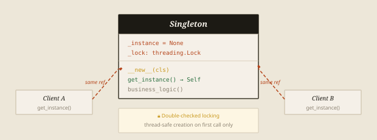
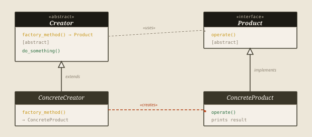
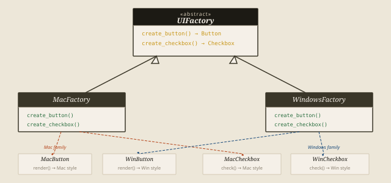
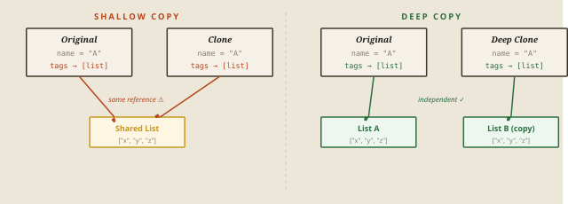
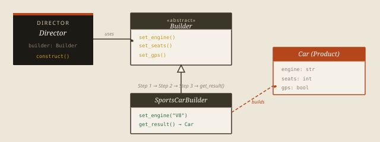

Every object in your program has to come from somewhere. The most naive approach —
scattering `new MyClass()` calls across your codebase — works until it doesn't. You need to
swap an implementation, support multiple variants, avoid expensive re-initialization, or
construct something too complex for a single constructor call. That's the moment creational
patterns become essential.

The Gang of Four identified five patterns that solve the full spectrum of object-creation
problems. This first series covers all five — what problem each solves, how it works
structurally, when to reach for it, and exactly how to write it in Java.

## Singleton

*One instance. One truth.*

*Ensure a class has exactly one instance and provide a global access point to it.*

Some resources in a system should have exactly one owner. A configuration manager that reads
from an environment file. A logging service that funnels all output to one stream. A
connection pool that manages a fixed set of database handles. If you allow multiple
instances of these, you don't just waste memory — you introduce conflicting state, competing
file handles, and split log output.

Singleton enforces the single-instance constraint at the architectural level. You don't rely
on developers remembering not to call the constructor. The class itself makes a second
instance impossible — the constructor is `private`.

### How It Works

In Java, a private constructor makes it impossible for outside code to call `new
Singleton()` directly. A private static field holds the sole instance. A public static
`getInstance()` method is the only access point. The `synchronized` keyword on a block —
combined with `volatile` on the instance field — gives us thread-safe double-checked locking
without paying the synchronization cost on every call.



*Figure 1 — Singleton — class structure and access flow*

**Java — Thread-Safe Singleton (Double-Checked Locking)**

```java
public class Singleton {

    // volatile prevents JVM instruction reordering
    private static volatile Singleton instance;

    // Private constructor — no outside code can call new Singleton()
    private Singleton() {}

    public static Singleton getInstance() {
        // First check — skip the lock once initialized
        if (instance == null) {
            synchronized (Singleton.class) {
                // Second check — another thread may have beaten us here
                if (instance == null) {
                    instance = new Singleton();
                }
            }
        }
        return instance;
    }

    public void configure(String env) {
        // configure the singleton
    }
}

// Usage — both variables point to the exact same object
Singleton cfg1 = Singleton.getInstance();
Singleton cfg2 = Singleton.getInstance();
System.out.println(cfg1 == cfg2);   // true
```

> **Use when** — Reach for Singleton when…
>
> - You need a single shared logger
> - Managing a central config object
> - Controlling a connection or thread pool
> - The object is expensive to initialize

> **Avoid when** — Avoid Singleton when…
>
> - You just want convenient global access
> - Unit testing with mock injection is needed
> - Multiple independent instances are valid
> - It would hide real dependencies from callers

## Factory Method

*Let subclasses decide what to create.*

*Define an interface for creating an object, but let subclasses decide which class to instantiate.*

Calling `ConcreteProduct()` directly binds your calling code to a specific class at compile
time. When the type of object you need depends on runtime conditions — user input, a feature
flag, a config file, or business rules that change per client — that binding becomes a
liability. Every new variant means cracking open your logic and adding another branch.

The Factory Method pattern solves this by pushing the instantiation decision into a
subclass. Your calling code only ever talks to the abstract `Creator` interface. Swap the
concrete creator, and a completely different product emerges — without touching the logic
that uses it.



*Figure 2 — Factory Method — UML class diagram*

**Java — Factory Method Pattern**

```java
// Product interface
interface Notification {
    void send(String message);
}

// Concrete products
class EmailNotification implements Notification {
    public void send(String message) {
        System.out.println("📧 Email: " + message);
    }
}

class SMSNotification implements Notification {
    public void send(String message) {
        System.out.println("📱 SMS: " + message);
    }
}

// Creator — declares the factory method
abstract class NotificationService {
    public abstract Notification createNotification();

    public void notify(String message) {
        Notification n = createNotification();  // subclass decides
        n.send(message);
    }
}

// Concrete creators
class EmailService extends NotificationService {
    public Notification createNotification() {
        return new EmailNotification();
    }
}

class SMSService extends NotificationService {
    public Notification createNotification() {
        return new SMSNotification();
    }
}

// Client code never touches EmailNotification / SMSNotification directly
NotificationService service = new EmailService();
service.notify("Your order has shipped!");  // 📧 Email: Your order has shipped!

service = new SMSService();
service.notify("Your order has shipped!");  // 📱 SMS: Your order has shipped!
```

> **In the Wild**
>
> Spring's dependency injection is Factory Method in action. When you declare a bean by
> interface and let Spring resolve the implementation at runtime, the framework is acting as a
> concrete creator. You write against the abstract type — it decides what you actually get.

## Abstract Factory

*Families of related objects, guaranteed compatible.*

*Provide an interface for creating families of related or dependent objects without specifying their concrete classes.*

Factory Method handles one product. Abstract Factory handles a *family* of products that
must work together. Think of a UI toolkit: a button, a checkbox, and a text input all need
to share the same visual style — either they're all Material Design or they're all Fluent
UI. You can't mix them. Abstract Factory enforces that guarantee.

The pattern gives you a factory interface with a method for each product type in the family.
Each concrete factory implements the whole interface, ensuring every object it produces
belongs to the same family. Client code talks only to the abstract factory — swap the
factory, and everything changes together.



*Figure 3 — Abstract Factory — two product families, one interface*

**Java — Abstract Factory (cross-platform UI)**

```java
// ── Product interfaces ────────────────────────
interface Button   { void render(); }
interface Checkbox { void check();  }

// ── Mac family ────────────────────────────────
class MacButton implements Button {
    public void render() { System.out.println("[Mac Button]"); }
}
class MacCheckbox implements Checkbox {
    public void check()  { System.out.println("[Mac Checkbox]"); }
}

// ── Windows family ────────────────────────────
class WinButton implements Button {
    public void render() { System.out.println("[Win Button]"); }
}
class WinCheckbox implements Checkbox {
    public void check()  { System.out.println("[Win Checkbox]"); }
}

// ── Abstract factory ──────────────────────────
interface UIFactory {
    Button   createButton();
    Checkbox createCheckbox();
}

class MacFactory implements UIFactory {
    public Button   createButton()   { return new MacButton(); }
    public Checkbox createCheckbox() { return new MacCheckbox(); }
}

class WindowsFactory implements UIFactory {
    public Button   createButton()   { return new WinButton(); }
    public Checkbox createCheckbox() { return new WinCheckbox(); }
}

// ── Client — knows nothing about Mac or Win ───
static void renderUI(UIFactory factory) {
    Button   btn = factory.createButton();
    Checkbox chk = factory.createCheckbox();
    btn.render();
    chk.check();
}

renderUI(new MacFactory());      // [Mac Button]  [Mac Checkbox]
renderUI(new WindowsFactory());  // [Win Button]  [Win Checkbox]
```

| Pattern | Factory Method | Abstract Factory |
| --- | --- | --- |
| Creates | One product type | A family of related products |
| Mechanism | Subclass overrides one method | Subclass implements entire factory interface |
| Use when | Type depends on runtime context | Multiple products must stay compatible |
| Real-world analogy | A bakery that makes bread or cake | An IKEA line — every item matches the same style |

## Prototype

*Clone it. Don't rebuild it.*

*Specify the kinds of objects to create using a prototypical instance, and create new objects by copying it.*

Some objects are expensive to create from scratch — they require database lookups, API
calls, heavy computation, or complex initialization sequences. If you need many similar
objects, rebuilding each one from zero is wasteful. The Prototype pattern solves this: you
create one fully configured object, then clone it whenever you need another.

There are two flavours of cloning you need to understand. A **shallow copy** duplicates the
object but shares references to nested objects. A **deep copy** recursively duplicates
everything — the clone is fully independent. Python's `copy` module provides both, and
knowing which to use is the real skill here.



*Figure 4 — Prototype — shallow vs. deep copy behaviour*

**Java — Prototype with deep copy via Cloneable**

```java
import java.util.ArrayList;
import java.util.List;

// Prototype interface
interface Prototype {
    Prototype clone();
}

class GameCharacter implements Prototype {
    private String       name;
    private int          level;
    private List<String> skills;  // mutable — deep copy matters

    public GameCharacter(String name, int level, List<String> skills) {
        this.name   = name;
        this.level  = level;
        this.skills = skills;
    }

    // Deep-copy constructor used by clone()
    private GameCharacter(GameCharacter source) {
        this.name   = source.name;
        this.level  = source.level;
        this.skills = new ArrayList<>(source.skills);  // new list, not shared
    }

    public GameCharacter clone() {
        return new GameCharacter(this);   // fully independent copy
    }

    public void setName(String n)  { this.name = n; }
    public void addSkill(String s) { this.skills.add(s); }

    public String toString() {
        return "GameCharacter(" + name + ", lv" + level + ", " + skills + ")";
    }
}

// Create a fully configured base character once
GameCharacter base = new GameCharacter(
    "Warrior", 10, new ArrayList<>(List.of("slash", "block"))
);

// Clone and customise — base remains untouched
GameCharacter elite = base.clone();
elite.setName("Elite Warrior");
elite.addSkill("whirlwind");

System.out.println(base);   // GameCharacter(Warrior, lv10, [slash, block])
System.out.println(elite);  // GameCharacter(Elite Warrior, lv10, [slash, block, whirlwind])
```

> Think of a cell dividing. The new cell starts as an exact copy of the original — same DNA,
> same structure. From that identical starting point, it then differentiates. The Prototype
> pattern works the same way: clone a complete, tested, configured object, then make the small
> changes you need. No rebuilding from scratch required.

## Builder

*Construct complex objects step by step.*

*Separate the construction of a complex object from its representation so the same process can create different representations.*

When an object requires many configuration steps, optional parameters, and conditional logic
to build correctly, a constructor becomes unmanageable fast. You end up with what developers
call the "telescoping constructor" problem — a cascade of overloaded signatures or one
enormous method call with a dozen arguments, most of which are `None`.

The Builder pattern separates what you're building from how you build it. A **Builder**
interface defines the build steps. A **Concrete Builder** implements them for a specific
variant. A **Director** orchestrates the sequence of calls. The **Product** is assembled
incrementally. In Java, you'll also commonly see the inner static builder variant —
popularised by frameworks like Lombok — that skips the Director entirely. Both are valid,
and we'll show the classic form here.



*Figure 5 — Builder — construction sequence and participants*

**Java — Builder with Director**

```java
// Product
class Car {
    private final String  engine;
    private final int     seats;
    private final boolean gps;

    private Car(CarBuilder b) {
        this.engine = b.engine;
        this.seats  = b.seats;
        this.gps    = b.gps;
    }

    public String toString() {
        return "Car{engine='" + engine + "', seats=" + seats + ", gps=" + gps + "}";
    }

    // ── Builder interface ──────────────────────
    interface Builder {
        Builder setEngine(String engine);
        Builder setSeats(int n);
        Builder setGps(boolean on);
        Car     build();
    }

    // ── Concrete builder ───────────────────────
    static class CarBuilder implements Builder {
        private String  engine = "";
        private int     seats  = 2;
        private boolean gps    = false;

        public Builder setEngine(String e)  { this.engine = e; return this; }
        public Builder setSeats(int n)      { this.seats  = n; return this; }
        public Builder setGps(boolean on)   { this.gps    = on; return this; }
        public Car     build()              { return new Car(this); }
    }
}

// ── Director — orchestrates the build sequence ──
class Director {
    private final Car.Builder builder;

    public Director(Car.Builder builder) { this.builder = builder; }

    public Car buildSportsCar() {
        return builder
            .setEngine("V8")
            .setSeats(2)
            .setGps(true)
            .build();
    }
}

// Usage
Director director = new Director(new Car.CarBuilder());
Car car = director.buildSportsCar();
System.out.println(car);  // Car{engine='V8', seats=2, gps=true}
```

> The Builder pattern shines when the construction process is stable but the representation
> varies. The Director knows the steps. The concrete Builder knows the details. They stay
> separate — and each can evolve independently.

> **Fluent Builder in Java — The Lombok Shortcut**
>
> For everyday Java, Lombok's `@Builder` annotation generates the entire builder boilerplate
> at compile time — no hand-written inner class required. Use the manual form when you need a
> Director to name and reuse specific build sequences. Reach for `@Builder` when you just want
> clean, readable object construction without telescoping constructors.
