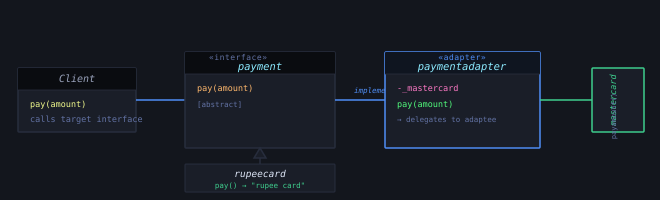
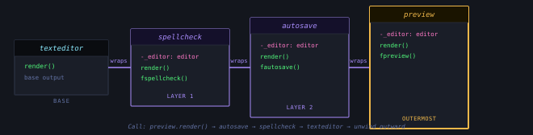
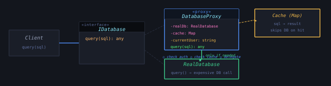
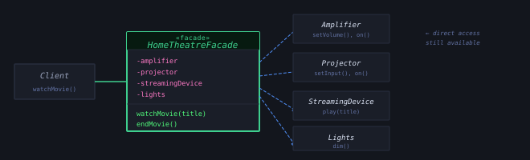
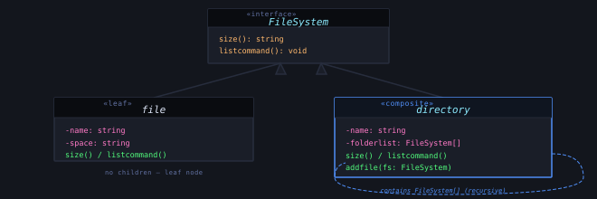

In Series 1 we answered one question: *how should objects come into existence?* Creational
patterns gave us five precise answers. Series 2 asks the next question — *once objects
exist, how should they fit together?*

Structural patterns are the blueprints for composition. They define the shape of your
system: how incompatible interfaces get bridged, how behaviour gets layered without
inheritance, how access gets controlled, how complexity gets hidden, and how trees of
objects behave as one. Master these five and you have the tools to manage any structural
problem that comes up in production code.

Convert the interface of a class into another interface that clients expect.

You have a system that expects one interface. You have a component that provides the same
functionality through a different interface. You can't change either. The Adapter pattern
solves this by wrapping the incompatible component in a class that speaks the language your
system already understands.

Think of a universal power adapter when you travel internationally. The socket on the wall
hasn't changed. Your device hasn't changed. The adapter bridges the two without modifying
either. That's exactly what this pattern does in code.



*Figure 1 — Adapter — structure and translation flow*

### The Problem — Payment System Example

Your system speaks `pay(amount)`. A legacy Mastercard integration speaks
`payamount(amount)`. You can't change the Mastercard library. The `paymentadapter` wraps it,
translates the call, and makes the incompatible component behave like it was built for your
interface all along.

**TypeScript — Adapter Pattern adapter.ts**

```typescript
// Target interface — what the system expects
interface payment {
    pay(amount: any): void
}

// Concrete target — already compatible
class rupeecard implements payment {
    pay(amount: any) {
        console.log(`rupee card payment is done ${amount}`);
    }
}

// Adaptee — incompatible legacy interface (can't change this)
class mastercard {
    payamount(amount: any) {
        console.log(`master card payment is done ${amount}`);
    }
}

// Adapter — wraps mastercard, speaks the payment interface
class paymentadapter implements payment {
    private _mastercard: mastercard

    constructor(mastercard: mastercard) {
        this._mastercard = mastercard;
    }

    pay(amount: any) {
        this._mastercard.payamount(amount);  // translation happens here
    }
}

// Client code — only talks to the payment interface
class clientcode {
    main() {
        const rupee = new rupeecard();
        rupee.pay(10);               // direct — no adapter needed

        const adapter = new paymentadapter(new mastercard())
        adapter.pay(20);             // adapter translates → payamount(20)
    }
}
new clientcode().main();
```

> **Real-world signal**
>
> Every time you wrap a third-party SDK to conform to your internal interface, you're writing
> an Adapter. It's the pattern that keeps your domain logic clean while legacy systems and
> external libraries stay at arm's length.

Attach additional responsibilities to an object dynamically, as a flexible alternative to
subclassing.

Inheritance solves the problem of adding behaviour once. Decorator solves the problem of
adding behaviour *in any combination, at runtime*. Instead of creating a subclass for every
feature combination, you wrap an object with another object that adds the feature. And
because decorators implement the same interface as the object they wrap, they can be stacked
arbitrarily deep.



*Figure 2 — Decorator — wrapping chain visualised*

Two examples below illustrate Decorator from two angles. The first — a text editor — shows
how feature layers (spell check, autosave, preview) stack onto a base component. The second
— a coffee order — shows how the pattern removes rather than adds: `blackcoffee` and
`sugerlesscoffee` each strip something from the base, proving decorators aren't just about
addition.

### Example 1 — Text Editor with Feature Layers

**TypeScript — Decorator Pattern decorator.ts**

```typescript
interface editor {
    render(): void;
}

// Base component
class texteditor implements editor {
    render() {
        console.log("basic text editor render");
    }
}

// Decorator 1 — adds spell check
class spellcheck implements editor {
    private _editor: editor;
    constructor(editor: editor) { this._editor = editor; }

    fspellcheck(): void { console.log("spellcheck got decorated"); }
    render(): void  { this._editor.render(); this.fspellcheck(); }
}

// Decorator 2 — adds autosave
class autosave implements editor {
    private _editor: editor;
    constructor(editor: editor) { this._editor = editor; }

    fautosave() { console.log("autosave got decorated"); }
    render(): void { this._editor.render(); this.fautosave(); }
}

// Decorator 3 — adds preview
class preview implements editor {
    private _editor: editor;
    constructor(editor: editor) { this._editor = editor; }

    fpreview() { console.log("preview got decorated"); }
    render(): void { this._editor.render(); this.fpreview(); }
}

// Stack decorators in any combination at runtime
const previewInstance: editor =
    new preview(new autosave(new spellcheck(new texteditor())));

previewInstance.render();
// basic text editor render
// spellcheck got decorated
// autosave got decorated
// preview got decorated
```

### Example 2 — Coffee Order (Decorator Removing Behaviour)

**TypeScript — Coffee Decorator coffee_decorator.ts**

```typescript
interface coffee { serve(): void; }

class basiccoffee implements coffee {
    serve(): void { console.log("Basic coffee serve"); }
}

// Decorator — removes milk
class blackcoffee implements coffee {
    private _coffee: coffee;
    constructor(coffee: coffee) { this._coffee = coffee; }

    fblackcoffee(): void {
        console.log("decorating black coffee by removing milk");
    }
    serve(): void {
        this.fblackcoffee();
        this._coffee.serve();
    }
}

// Decorator — removes sugar
class sugerlesscoffee implements coffee {
    private _coffee: coffee;
    constructor(coffee: coffee) { this._coffee = coffee; }

    fsugerlesscoffee() {
        console.log("decorating sugerless coffee by removing sugar");
    }
    serve(): void {
        this.fsugerlesscoffee();
        this._coffee.serve();
    }
}

// Chain: sugerless wraps blackcoffee wraps basiccoffee
const order = new sugerlesscoffee(new blackcoffee(new basiccoffee()));
order.serve();
// decorating sugerless coffee by removing sugar
// decorating black coffee by removing milk
// Basic coffee serve
```

> Think of Russian nesting dolls. Each doll wraps the one inside, and they're all the same
> shape. When you call render() on the outermost, it calls the one inside, which calls the one
> inside that — all the way to the base, then unwinds outward. That's exactly the call stack
> you saw above: preview → autosave → spellcheck → texteditor → back up.

> **Use when** — Use Decorator when…
>
> - Behaviour combinations grow exponentially via inheritance
> - Features need to be toggled at runtime
> - Open/Closed Principle must hold — extend without modifying
> - Middleware pipelines, logger wrappers, HTTP request chains

> **Avoid when** — Avoid Decorator when…
>
> - Order of wrapping matters and is hard to control
> - You only have one or two fixed feature combinations
> - Deep stacks make debugging call chains painful

Provide a surrogate or placeholder for another object to control access to it.

The Proxy pattern puts a stand-in object in front of the real one. From the client's
perspective, nothing changes — they call the same interface. But the proxy intercepts the
call and can do things before and after: check access permissions, cache results, log the
operation, defer expensive initialization until the moment it's actually needed.

There are three main flavours. A **Virtual Proxy** delays creation of an expensive object
until first use. A **Protection Proxy** guards access based on permissions. A **Caching
Proxy** memoises results to avoid repeated work. The example below demonstrates all three
ideas in a database query scenario.



*Figure 3 — Proxy — client sees same interface, proxy intercepts*

**TypeScript — Proxy Pattern proxy.ts**

```typescript
// Subject interface — proxy and real object share this
interface IDatabase {
    query(sql: string): any;
}

// Real subject — expensive to call
class RealDatabase implements IDatabase {
    query(sql: string): any {
        console.log(`[DB] Executing: ${sql}`);
        return { rows: ["result1", "result2"] };
    }
}

// Proxy — access control + caching in one place
class DatabaseProxy implements IDatabase {
    private realDb: RealDatabase | null = null;   // virtual proxy — lazy init
    private cache = new Map<string, any>();
    private currentUser: string;

    constructor(user: string) {
        this.currentUser = user;
    }

    query(sql: string): any {
        // ① Protection proxy — check role
        if (this.currentUser !== "admin" && sql.includes("DELETE")) {
            console.log(`[PROXY] Access denied for user: ${this.currentUser}`);
            return null;
        }

        // ② Caching proxy — return cached result if available
        if (this.cache.has(sql)) {
            console.log(`[PROXY] Cache hit for: ${sql}`);
            return this.cache.get(sql);
        }

        // ③ Virtual proxy — create real object only on first actual use
        if (!this.realDb) {
            this.realDb = new RealDatabase();
            console.log("[PROXY] RealDatabase created (lazy init)");
        }

        const result = this.realDb.query(sql);
        this.cache.set(sql, result);
        return result;
    }
}

// Usage — client only sees IDatabase, never RealDatabase directly
const db: IDatabase = new DatabaseProxy("admin");
db.query("SELECT * FROM users");    // [PROXY] RealDatabase created → [DB] Executing
db.query("SELECT * FROM users");    // [PROXY] Cache hit — no DB call

const guest: IDatabase = new DatabaseProxy("guest");
guest.query("DELETE FROM logs");     // [PROXY] Access denied
```

> **Proxy vs Decorator — the key distinction**
>
> Both patterns wrap an object and share its interface. The difference is intent. A
> **Decorator adds or modifies behaviour**. A **Proxy controls access** — it manages the
> lifecycle, guards the door, or caches the result, without enriching the interface itself.
> When you're asking "what should this object do?" use Decorator. When you're asking "should
> this object be accessed at all, or how?" use Proxy.

Provide a simplified interface to a complex subsystem.

Subsystems grow complex. A home theatre system has an amplifier, a projector, a streaming
device, lighting controls, and a screen. Turning on a movie requires orchestrating all of
them in the right sequence. A Facade provides a single, simple method — `watchMovie()` —
that handles all of that coordination behind the scenes.

The Facade doesn't hide the subsystem. Clients who need fine-grained control can still
access the components directly. The Facade is a convenience layer for the 80% of use cases
that just need the simple path.



*Figure 4 — Facade — one entry point, multiple subsystems*

**TypeScript — Facade Pattern facade.ts**

```typescript
// Complex subsystems — each has its own detailed interface
class Amplifier {
    on(): void                  { console.log("Amplifier: on"); }
    setVolume(level: number): void { console.log(`Amplifier: volume → ${level}`); }
    off(): void                 { console.log("Amplifier: off"); }
}

class Projector {
    on(): void                    { console.log("Projector: on"); }
    setInput(source: string): void { console.log(`Projector: input → ${source}`); }
    off(): void                   { console.log("Projector: off"); }
}

class StreamingDevice {
    play(title: string): void { console.log(`Streaming: playing "${title}"`); }
    stop(): void               { console.log("Streaming: stopped"); }
}

class Lights {
    dim(level: number): void  { console.log(`Lights: dimmed to ${level}%`); }
    on(): void                 { console.log("Lights: on"); }
}

// Facade — one simple interface over all four subsystems
class HomeTheatreFacade {
    private amp    = new Amplifier();
    private proj   = new Projector();
    private stream = new StreamingDevice();
    private lights = new Lights();

    watchMovie(title: string): void {
        console.log("--- Starting movie night ---");
        this.lights.dim(20);
        this.amp.on(); this.amp.setVolume(7);
        this.proj.on(); this.proj.setInput("streaming");
        this.stream.play(title);
    }

    endMovie(): void {
        console.log("--- Ending movie night ---");
        this.stream.stop();
        this.proj.off();
        this.amp.off();
        this.lights.on();
    }
}

// Client — one call, all the complexity handled internally
const theatre = new HomeTheatreFacade();
theatre.watchMovie("Inception");
// --- Starting movie night ---
// Lights: dimmed to 20%
// Amplifier: on  |  Amplifier: volume → 7
// Projector: on  |  Projector: input → streaming
// Streaming: playing "Inception"

theatre.endMovie();
```

> **In the Wild**
>
> Every time you call a high-level SDK method that abstracts over several lower-level APIs,
> you're using a Facade. Express.js's `app.listen()` is a facade over Node's HTTP server,
> socket binding, and event loop. Spring Boot's autoconfiguration is a facade over beans,
> datasources, and JPA setup. The simplicity on the surface is always the Facade pattern
> hiding a complex subsystem underneath.

Compose objects into tree structures to represent part-whole hierarchies. Let clients treat
individual objects and compositions uniformly.

Some structures are inherently recursive. A file system has files and directories. A
directory contains files and other directories. A UI component tree has leaves (buttons,
labels) and composites (panels, modals) that contain other components. The challenge: you
want to treat a single file and an entire directory subtree through the same interface.
Composite makes this possible.

The pattern defines a shared interface for both leaves (no children) and composites
(containers with children). When you call `listcommand()` on a directory, it calls
`listcommand()` on each child — recursing through the entire subtree automatically. The
client never needs to distinguish between a file and a folder.



*Figure 5 — Composite — file system tree structure*

**TypeScript — Composite Pattern composite.ts**

```typescript
interface FileSystem {
    size(): string;
    listcommand(): void;
}

// Leaf — no children, knows only its own size
class file implements FileSystem {
    private name = "";
    private space = "0";

    constructor(name: string, space: string) {
        this.name = name;
        this.space = space;
    }

    size(): string { return this.space; }

    listcommand(): void {
        console.log(`File Name is ${this.name} and size is ${this.space}`);
    }
}

// Composite — contains children, aggregates their sizes
class directory implements FileSystem {
    private name = "";
    private space = "0";
    folderlist: FileSystem[] = [];

    constructor(name: string, space: string) {
        this.name = name;
        this.space = space;
    }

    size(): string {
        let total = 0;
        for (let i = 0; i < this.folderlist.length; i++) {
            total += parseInt(this.folderlist[i].size());  // recurses into subdirs
        }
        this.space = total.toString();
        return this.space;
    }

    listcommand(): void {
        console.log(`Directory Name is ${this.name} and size is ${this.space}`);
        for (let i = 0; i < this.folderlist.length; i++) {
            this.folderlist[i].listcommand();                // recurses into children
        }
    }

    addfile(fs: FileSystem) { this.folderlist.push(fs); }
}

// Build a tree: directories contain files (and could contain other directories)
const dsa = new directory("DSA", "0");
dsa.addfile(new file("slidingalgo.java", "2"));
dsa.addfile(new file("linklist.ts", "3"));
dsa.size();
dsa.listcommand();
// Directory Name is DSA and size is 5
// File Name is slidingalgo.java and size is 2
// File Name is linklist.ts and size is 3

const lld = new directory("lld", "0");
lld.addfile(new file("factorypattern.java", "25"));
lld.addfile(new file("compositepattern.ts", "31"));
lld.size();
lld.listcommand();
```

> **The recursive insight**
>
> The power of Composite is that `directory.folderlist` holds `FileSystem[]` — not `file[]`.
> That means a directory can contain other directories, which can contain other directories,
> recursively. The tree can be arbitrarily deep, and `listcommand()` on the root node
> traverses the entire structure with zero extra client code. This same pattern powers React's
> component tree, DOM manipulation, and org chart rendering.

| Pattern | Core Idea | Client sees | Real-world example |
| --- | --- | --- | --- |
| Adapter | Translate incompatible interfaces | Target interface only | Legacy SDK wrapper, USB-C adaptor |
| Decorator | Add behaviour by wrapping | Same interface, richer behaviour | Express middleware, Java I/O streams |
| Proxy | Control access to an object | Same interface, intercepted calls | Auth guard, cache layer, lazy loader |
| Facade | Simplify a complex subsystem | Simplified API, subsystems hidden | SDK entry point, Spring Boot autoconfigure |
| Composite | Treat trees of objects uniformly | Single interface for leaf and branch | File system, React component tree, DOM |
