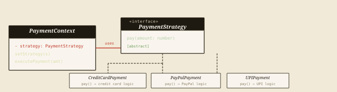
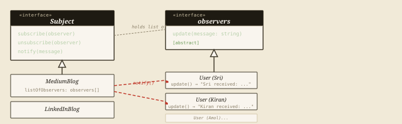
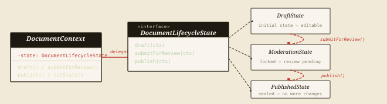
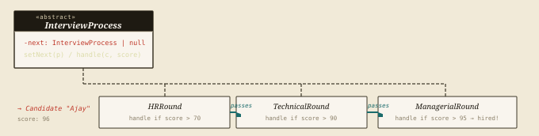

Series 1 asked: *how should objects be born?* Series 2 asked: *how should they fit
together?* Series 3 asks the final question — *how should they behave?* Behavioural patterns
are about communication, decision-making, and responsibility. They answer the hardest
runtime questions: who does what, who gets notified when things change, who decides which
algorithm to run, and who is responsible when a request needs to travel through a system.

Four patterns. All four with real TypeScript implementations from production-style code.
Let's close the series.

## Strategy

*Swap algorithms at runtime without changing the code that uses them.*

Picture a GPS app. The user opens it and asks for directions. Should it take the fastest
route? The shortest? The most scenic? Each of those is a different algorithm. Without
Strategy, you'd jam all three into a single function with `if-else` branches that grows
every time a new route type appears. With Strategy, each algorithm lives in its own class —
and you swap them in and out at runtime like batteries.

That's the entire pattern. A **Strategy interface** declares the method all algorithms must
implement. Each **Concrete Strategy** is a different algorithm. A **Context** holds a
reference to whichever strategy is currently active and delegates work to it. The Context
never cares what the strategy is — it just calls the interface.



*Figure 1 — Strategy — context delegates to swappable algorithm objects*

### Real-World Implementation — Payment Processing

Three payment methods. One context. Swap strategies at runtime without touching a single
line of payment logic.

**TypeScript — Strategy Pattern strategy.ts**

```typescript
// Strategy interface — all payment methods must honour this contract
interface PaymentStrategy {
    pay(amount: number): void;
}

// Concrete Strategy 1 — Credit Card
class CreditCardPayment implements PaymentStrategy {
    private cardNumber: string;
    private cardHolderName: string;
    private cvv: string;

    constructor(cardNumber: string, cardHolderName: string, cvv: string) {
        this.cardNumber = cardNumber;
        this.cardHolderName = cardHolderName;
        this.cvv = cvv;
    }

    pay(amount: number): void {
        console.log(`Processing credit card payment of $${amount} for ${this.cardHolderName}`);
    }
}

// Concrete Strategy 2 — PayPal
class PayPalPayment implements PaymentStrategy {
    private email: string;
    constructor(email: string) { this.email = email; }

    pay(amount: number): void {
        console.log(`Processing PayPal payment of $${amount} for ${this.email}`);
    }
}

// Concrete Strategy 3 — UPI
class UPIPayment implements PaymentStrategy {
    private upiId: string;
    constructor(upiId: string) { this.upiId = upiId; }

    pay(amount: number): void {
        console.log(`Processing UPI payment of $${amount} for UPI ID ${this.upiId}`);
    }
}

// Context — holds the active strategy, delegates payment to it
class PaymentContext {
    private strategy: PaymentStrategy;

    constructor(strategy: PaymentStrategy) { this.strategy = strategy; }

    setStrategy(strategy: PaymentStrategy): void {
        this.strategy = strategy;   // swap at runtime — no logic changes here
    }

    executePayment(amount: number): void {
        this.strategy.pay(amount);  // delegates — doesn't care which strategy
    }
}

// Client — swapping strategies at runtime
const ctx = new PaymentContext(new CreditCardPayment("1234-5678", "Ajay", "123"));
ctx.executePayment(100);   // → credit card logic runs

ctx.setStrategy(new PayPalPayment("kotnala.ajay@gmail.com"));
ctx.executePayment(200);   // → PayPal logic runs

ctx.setStrategy(new UPIPayment("kotnala.ajay@upi"));
ctx.executePayment(300);   // → UPI logic runs
```

> Think of a phone charger adapter kit. The phone (Context) is always the same. The
> country-specific adapter (Strategy) is what changes. You don't rewire the phone for each
> country — you swap the adapter. Same interface, different implementation, zero disruption to
> the device itself.

> **Real-world signal**
>
> Every time you find yourself writing `if (method === 'credit') {... } else if (method ===
> 'upi') {... }` in a processing function, that's Strategy waiting to be born. The branching
> is the smell. Encapsulate each branch into its own class and inject the right one at the
> call site.

> **Use when** — Use Strategy when…
>
> - Multiple algorithms do the same job differently
> - Behaviour must switch at runtime based on context
> - You want to eliminate conditional branching on type
> - Algorithms need to be tested or replaced independently

> **Avoid when** — Skip Strategy when…
>
> - You only have one or two static algorithms
> - The logic difference is a single line — just use a flag
> - The context never changes algorithm mid-lifecycle

## Observer

*When one thing changes, everything that cares gets told — automatically.*

You're building a blog platform. When a new post goes live on Medium, your subscribers
should get notified. When a post drops on LinkedIn, a different set of followers should hear
about it. The naive approach is for the blog to maintain an ever-growing list of direct
calls to notification services. Add Slack? Update the blog class. Add email digest? Update
the blog class again. The blog shouldn't own all that logic.

Observer decouples the subject (the blog) from the observers (the subscribers). The subject
simply broadcasts — *"something changed"* — and every registered observer reacts however it
sees fit. The subject doesn't know or care how many observers there are, what they do, or
when they were added.



*Figure 2 — Observer — subject broadcasts, observers react independently*

### Real-World Implementation — Blog Notification System

Medium subscribers get notified about Medium posts. LinkedIn followers get notified about
LinkedIn posts. Kiran subscribes to both — and unsubscribing from one doesn't affect the
other. The blog classes never need to change when the subscriber list evolves.

**TypeScript — Observer Pattern observer.ts**

```typescript
// Observer interface — every subscriber must implement this
interface observers {
    update(message: string): void;
}

// Subject interface — what a "publishable" blog must expose
interface Subject {
    subscribe(observer: observers): void;
    unsubscribe(observer: observers): void;
    notify(message: string): void;
}

// Concrete Subject 1 — Medium blog
class MediumBlog implements Subject {
    listOfObservers: observers[] = [];

    subscribe(observer: observers): void {
        this.listOfObservers.push(observer);
    }

    unsubscribe(observer: observers): void {
        if (this.listOfObservers.includes(observer)) {
            console.log(`Observer unsubscribed successfully!`);
            this.listOfObservers = this.listOfObservers.filter(obs => obs !== observer);
        } else {
            console.log(`Observer not found in the list!`);
        }
    }

    notify(message: string): void {
        console.log(`Notifying observers: ${message}`);
        for (const observer of this.listOfObservers) {
            observer.update(message);   // each observer reacts in its own way
        }
    }
}

// Concrete Subject 2 — LinkedIn blog (same structure)
class LinkedInBlog implements Subject {
    listOfObservers: observers[] = [];
    subscribe(o: observers)   { this.listOfObservers.push(o); }
    unsubscribe(o: observers) { this.listOfObservers = this.listOfObservers.filter(x => x !== o); }
    notify(message: string)    {
        console.log(`LinkedIn notifying: ${message}`);
        this.listOfObservers.forEach(o => o.update(message));
    }
}

// Concrete Observer — a user who subscribes to blogs
class User implements observers {
    private name: string;
    constructor(name: string) { this.name = name; }

    update(message: string): void {
        console.log(`${this.name} received: ${message}`);
    }
}

// Client code
const mediumBlog   = new MediumBlog();
const linkedInBlog = new LinkedInBlog();

const sri   = new User("Sri");
const kiran = new User("Kiran");
const amol  = new User("Amol");

mediumBlog.subscribe(sri);
mediumBlog.subscribe(kiran);
linkedInBlog.subscribe(kiran);
linkedInBlog.subscribe(amol);

mediumBlog.notify("New post on Medium about Design Patterns!");
// Sri received: ...   |  Kiran received: ...

linkedInBlog.notify("New post on LinkedIn about Design Patterns!");
// Kiran received: ... |  Amol received: ...

mediumBlog.unsubscribe(kiran);
mediumBlog.notify("Another post on Medium about AI!");
// Only Sri received: ... (Kiran was removed)
```

> The subject doesn't know who's listening. The observer doesn't know what it's subscribed to.
> That mutual ignorance is precisely what makes event-driven systems scale.

> **In the wild**
>
> This pattern is everywhere. DOM event listeners (`addEventListener`). Redux's store
> subscriptions. RxJS observables. Firebase real-time listeners. Every pub-sub system — Kafka,
> SNS, EventBridge — is Observer at infrastructure scale. When you write `onClick` in React,
> you're registering an observer on a DOM subject.

## State

*Let an object's class change when its state changes.*

Some objects behave completely differently depending on where they are in their lifecycle. A
document in *Draft* can be edited freely. The same document in *Moderation* can't be
touched. Once *Published*, it's sealed. Every operation — edit, submit, publish — means
something different in each state.

Without State, you write `if (state === 'draft') {... } else if (state === 'moderation')
{... }` blocks everywhere, and every new state means hunting through every method to add
another branch. With State, each state becomes a class. The object just delegates to its
current state, and transitions are explicit state-to-state swaps. The `if-else` soup
evaporates.



*Figure 3 — State — document lifecycle: Draft → Moderation → Published*

### Real-World Implementation — Document Lifecycle

Each state class knows what's legal in that state and how to respond when someone tries to
do something that isn't. The context just routes calls — it has no branching logic of its
own.

**TypeScript — State Pattern state.ts**

```typescript
// State interface — every state must know how to handle these three actions
interface DocumentLifecycleState {
    draft(ctx: DocumentContext): void;
    submitForReview(ctx: DocumentContext): void;
    publish(ctx: DocumentContext): void;
}

// Context — delegates every operation to its current state
class DocumentContext {
    private state: DocumentLifecycleState;

    constructor() { this.state = new DraftState(); }

    setState(state: DocumentLifecycleState): void { this.state = state; }
    draft(): void           { this.state.draft(this); }
    submitForReview(): void  { this.state.submitForReview(this); }
    publish(): void         { this.state.publish(this); }
}

// State 1 — Draft: free to edit, can submit, cannot publish directly
class DraftState implements DocumentLifecycleState {
    draft(ctx: DocumentContext): void {
        console.log("Document is already in Draft state.");
    }
    submitForReview(ctx: DocumentContext): void {
        console.log("Submitting document for review...");
        ctx.setState(new ModerationState());  // → transition
    }
    publish(ctx: DocumentContext): void {
        console.log("Cannot publish from Draft. Submit for review first.");
    }
}

// State 2 — Moderation: locked for editing, can be published
class ModerationState implements DocumentLifecycleState {
    draft(ctx: DocumentContext): void {
        console.log("Cannot edit during Moderation. Wait for review to complete.");
    }
    submitForReview(ctx: DocumentContext): void {
        console.log("Already submitted for review.");
    }
    publish(ctx: DocumentContext): void {
        console.log("Publishing document...");
        ctx.setState(new PublishedState());   // → transition
    }
}

// State 3 — Published: sealed, no further changes allowed
class PublishedState implements DocumentLifecycleState {
    draft(ctx: DocumentContext): void {
        console.log("Cannot edit Published document. Create a new one.");
    }
    submitForReview(ctx: DocumentContext): void {
        console.log("Cannot re-submit a Published document.");
    }
    publish(ctx: DocumentContext): void {
        console.log("Document is already published.");
    }
}

// Client
const doc = new DocumentContext();
doc.draft();           // "Document is already in Draft state."
doc.submitForReview(); // "Submitting document for review..."  → now Moderation
doc.publish();         // "Publishing document..."             → now Published
doc.draft();           // "Cannot edit Published document."
doc.publish();         // "Document is already published."
```

> A traffic light is the textbook example. Green doesn't know what Red does. Red doesn't know
> what Yellow does. Each light state is a class that manages its own behaviour and decides
> when to hand control to the next state. The intersection (context) doesn't contain if
> (colour === 'green') {... } — it just calls currentState.handle().

> **State vs Strategy — the confusion**
>
> They look identical in code — both inject behaviour into a context. The difference is
> **intent and lifecycle**. In Strategy, the context's class doesn't "know" it changed — it
> just got a new algorithm. In State, the states themselves trigger transitions by calling
> `ctx.setState()`. State is about an object evolving through a lifecycle. Strategy is about
> picking the right tool for a job. If your object has a lifecycle, reach for State. If it
> just needs swappable algorithms, reach for Strategy.

## Chain of Responsibility

*Pass a request down a chain of handlers until one of them deals with it.*

Not every request belongs at the same desk. A support ticket tagged as a minor UI glitch
should be handled by L1 support. A security vulnerability should bypass L1 entirely and land
with the engineering team. An expense report under ₹1000 can be approved by a team lead;
over ₹50,000 it needs a director.

Chain of Responsibility builds a pipeline of handlers. Each handler gets the request,
decides whether it can process it, and either handles it or passes it to the next handler in
the chain. The sender doesn't know which handler will ultimately respond. The chain is
configured at runtime, so it's easy to add, remove, or reorder handlers without touching the
individual handler classes.



*Figure 4 — Chain of Responsibility — interview pipeline: HR → Technical → Managerial*

### Real-World Implementation — Interview Process

Ajay enters with a score of 96. HR passes him at 70+. Technical passes him at 90+.
Managerial approves the hire at 95+. Each round is a handler class — none of them knows
about the others, and the chain is wired together in client code, not baked into the
handlers themselves.

**TypeScript — Chain of Responsibility COR.ts**

```typescript
// Abstract handler — each round extends this
abstract class InterviewProcess {
    protected next: InterviewProcess | null = null;

    setNext(interviewProcess: InterviewProcess): void {
        this.next = interviewProcess;
    }

    abstract handle(candidate: string, score: string): void;
}

// Handler 1 — HR clears candidates with score > 70
class HRRound extends InterviewProcess {
    handle(candidate: string, score: string): void {
        console.log(`HR Round: Evaluating ${candidate}`);
        if (parseInt(score) > 70) {
            console.log(`${candidate} passed HR. Score: ${score}`);
            if (this.next) this.next.handle(candidate, score);  // pass along
        } else {
            console.log(`${candidate} rejected at HR. Score: ${score}`);
        }
    }
}

// Handler 2 — Technical clears candidates with score > 90
class TechnicalRound extends InterviewProcess {
    handle(candidate: string, score: string): void {
        console.log(`Technical Round: Evaluating ${candidate}`);
        if (parseInt(score) > 90) {
            console.log(`${candidate} passed Technical. Score: ${score}`);
            if (this.next) this.next.handle(candidate, score);  // pass along
        } else {
            console.log(`${candidate} rejected at Technical. Score: ${score}`);
        }
    }
}

// Handler 3 — Managerial is the final gate at score > 95
class ManagerialRound extends InterviewProcess {
    handle(candidate: string, score: string): void {
        console.log(`Managerial Round: Evaluating ${candidate}`);
        if (parseInt(score) > 95) {
            console.log(`${candidate} passed Managerial. Hired! Score: ${score}`);
        } else {
            console.log(`${candidate} rejected at Managerial. Score: ${score}`);
        }
    }
}

// Client — wires the chain at runtime
const hrRound         = new HRRound();
const technicalRound  = new TechnicalRound();
const managerialRound = new ManagerialRound();

hrRound.setNext(technicalRound);
technicalRound.setNext(managerialRound);

hrRound.handle("Ajay", "96");
// HR Round: Evaluating Ajay
// Ajay passed HR. Score: 96
// Technical Round: Evaluating Ajay
// Ajay passed Technical. Score: 96
// Managerial Round: Evaluating Ajay
// Ajay passed Managerial. Hired! Score: 96

hrRound.handle("Bob", "75");
// HR Round: Evaluating Bob
// Bob passed HR. Score: 75
// Technical Round: Evaluating Bob
// Bob rejected at Technical. Score: 75   ← chain stops here
```

> **In the wild**
>
> Express.js middleware is Chain of Responsibility. Each `app.use()` call adds a handler to
> the chain. Auth middleware, logging middleware, error handlers — they each call `next()` to
> pass the request along or return early to stop the chain. Every time you've written `next()`
> in a middleware function, you've used Chain of Responsibility.

| Pattern | Core Question | Key mechanism | Real-world example |
| --- | --- | --- | --- |
| Strategy | Which algorithm should run? | Inject and swap algorithm objects | Payment methods, sorting, routing |
| Observer | Who needs to know when X changes? | Subject broadcasts to all subscribers | Event listeners, pub-sub, Redux store |
| State | What is this object allowed to do right now? | Delegate to current state class, state triggers transitions | Document lifecycle, traffic lights, order status |
| Chain of Responsibility | Who in this pipeline should handle this request? | Pass along until a handler accepts or chain ends | Express middleware, auth guards, approval workflows |

> Full source code — all three series: <https://github.com/ajaykotnala/LowLevelDesign>
