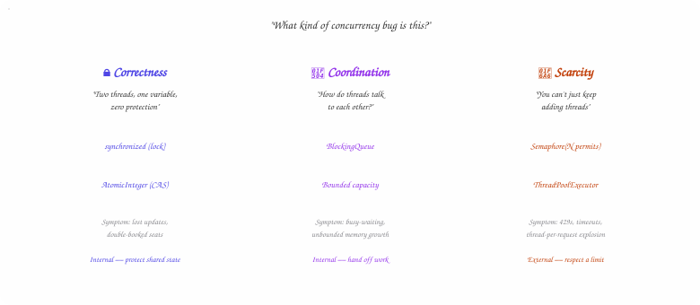
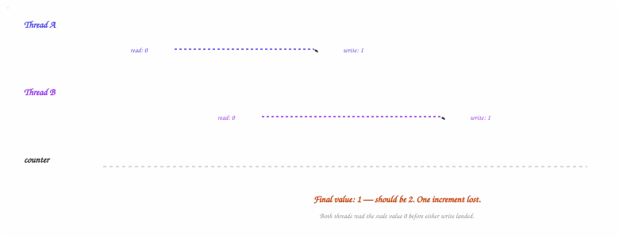
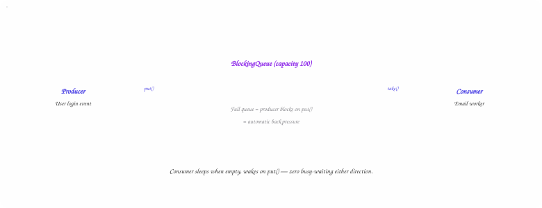
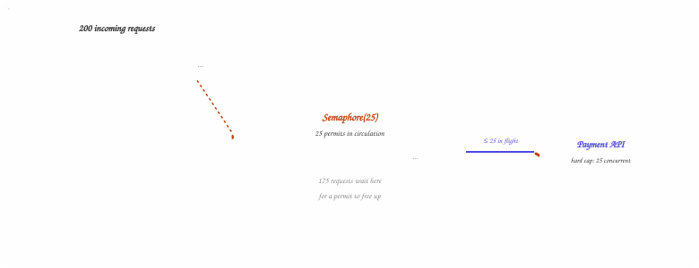
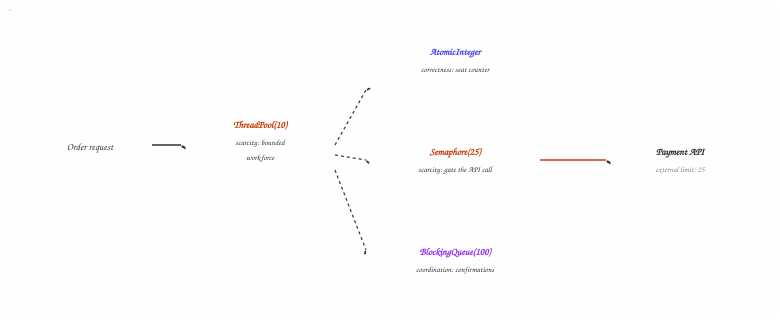
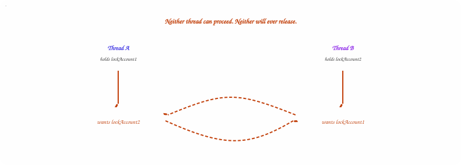

## Introduction — Why These Bugs Feel Random

Concurrency bugs have a specific flavor of misery: the code review looks fine, the unit
tests pass, and then production falls over at 2 AM because two things happened **at the same
instant** instead of one after another. There's no stack trace pointing at the real cause,
because the real cause isn't a line of code — it's a *timing window* that only opens under
load.

The good news, and the thing most explanations skip, is that almost every concurrency bug
you'll hit — or get asked about in a system design interview — reduces to one of **three
categories**. Once you can name which bucket a symptom belongs to, the fix stops being a
mystery and becomes a lookup: this category, that tool.

> **💡 Interview Tip**
>
> When an interviewer describes a bug — "counts are wrong," "the service hangs," "the
> downstream API is rate-limiting us" — your first move should be classification, out loud:
> "that sounds like a correctness problem" or "that's resource scarcity, not a race
> condition." Naming the category before naming the fix is what separates someone who
> memorized `synchronized` from someone who understands why it exists.

## Motivating Example — The Airline Seat Race

Picture a booking service for a single flight with one seat left. Two users load the seat
map within milliseconds of each other. Both requests read `seatAvailable = true`. Both
proceed to book. Both get a confirmation email. The airline now has one seat and two paying
passengers standing in the gate area.

Nothing in this scenario is exotic. There's no network partition, no crashed server, no
malformed input. Two threads simply read a shared value before either had a chance to write
back the update — a **check-then-act race**. It's one of the oldest bugs in software, and
it's the cleanest entry point into the first category: correctness.

| | |
| --- | --- |
| **3** | Concurrency Bug Categories |
| **3** | Steps Hidden in "counter++" |
| **1** | Seat, Two Confirmed Bookings |
| **0** | Stack Traces Pointing at the Cause |

## The Three-Category Map

Before going tool-by-tool, it helps to see the whole map at once. Each category answers a
different question, and — this is the part worth remembering — each one has exactly the
wrong tool for the other two. A semaphore won't fix a race condition. A lock won't fix
backpressure. Matching the tool to the category is the entire skill.

- **Correctness** — Two threads, one variable, zero protection. Fixed with locks or atomics.
- **Coordination** — How does one thread hand work to another? Fixed with blocking queues.
- **Scarcity** — An external limit, not a thread limit. Fixed with semaphores and pools.



*Figure 1 — Diagram 1 — The Three-Category Map*

Three questions, three tools. Correctness and coordination protect internal thread state; scarcity respects a limit imposed from outside your process.

> **⚠️ Watch Out**
>
> Correctness and coordination are about threads inside your process cooperating safely.
> Scarcity is different in kind — it's an external constraint (a payment gateway's rate limit,
> a database's connection cap) that exists whether or not your threads misbehave. A semaphore
> only throttles a single instance; run 10 instances of your service and the gateway still
> sees 10 × your permit count unless the limit is enforced somewhere shared, like a
> distributed rate limiter.

## Category 1 — Correctness: Locks vs. Atomics

This is the classic. Two threads read the same variable, both modify it, both write back —
and one of the writes silently disappears. Nothing crashes. Nothing logs an error. The
number is just wrong.

**Java**

```java
// This looks like a single, indivisible operation. It isn't.
counter++;

// The JVM actually does this in three separate steps:
int tmp = counter;   // 1. READ
tmp = tmp + 1;       // 2. ADD
counter = tmp;         // 3. WRITE
```

If a second thread reads `counter` between steps 1 and 3 of the first thread, it reads the
*old* value. Both threads compute the same "new" value from the same stale starting point,
and one increment vanishes. This is a **race condition**, and it's the root of most
thread-safety bugs.



*Figure 2 — Diagram 2 — Race Condition Timeline: The Lost Update*

Thread B reads counter before Thread A's write is visible. Two increments, one survives.

### The Fix: Lock It, or Go Atomic

**Option A — `synchronized` (lock the critical section).** A lock forces threads to take
turns. Only one thread can be inside the protected block at a time, so the check-then-act
sequence can't be split by another thread.

**Java**

```java
synchronized (this) {
    if (seatAvailable) {
        bookSeat();   // only one thread enters at a time
        seatAvailable = false;
    }
}
```

**Option B — `AtomicInteger` (hardware-level atomicity).** For a simple counter, you don't
need a lock at all. `AtomicInteger` uses a CPU-level compare-and-swap instruction that makes
the read-modify-write happen as one indivisible step — no thread ever observes it
half-finished.

**Java**

```java
AtomicInteger bookedSeats = new AtomicInteger(0);
bookedSeats.incrementAndGet();   // thread-safe, no lock required
```

> **💡 Rule of Thumb**
>
> Use `synchronized` (or `ReentrantLock`) when you're protecting a **multi-step** operation —
> check-then-act, read-modify-write across more than one field. Reach for `AtomicInteger` /
> `AtomicLong` / `AtomicReference` only when the entire operation is a single variable update.
> Wrapping a whole method in `synchronized` "just in case" is how you turn a 10,000 req/s
> service into a 400 req/s service.

> ### Deep Dive: What Does AtomicInteger Actually Do Under the Hood? +
>
> `AtomicInteger` doesn't use a lock at all — it uses a CPU instruction called
> **Compare-And-Swap (CAS)**. The logic is: "read the current value, compute the new value,
> then write it back *only if* nobody else changed it in the meantime." If another thread got
> there first, the CAS fails and the thread retries the whole read-compute-write cycle — a
> tight loop, not a blocked wait.
>
> This is why atomics are faster than locks under light-to-moderate contention: there's no
> context switch, no OS-level blocking, just a spin-and-retry that usually succeeds on the
> first or second attempt. Under very high contention (hundreds of threads hammering the same
> counter), CAS retries can actually burn more CPU than a lock would have — this is the
> rationale behind classes like `LongAdder`, which stripe the counter across multiple cache
> lines to reduce contention.

## Category 2 — Coordination: Producer/Consumer

Race conditions are about protecting data. Coordination is a different problem entirely:
threads that need to work *alongside* each other, in order, without one blocking the other
unnecessarily.

Take a login flow: a user submits credentials, your system validates them, and — separately
— a welcome email goes out. The email service shouldn't block the login response, but it
does need to know when work has arrived. This is the **producer-consumer problem**, and it
shows up everywhere in backend systems: job queues, webhook fan-out, log shipping, event
pipelines.

**Flow**

```text
User logs in ──→ [ Work Queue ] ──→ Email Worker
   (Producer)                      (Consumer)
```

### Sub-Problem A: How Does the Consumer Know Work Arrived?

If the consumer loops endlessly checking an empty queue, it burns CPU doing nothing —
**busy-waiting**. The fix is a `BlockingQueue`: the consumer sleeps when the queue is empty
and wakes automatically the instant the producer adds something. No polling loop, no wasted
cycles.

**Java**

```java
BlockingQueue<Task> queue = new LinkedBlockingQueue<>();

// Producer thread
queue.put(newTask);          // adds work, wakes any sleeping consumer

// Consumer thread
Task task = queue.take();    // blocks (sleeps) until work arrives
process(task);
```

### Sub-Problem B: What If Work Arrives Faster Than It Can Be Processed?

An unbounded queue is an unbounded memory leak with good manners — it fails silently until
it doesn't. Cap it, and the queue itself becomes the signal that tells the producer to slow
down.

**Java**

```java
BlockingQueue<Task> queue = new LinkedBlockingQueue<>(100); // max 100 items

queue.put(task);  // blocks when full — producer is automatically throttled
```

This is **backpressure**: a full queue applying resistance back toward the producer instead
of accepting work it can't keep up with. It's one of the most underrated patterns in
distributed systems design — it's the same principle behind consumer lag in a message
broker, TCP flow control, and reactive streams' `request(n)` protocol.



*Figure 3 — Diagram 3 — Producer/Consumer with Backpressure*

A bounded BlockingQueue decouples producer and consumer speed while capping memory — the same mechanism that makes Kafka consumer lag a meaningful signal instead of a crash.

> **💡 Cross-Reference**
>
> If you've read the [Kafka deep dive](kafka-system-design.html), this is the same idea scaled
> up: a Kafka partition is a durable, distributed `BlockingQueue`, and consumer lag is what
> backpressure looks like when the "queue" is a replicated log instead of an in-memory
> structure. Interviewers love it when you draw that line explicitly.

## Category 3 — Scarcity: Semaphores & Thread Pools

The first two categories deal with threads interacting with each other. Scarcity is a
different beast — it's about *external* limits that exist whether your threads behave or
not.

Say you integrate with a payment gateway capped at 25 concurrent requests. What happens when
200 requests hit your service at once? Without protection, you fire 200 threads at the API,
it rate-limits you, requests fail, and your on-call phone goes off.

### Fix A: Semaphore — the Permit System

A semaphore is a counter that caps how many threads can enter a section simultaneously. Set
it to 25, and only 25 threads can hold a permit at any one time — the 26th blocks until one
is released.

**Java**

```java
Semaphore permit = new Semaphore(25);

permit.acquire();          // blocks if 25 threads already inside
try {
    callPaymentAPI();
} finally {
    permit.release();      // ALWAYS release — even on exception
}
```

> **⚠️ Watch Out**
>
> That `finally` block is not optional. If the API call throws and you don't release the
> permit, the semaphore slowly drains toward zero and your entire service freezes — every
> thread waiting on a permit that will never come back. This is the single most common way
> semaphore-based throttling fails in production, and it's silent right up until the pool is
> exhausted.

### Fix B: Thread Pool — the Managed Workforce

For handling N concurrent requests in general, a thread pool is the default tool. Instead of
spawning a new OS thread per request — expensive and unbounded — you maintain a fixed
workforce and queue the overflow.

**Java**

```java
ThreadPoolExecutor pool = new ThreadPoolExecutor(
    2,                              // core: minimum live threads
    10,                             // max: ceiling under load
    60, TimeUnit.SECONDS,           // idle threads above core die after 60s
    new LinkedBlockingQueue<>(100)  // task queue — holds 100 pending tasks
);

pool.submit(() -> handleRequest(req));  // submit work, never create threads manually
```



*Figure 4 — Diagram 4 — Semaphore Permit Gate*

Exactly 25 requests hold a permit and call the API at any moment; the rest wait in an orderly queue instead of getting rejected upstream.

> ### Deep Dive: Semaphore vs. Mutex — What's Actually Different? +
>
> A mutex (what `synchronized` gives you) allows exactly **one** thread in at a time, and —
> critically — only the thread that acquired it can release it. A semaphore generalizes this
> to **N** permits, and any thread can release a permit, not just the one that acquired it.
> That second property is what makes semaphores useful for producer/consumer signaling
> patterns too, not just throttling — though for pure throttling, N permits is the whole
> story.
>
> A common interview follow-up: "what's a binary semaphore, and how is it different from a
> mutex?" A semaphore initialized with 1 permit behaves similarly to a mutex for mutual
> exclusion, but still lacks ownership — thread A can acquire it and thread B can release it.
> That's a feature for signaling, and a footgun if you meant to use it as a lock.

## Putting It All Together

In a real system, you use all three at once, each doing exactly one job. Here's the airline
booking service with correctness, coordination, and scarcity layered in — nothing overlaps,
nothing is redundant.

**Java**

```java
class BookingService {

    // Scarcity: only 25 concurrent calls to the payment gateway
    Semaphore apiPermit = new Semaphore(25);

    // Scarcity: bounded workforce, never spawn threads manually
    ExecutorService pool = Executors.newFixedThreadPool(10);

    // Correctness: thread-safe seat counter
    AtomicInteger bookedSeats = new AtomicInteger(0);

    // Coordination: confirmations waiting to be emailed out
    BlockingQueue<Order> confirmationQueue = new LinkedBlockingQueue<>(100);

    void bookSeat(Order order) {
        pool.submit(() -> {
            bookedSeats.incrementAndGet();   // correctness

            apiPermit.acquire();
            try {
                callThirdPartyAPI(order);    // scarcity
            } finally {
                apiPermit.release();
            }

            confirmationQueue.put(order);    // coordination
        });
    }
}
```



*Figure 5 — Diagram 5 — Booking Service: All Three Categories at Once*

One request, three independent mechanisms. Remove any one and a different failure mode appears — double-booked seats, dropped confirmations, or a rate-limited payment gateway.

## Failure Modes: Deadlock, Livelock, Starvation

Every tool above can fail in its own specific way once you add a second lock, a second
permit, or enough contention. These three failure modes are the ones interviewers probe for
once you've named the right primitive — because picking `synchronized` is easy; using two of
them safely is where seniority shows.

- **Deadlock** — Two threads each hold a lock the other needs. Both wait forever.
- **Livelock** — Threads keep responding to each other and stay busy — but no one makes progress.
- **Starvation** — A thread is perpetually skipped in favor of higher-priority or luckier threads.

### Deadlock: The Circular Wait

Deadlock needs four conditions at once — mutual exclusion, hold-and-wait, no preemption, and
circular wait — but in practice it almost always comes down to **two locks acquired in
different orders by different threads**.

**Java — Deadlock-Prone**

```java
// Thread A does this:
synchronized (lockAccount1) {
    synchronized (lockAccount2) { transfer(); }
}

// Thread B does this, concurrently:
synchronized (lockAccount2) {
    synchronized (lockAccount1) { transfer(); } // deadlock if A holds lockAccount1
}
```



*Figure 6 — Diagram 6 — Deadlock: The Circular Wait*

A locks 1, wants 2. B locks 2, wants 1. Each is waiting on the other to let go — permanently.

> **💡 The Fix**
>
> Deadlock from lock ordering has a mechanical fix: acquire locks in a **globally consistent
> order** — e.g., always lock the account with the lower ID first, regardless of which thread
> is calling. If ordering isn't possible, use `tryLock(timeout)` instead of a blocking
> acquire, and back off and retry on failure rather than waiting indefinitely.

**Livelock** is deadlock's more polite cousin: two threads detect a potential collision and
both back off "politely," retry, collide again, and repeat — busy the whole time, producing
nothing. It's the concurrency equivalent of two people stepping side to side in a hallway,
each trying to let the other pass. **Starvation** is subtler still: a thread is technically
able to run, but a scheduler or unfair lock keeps handing the resource to other threads
first — common with `synchronized`'s unspecified fairness, which is why
`ReentrantLock(true)` (fair mode) exists for cases where starvation is unacceptable.

## Beyond Java: Other Languages, Same Problems

The three categories are language-agnostic — every runtime that lets you do more than one
thing at once has to solve correctness, coordination, and scarcity somehow. The primitives
just wear different clothes.

### Python — the GIL Changes Which Problems You Actually Hit

CPython's Global Interpreter Lock means only one thread executes Python bytecode at a time,
so pure `counter += 1` races are rarer than in Java for CPU-bound code — though I/O-bound
races (two coroutines both checking and updating a shared dict) are just as real.
Coordination and scarcity look almost identical to Java, just under `asyncio`.

**Python — asyncio**

```python
# Scarcity: cap concurrent calls to an external API
sem = asyncio.Semaphore(25)

async def call_payment_api(order):
    async with sem:            # acquire/release handled for you
        await gateway.charge(order)

# Coordination: producer/consumer via an async queue
queue = asyncio.Queue(maxsize=100)
await queue.put(task)          # blocks (suspends) when full
task = await queue.get()        # suspends until work arrives
```

### Go — Coordination Is the Language, Not a Library

Go inverts the usual advice: "don't communicate by sharing memory; share memory by
communicating." Channels are the coordination primitive, and they fold naturally into the
same producer-consumer shape — a buffered channel *is* a bounded blocking queue.

**Go**

```go
// Coordination: buffered channel = bounded queue with built-in backpressure
tasks := make(chan Task, 100)
go func() { tasks <- newTask }()      // blocks when full
task := <-tasks                          // blocks when empty

// Scarcity: a buffered channel of empty structs doubles as a semaphore
sem := make(chan struct{}, 25)
sem <- struct{}{}                        // acquire
defer func() { <-sem }()             // release, guaranteed on return

// Correctness: atomic counter, same idea as Java's AtomicInteger
var booked int64
atomic.AddInt64(&booked, 1)
```

### JavaScript — Single-Threaded, But Not Race-Free

Node's event loop means classic read-modify-write races on plain variables can't happen —
there's only one thread executing your JS. But `await` points are yield points, and two
`async` functions can still interleave around a shared resource (a file, a database row) in
a way that reproduces the exact same check-then-act bug, just without the word "thread"
anywhere in sight.

**JavaScript**

```java
// Looks safe — it isn't, if seatAvailable is read from a shared store
async function bookSeat() {
  const available = await db.get('seatAvailable'); // yield point
  if (available) {
    await db.set('seatAvailable', false);  // another call may have run in between
  }
}
// Fix: an atomic compare-and-set at the database layer, or a mutex library like async-mutex
```

| Category | Java | Python (asyncio) | Go | JavaScript |
| --- | --- | --- | --- | --- |
| Correctness | `synchronized` / `AtomicInteger` | Rare for CPU work (GIL); still needed for shared I/O state | `sync.Mutex` / `atomic` package | Rare for CPU work; async yield points still race |
| Coordination | `BlockingQueue` | `asyncio.Queue` | Buffered `chan` | Promise queues / async iterators |
| Scarcity | `Semaphore` / `ThreadPoolExecutor` | `asyncio.Semaphore` | Buffered `chan struct{}` as permit | `p-limit` or a manual counter |

## The Mental Model — Quick Decision Reference

Concurrency bugs feel mysterious until you categorize them. Once you see which bucket a
problem falls into, the fix is usually a lookup, not a debugging session.

- **Something looks wrong with a shared variable?** → Correctness → Lock (`synchronized` / `ReentrantLock`) or Atomic
- **One thread needs to hand work to another?** → Coordination → `BlockingQueue`, sized to apply backpressure
- **Too many threads hitting a limited external resource?** → Scarcity → Semaphore for a hard cap, Thread Pool for general workload management
- **Two threads waiting on each other and nothing's moving?** → Deadlock → check lock acquisition order first

> ### Deep Dive: Do Virtual Threads Make Thread Pools Obsolete? +
>
> Java's virtual threads (stable since JDK 21) make blocking I/O cheap — you can spin up
> millions of virtual threads instead of pooling a few hundred OS threads, because the JVM
> parks a virtual thread off its carrier OS thread the moment it blocks. That removes the
> *thread creation cost* argument for pooling.
>
> It does **not** remove the need for correctness or scarcity controls. You still need a lock
> or atomic around shared mutable state, and you still need a `Semaphore` if a downstream
> dependency has a hard concurrency cap — virtual threads make it *easier* to accidentally
> fire 10,000 concurrent calls at a service that can handle 25, precisely because spawning
> them is now nearly free. If anything, scarcity discipline matters more in a virtual-thread
> world, not less.

## Interview Essentials & Level Expectations

Concurrency questions scale from "what's a race condition?" to "design the throttling layer
for a payments platform handling 50 downstream partners with different rate limits." Here's
what's typically expected at each level.

- **Mid-Level (E4)** *(80% Concepts · 20% Ops)* — Know the Vocabulary Explain what a race condition is and why counter++ isn't atomic. Know the difference between a lock and an atomic. Describe producer-consumer at a high level. Recognize a deadlock when shown one.
- **Senior (E5)** *(50% Design · 50% Depth)* — Own the Trade-offs Choose between synchronized, ReentrantLock, and atomics with justification. Size a thread pool and a bounded queue. Explain backpressure and why unbounded queues are a production incident waiting to happen. Diagnose deadlock from a thread dump.
- **Staff+ (E6)** *(30% Design · 70% Depth)* — Operate at Scale Design multi-tenant throttling across distributed instances (a local Semaphore isn't enough — needs a shared limiter). Reason about virtual threads vs. platform threads at scale. Set fairness policy for starvation-prone resources. Own the org-wide pattern for "how do we call rate-limited third parties safely."

> **💡 Senior Signal**
>
> Volunteer the distributed caveat unprompted: a `Semaphore(25)` only protects a single
> process. The moment you run more than one instance, the real limit needs to live somewhere
> shared — a Redis-backed token bucket, an API gateway with rate limiting, or the third
> party's own client-side throttling SDK. Interviewers who ask about scarcity are often
> listening for exactly this distinction between local and distributed enforcement.

## Summary

Nearly every concurrency bug collapses into **correctness, coordination, or scarcity** —
protecting shared state, handing off work between threads, or respecting a limit imposed
from outside your process. Name the category first; the tool follows almost automatically.

For interviews, anchor on a concrete scenario — a double-booked seat, a stalled email queue,
a rate-limited API — walk through which category it belongs to, name the fix, and
proactively mention the failure mode of that fix (a forgotten `finally`, a lock ordering
bug, an unbounded queue). That's the difference between reciting definitions and
demonstrating you've actually been paged for one of these at 2 AM.

| Concept | One-Line Recall |
| --- | --- |
| Race Condition | Two threads interleave a multi-step read-modify-write; one update is lost |
| Lock (`synchronized`) | Forces mutual exclusion for multi-step critical sections |
| Atomic (`AtomicInteger`) | Hardware CAS makes a single read-modify-write indivisible, lock-free |
| BlockingQueue | Consumer sleeps when empty, wakes on producer's put — no busy-waiting |
| Backpressure | Bounded queue signals the producer to slow down instead of growing forever |
| Semaphore | N permits cap concurrent access to a scarce external resource |
| Thread Pool | Fixed, reusable workforce; avoids per-request thread creation cost |
| Deadlock | Circular wait on locks acquired in inconsistent order — fix via consistent ordering |

> **💡 Final Thought**
>
> The best concurrency answers sound like a triage checklist, not a glossary. Ask "is this
> correctness, coordination, or scarcity?" before reaching for a tool — and name the failure
> mode of whatever you pick. That instinct only comes from having watched each of these three
> patterns break production at least once, which, if this article did its job, you now get for
> free.

> **Source**
>
> This is an expanded, diagram-illustrated edition of a shorter piece originally published on
> [Medium](https://medium.com/@ajay.kotnalajpr/every-developer-hits-these-3-concurrency-problems-heres-how-to-solve-them-b91815629e1c)
> — this version adds failure modes, cross-language coverage, and the level-expectation
> breakdown.
