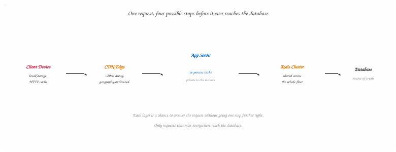
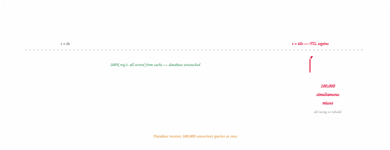
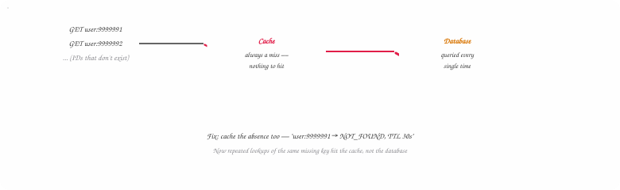

## Introduction — Why 10,000× Matters

The motivation for caching comes down to one uncomfortable number. Accessing data from a
disk-backed database — even a fast SSD, even over a fast network — takes roughly 1
millisecond end to end. Accessing the same data from RAM takes about 100 nanoseconds. That's
approximately **10,000 times faster**.

That gap sounds academic until you think about it at scale. At 10,000 requests per second, a
system that saves 1ms per request saves 10 seconds of aggregate wait time *every second*.
The math compounds quickly, and so do the freed-up database connections, the reduced query
load, the I/O contention that never happens.

A cache keeps copies of frequently accessed data in a faster layer — usually memory — so
your system doesn't reach all the way back to the source on every request. The first request
pays full price. Everyone after gets the discount.

| | |
| --- | --- |
| **~100ns** | Typical RAM Access |
| **~1ms** | Typical DB Round-Trip |
| **10,000×** | Approximate Speedup |
| **10s** | Saved Per Second at 10K req/s |

> **💡 Interview Tip**
>
> The 10,000× figure compares a full database round-trip — network hop, query planning,
> serialization — against raw memory access latency. It's not a perfectly clean physics
> comparison, but the direction and order of magnitude are right, and that's all the number
> needs to do: justify why a cache is worth the added complexity in the first place.

## Where Caching Actually Lives

Caching isn't a single thing you attach to a system — it exists at several distinct layers,
each solving a different problem, each with its own tradeoff.

- **External** — Redis or Memcached, shared across your whole fleet. One fetch benefits every server.
- **In-Process** — Lives inside the app's own memory. No network hop, but private to that one instance.
- **CDN** — Caching for geography, not speed of storage. Solves the speed-of-light problem.
- **Client-Side** — On the user's device. Nothing is faster than data that never leaves it.

**External caching** is the most common form. A dedicated service like Redis runs separately
from your application and database. Your app checks it first on every read — hit, return
immediately; miss, query the database, store the result, return it. What makes it powerful
at scale is the shared view: fifty application servers talking to the same Redis cluster
means once *any* server fetches a piece of data, every other server benefits immediately.

**In-process caching** is overlooked more than it deserves. Nothing stops you from using a
slice of your application's own memory to cache data directly — no network hop, no
serialization. The obvious tradeoff: each server has its own private copy. If server A
caches a value, servers B through Z don't see it, which creates fleet-wide inconsistency. It
shines for data every request needs, that rarely changes, and needs the absolute lowest
latency — config tables, feature flags, small lookup sets.

**CDNs** solve a different problem entirely: not memory-vs-disk, but the speed of light. A
user in Sydney requesting a file stored in Virginia waits 300–350ms on round-trip alone,
before any work happens. A CDN places edge servers close to users, so that same request
might hit a server 20ms away instead of 16,000km away. Modern CDNs cache more than static
media — API responses, HTML, even edge logic — but the core win is always distance.

**Client-side caching** stores data directly on the user's device — browser HTTP cache,
local storage, on-device mobile storage. Nothing beats data that never leaves the device.
The cost is control: once data is on someone's phone, freshness and invalidation become
genuinely hard. This layer matters most for offline-first systems — a fitness app recording
a workout locally and syncing later.



*Figure 1 — Diagram 1 — Where Caching Lives, Request by Request*

A request checks client storage, then a CDN edge, then the app's in-process cache, then a shared Redis cluster — and only touches the database if all four miss.

## How Reads & Writes Flow Through a Cache

Four architectures define how reads and writes touch the cache. They're usually presented as
four alternatives — in practice, treat them as two independent choices: one pattern for
reads, one for writes. Most production systems mix them.

### Cache-Aside (the default for reads)

The application checks the cache first. Hit — return immediately. Miss — query the database,
write the result into the cache, return to the caller. Lazy and effective: only data that's
actually been requested ever ends up cached, so there's no risk of filling memory with data
nobody asked for.

**Java — Cache-Aside**

```java
String getUser(String id) {
    String cached = redis.get("user:" + id);
    if (cached != null) {
        return cached;              // hit — one round trip
    }
    String fromDb = db.query("SELECT ... WHERE id = ?", id);
    redis.set("user:" + id, fromDb, Duration.ofMinutes(10));
    return fromDb;                  // miss — two round trips
}
```

### Write-Through (strong consistency on writes)

On every write, the app writes to the cache first, and the cache synchronously persists to
the database before the write is considered complete. Reads always see fresh data — no
window where cache and database disagree — but writes are slower, and the cache fills with
everything written, not just what's read.

**Java — Write-Through**

```java
void updateUser(String id, User user) {
    redis.set("user:" + id, user);
    db.save(user);   // must succeed too — write isn't "done" until both land
    // dual-write problem: if this line throws, cache and DB now disagree
}
```

### Write-Behind (fast writes, deferred persistence)

Similar to write-through, but the database write is deferred. The app writes to the cache;
the cache flushes to the database asynchronously, usually batched. Writes are fast because
nothing waits on the database — but if the cache crashes before flushing, in-memory-only
writes are gone. Fits analytics pipelines and activity logs, where some loss is tolerable.

**Java — Write-Behind (conceptual)**

```java
void recordEvent(Event e) {
    redis.rpush("pending-writes", e);   // returns immediately
}
// separate background job, running every few seconds:
void flushBatch() {
    List<Event> batch = redis.lrange("pending-writes", 0, 999);
    db.batchInsert(batch);
    redis.ltrim("pending-writes", batch.size(), -1);
}
```

### Read-Through (the cache owns the miss)

The cache handles the database lookup itself instead of delegating back to the application.
On a miss, the cache fetches, stores, and returns the data directly — the app just asks and
trusts the cache to figure out the rest. This is the model CDNs follow. For
application-level caching it needs a library sophisticated enough to know how to speak to
your database, rather than vanilla Redis.


*Figure 2 — Diagram 2 — Reads vs. Writes: Two Independent Choices*

Cache-aside reads paired with write-through writes is one of the most common production combinations — lazy population on the read side, strong consistency on the write side.

> **⚠️ Watch Out**
>
> Write-through's dual-write problem is real: if the cache write succeeds and the database
> write fails (or vice versa), the two stores now disagree, and you need retry logic
> sophisticated enough to recover — or you accept the small inconsistency window and rely on a
> short TTL to bound it. There's no version of write-through that makes this problem
> disappear; it only manages it.

## Eviction — The Art of Forgetting

Memory is finite. When the cache fills up, something has to go. The eviction policy decides
what.

- **LRU** — Evicts what hasn't been touched in the longest time. The sensible default.
- **LFU** — Evicts by access count, not recency. Wins on skewed access patterns.
- **FIFO** — Evicts whatever arrived first. Simple, and almost never the right choice.
- **TTL** — Not eviction by size — a freshness guarantee. Pairs with LRU, doesn't replace it.

**Least Recently Used (LRU)** evicts the item that hasn't been accessed in the longest time.
The intuition holds: if you haven't needed something recently, you probably need it less
than what you've been actively reading. It's the most widely deployed policy and the right
default for most workloads.

**Least Frequently Used (LFU)** evicts by access count rather than recency — an item
accessed once three seconds ago is more eviction-worthy than one accessed a thousand times
but not in the last minute. LFU tends to beat LRU when a small fraction of keys account for
the overwhelming majority of reads.

**First In, First Out (FIFO)** removes whatever's been in the cache longest, regardless of
recency or frequency. Simple to implement, and almost never the right choice — age alone
says very little about usefulness.

**Time to Live (TTL)** isn't really an eviction policy — it's a freshness guarantee. Each
item expires after a set duration, regardless of how recently it was accessed. TTL typically
runs alongside LRU: LRU manages capacity, TTL manages staleness. For anything time-sensitive
— session tokens, personalized feeds — TTL is essential.

An LRU cache needs O(1) `get` and `put`, which means a hash map for lookup paired with a
doubly linked list for ordering — the map gives instant access to a node, the list keeps
track of what's most and least recent without any scanning.

**Java — O(1) LRU Cache**

```java
public class LRUCache {

    // Doubly linked list node. HEAD side = most recent, TAIL side = least recent.
    private static class Node {
        int key, value;
        Node prev, next;
        Node(int key, int value) { this.key = key; this.value = value; }
    }

    private final int capacity;
    private final Node head = new Node(0, 0);   // dummy, never holds real data
    private final Node tail = new Node(0, 0);   // dummy, never holds real data
    private final HashMap<Integer, Node> map = new HashMap<>();

    public LRUCache(int capacity) {
        this.capacity = capacity;
        head.next = tail;
        tail.prev = head;
    }

    public int get(int key) {
        Node node = map.get(key);
        if (node == null) return -1;
        moveToFront(node);          // touching a key marks it most-recent
        return node.value;
    }

    public void put(int key, int value) {
        Node existing = map.get(key);
        if (existing != null) {
            existing.value = value;
            moveToFront(existing);
            return;
        }
        Node fresh = new Node(key, value);
        map.put(key, fresh);
        addToFront(fresh);
        if (map.size() > capacity) {
            Node lru = tail.prev;        // node just before TAIL is always least-recent
            remove(lru);
            map.remove(lru.key);
        }
    }

    private void addToFront(Node n) {
        n.prev = head; n.next = head.next;
        head.next.prev = n; head.next = n;
    }

    private void remove(Node n) {
        n.prev.next = n.next; n.next.prev = n.prev;
    }

    private void moveToFront(Node n) { remove(n); addToFront(n); }
}
```

> **⚠️ A Note on the Source Material**
>
> The original walkthrough of this exact structure declared two top-level classes named
> `LRUCache` in the same file — a demo class with a `main` method reusing the real class's
> name, which doesn't compile. The version above nests `Node` as a private static inner class
> and keeps everything under a single public class, which is both correct Java and closer to
> how you'd actually ship this.

## Failure Mode 1 — The Thundering Herd

There's a famous line: "There are only two hard problems in computer science: cache
invalidation and naming things." The second one is a joke. The first one is not.

Consider a popular homepage feed cached with a 60-second TTL, serving 100,000 requests per
second. For 59 seconds, everything is smooth — every request hits the cache, the database
barely notices. Then the TTL expires. In the next instant, every in-flight request finds the
cache empty and races to rebuild it. **One hundred thousand cache misses hit the database
simultaneously**. The thing you built to protect the database just handed it a
hundred-thousand-request spike.

It's a specific kind of irony: the more effective your cache was at absorbing traffic, the
worse the stampede when it expires. A high hit rate means more requests silently depending
on that one cached value — and more requests racing to rebuild it the moment it's gone.



*Figure 3 — Diagram 3 — Thundering Herd at TTL Expiry*

Fifty-nine seconds of calm, then every request hits an empty cache in the same instant — the database absorbs the full spike the cache was supposed to prevent.

Two approaches address it, and they compose well together.

### Request Coalescing ("Single Flight")

Only one request is allowed to rebuild a given cache key at a time. Every other request for
that same key waits and reads from the cache once it's been repopulated, instead of
independently hitting the database.

**Java — Single Flight (conceptual)**

```java
ConcurrentHashMap<String, CompletableFuture<String>> inFlight = new ConcurrentHashMap<>();

String getWithCoalescing(String key) {
    String cached = redis.get(key);
    if (cached != null) return cached;

    // computeIfAbsent is atomic — only the first caller actually rebuilds
    CompletableFuture<String> future = inFlight.computeIfAbsent(key, k ->
        CompletableFuture.supplyAsync(() -> {
            String fresh = db.query(key);
            redis.set(key, fresh, Duration.ofSeconds(60));
            return fresh;
        })
    );
    try {
        return future.get();          // every other caller just waits here
    } finally {
        inFlight.remove(key, future);
    }
}
```

### Cache Warming (Refresh Before Expiry)

Rather than letting a key expire, proactively refresh it just before the deadline. At the
55-second mark, kick off a background refresh for a 60-second TTL. From the perspective of
any request, the key never actually expires.

> **💡 Interview Tip**
>
> Volunteer both fixes and explain the difference in intent: single-flight limits the *damage*
> of an expiry (only one query gets through instead of 100,000); cache warming tries to
> *prevent the expiry from being visible at all*. Production systems often run both — warming
> as the primary defense, single-flight as the safety net for keys warming didn't catch in
> time.

## Failure Mode 2 — Consistency & Staleness

The cache and the database are two separate stores. Any time you write to one and read from
the other, there's a window where they disagree.

A user updates their profile picture. The database gets the new image immediately. The cache
still holds the old one. For the next few minutes — however long the TTL is — anyone reading
that profile sees the old photo. This is stale data, and it's the *normal operating
condition* of any cache-aside system, not a bug.

How much this matters depends entirely on what the data is. A news feed that's stale for 60
seconds is fine. A bank balance that's stale for 60 seconds is not. The right response isn't
to avoid caching things that change — it's to be deliberate about the tradeoff.

- **Invalidation on write** — the aggressive option. When the database updates, immediately delete the corresponding cache key. The next read misses and fetches fresh data. More complex (you're coordinating two operations on every write) but keeps the inconsistency window as small as it can be.
- **Short TTLs** — the passive option. Accept the cache will be stale for a bounded period, and set that period to something the system can actually tolerate. Works well when a brief delay is genuinely harmless.
- **Eventual consistency** — explicitly acknowledging the system isn't strongly consistent, and that's fine. For most user-facing data, a few seconds of staleness is invisible to the person experiencing it. This is an architectural choice, not a shortcut.

> **⚠️ Watch Out**
>
> Never let "we have a cache" become the default answer for data where staleness has a dollar
> cost — account balances, inventory counts near zero, anything feeding a fraud or compliance
> decision. For that class of data, either invalidate on write with a tight SLA, or don't
> cache it at all and accept the latency cost.

## Failure Mode 3 — Hot Keys

A cache does a good job distributing load across many keys. What it doesn't solve is a
single key that receives a disproportionate share of all traffic.

A celebrity posts something significant. Their profile key goes from a few hundred reads per
second to a few million. That key lives on one Redis node. The rest of the cluster is fine.
**That one node is on fire.** The cache hit rate across the system looks great — the p99
latency on requests for that one profile is falling apart.


*Figure 4 — Diagram 4 — One Key, One Overloaded Node*

Cluster-wide hit rate stays high the entire time — the metric that looks fine is hiding exactly where the fire is.

Two approaches help.

- **Replicate hot keys** across multiple cache nodes so reads distribute instead of all landing on one — a small pool of read replicas just for the handful of keys that need it.
- **Pull the hottest keys into in-process caches** on each application server, so the most extreme traffic never reaches Redis at all — trading a little staleness for removing the bottleneck entirely.

> **💡 Takeaway**
>
> Hot keys are a reminder that caching improves aggregate throughput but doesn't eliminate the
> concept of a bottleneck — it just moves it somewhere new. Cluster-wide metrics (average hit
> rate, average latency) will actively hide a hot key problem; you need per-key or per-shard
> visibility to catch this before p99 users notice.

## Failure Mode 4 — Cache Penetration

Thundering herd and hot keys both involve keys that exist. Cache penetration is different:
repeated requests for keys that **don't exist in the database at all**. A cache can only
return a hit for something it's stored, and it never stores a value for a lookup that came
back empty — so every request for a nonexistent ID sails straight past the cache and hits
the database, every single time.

This is a common attack vector, not just an edge case: an attacker who wants to bypass your
cache entirely can simply request random, non-existent user IDs in a loop. Every request is
a guaranteed cache miss and a guaranteed database query.



*Figure 5 — Diagram 5 — Cache Penetration: Every Request Skips the Cache*

Nonexistent keys defeat a normal cache by design — there was never a value to store. Negative caching closes that gap.

### The Fix: Negative Caching

Cache the absence, not just the presence. When a lookup comes back empty, store a
short-lived sentinel value — `NOT_FOUND` — so the next request for that same missing key
hits the cache instead of the database.

**Java — Negative Caching**

```java
String getUser(String id) {
    String cached = redis.get("user:" + id);
    if (cached != null) {
        return cached.equals("__NOT_FOUND__") ? null : cached;
    }
    String fromDb = db.query("SELECT ... WHERE id = ?", id);
    if (fromDb == null) {
        // short TTL — a legitimately new user shouldn't stay "not found" for long
        redis.set("user:" + id, "__NOT_FOUND__", Duration.ofSeconds(30));
        return null;
    }
    redis.set("user:" + id, fromDb, Duration.ofMinutes(10));
    return fromDb;
}
```

> ### Deep Dive: Bloom Filters — Negative Caching Without Storing Every Key +
>
> Negative caching one key at a time works, but a wide enough attack (millions of distinct
> fake IDs) still fills Redis with millions of `NOT_FOUND` entries. A **Bloom filter** solves
> this more cheaply: a compact probabilistic structure that answers "might this key exist?"
> using a fraction of the memory a real key set would need. It can never produce a false
> negative — if it says "definitely not present," it's right — but it can produce rare false
> positives.
>
> Placed in front of the cache, a Bloom filter lets you reject impossible lookups instantly,
> before they even become a cache miss: check the filter first, and if it says "definitely not
> present," skip both the cache and the database entirely. This is the standard defense
> large-scale systems use against penetration attacks, layered on top of — not instead of —
> negative caching for the keys that do pass through.

## Back-of-Envelope: Sizing a Cache

"How big should the cache be?" is a question interviewers ask precisely because it forces
you to connect hit rate, working set, and memory cost instead of reciting definitions.

**Estimate — User Profile Cache**

```text
// Inputs
Daily active users:        20,000,000
Avg profile object size:   2 KB
Target hit rate:           90%
Read traffic:               50,000 req/s

// Working set: how many distinct profiles get read on a typical day
// Assume 80/20 skew — 20% of DAU account for 80% of reads
Hot working set  ≈ 20,000,000 × 20%  = 4,000,000 profiles

// Memory needed to hold that working set
4,000,000 × 2 KB  = 8,000,000 KB  ≈ 7.6 GB

// Add ~30% overhead for Redis key metadata, hash structures, replication buffer
7.6 GB × 1.3  ≈ 10 GB   // realistic cluster sizing target

// Database queries avoided per second at 90% hit rate
50,000 req/s × 90%  = 45,000 req/s absorbed by the cache
50,000 req/s × 10%  =  5,000 req/s still reaching the database
```

The number that actually matters for the sizing conversation isn't "how much data exists" —
it's **the working set**, the slice of data that gets read often enough to be worth keeping
warm. Caching 100% of a dataset is rarely the goal; caching the 20% that drives 80% of reads
usually gets you 90%+ of the benefit at a fraction of the memory cost.

> **💡 Interview Tip**
>
> When asked to size a cache, state your assumptions out loud before computing anything — DAU,
> object size, access skew, target hit rate. The number itself matters less than showing you
> know which four or five inputs actually determine it. If the interviewer pushes on your skew
> assumption, that's a signal to talk about instrumenting real hit-rate metrics rather than
> guessing forever.

## The Real Decision — Speed vs. Consistency vs. Complexity

Every caching decision is really a three-way tradeoff, and the honest answer to "should I
add a cache here?" is never just yes or no.

| You Optimize For | You Give Up | Typical Choice |
| --- | --- | --- |
| Maximum speed | Freshness guarantees | Longer TTL, cache-aside reads, tolerate staleness |
| Strong consistency | Write latency, added failure modes | Write-through + invalidation on write |
| Operational simplicity | Some performance headroom | Short TTL cache-aside, skip write-through entirely |

The failure modes covered above — thundering herd, staleness, hot keys, penetration — aren't
reasons to avoid caching. They're the cost of admission for the 10,000× speedup. The
engineering job is choosing which of them you can tolerate and building the specific, narrow
mitigation for the ones you can't.

## Interview Essentials & Level Expectations

Caching questions scale from "what's the difference between LRU and LFU" to "design the
caching layer for a global e-commerce checkout with regional data residency requirements."
Here's what's typically expected at each level.

- **Mid-Level (E4)** *(80% Concepts · 20% Ops)* — Know the Vocabulary Explain what a cache is and why it's faster than a database. Know cache-aside at a basic level. Name LRU as an eviction policy and explain the intuition. Recognize that caches can go stale.
- **Senior (E5)** *(50% Design · 50% Depth)* — Own the Trade-offs Choose between cache-aside, write-through, and write-behind with justification. Size a cache using working-set math. Explain thundering herd and at least one concrete fix. Diagnose a hot key from lopsided per-node metrics.
- **Staff+ (E6)** *(30% Design · 70% Depth)* — Operate at Scale Design multi-region cache topology with data residency and replication lag in mind. Reason about Bloom filters and negative caching as a penetration defense at scale. Set org-wide standards for TTL policy and invalidation strategy across dozens of services with different consistency needs.

> **💡 Senior Signal**
>
> Volunteer the failure modes before being asked. An interviewer who hears "I'd use
> cache-aside with a 60-second TTL" and nothing else will probe for thundering herd. An
> interviewer who hears "I'd use cache-aside with a 60-second TTL, and I'd add single-flight
> coalescing so expiry doesn't cause a stampede" has already answered the follow-up. That's
> the signal staff-level candidates give without being asked for it.

## Summary

Caching is simple in concept — keep a copy closer, save the round trip — and genuinely hard
in practice, because every mechanism that makes it fast also opens a specific way for it to
fail under load: a stampede at expiry, a stale read after a write, one key melting one node,
or a flood of lookups for things that were never there to begin with.

None of these failure modes are reasons to avoid caching. They're the reason caching is a
system design topic and not a one-line optimization. Name the layer, name the read/write
pattern, name the eviction policy, and — critically — name which failure modes you're
accepting and which you're actively defending against.

| Concept | One-Line Recall |
| --- | --- |
| Cache-Aside | App checks cache, queries DB on miss, writes result back — the default read pattern |
| Write-Through | Synchronous cache + DB write; always fresh, slower, dual-write risk |
| Write-Behind | Fast async write, batched to DB later; risk of loss on crash before flush |
| LRU Eviction | Evict least-recently-used; O(1) via hash map + doubly linked list |
| Thundering Herd | Mass simultaneous misses at TTL expiry; fixed with single-flight or warming |
| Hot Key | One key overloads one node; cluster-wide metrics hide it — check per-key |
| Cache Penetration | Requests for nonexistent keys always miss; fixed with negative caching / Bloom filters |
| Working Set | The slice of data worth keeping warm — usually far smaller than total data size |

> **💡 Final Thought**
>
> A cache that's never failed under load hasn't been tested by load yet. The engineers who
> reason well about caching aren't the ones who've memorized the four architecture patterns —
> they're the ones who've watched a TTL expire at the worst possible moment and built the
> single-flight guard afterward. This article is meant to get you that instinct without the
> incident.

> **Source**
>
> This is an expanded, diagram-illustrated edition of a shorter piece originally published on
> [Medium](https://medium.com/@ajay.kotnalajpr/the-hidden-complexity-of-caching-7b075a9db920)
> — this version corrects the LRU code sample, and adds cache penetration, back-of-envelope
> sizing, and the level-expectation breakdown.
