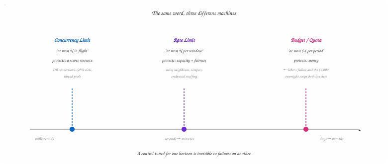
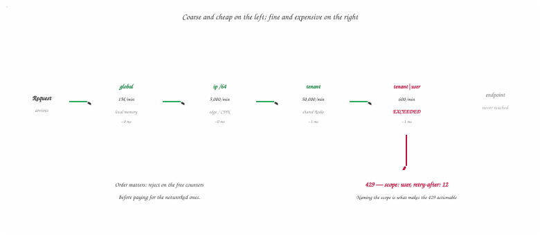
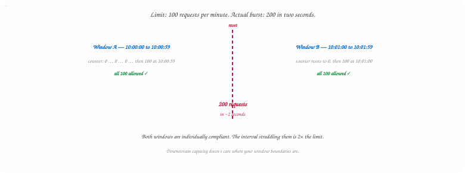
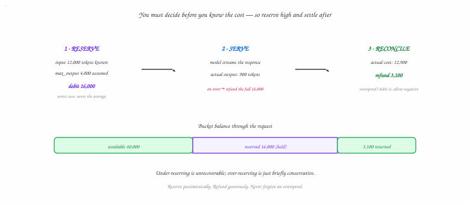
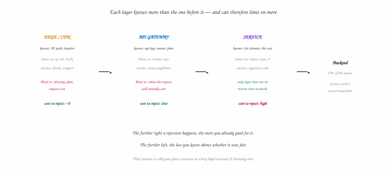
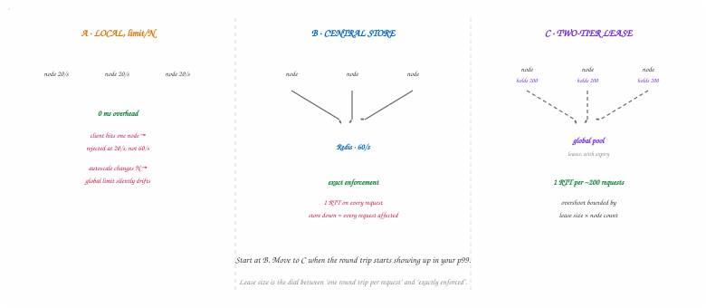
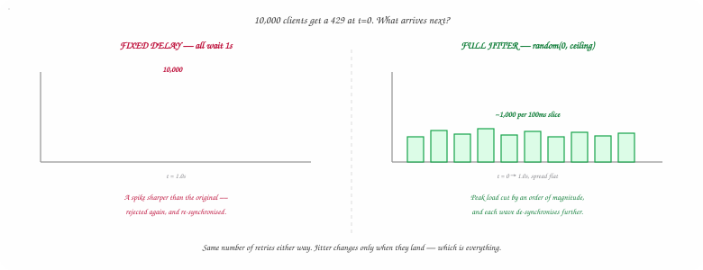
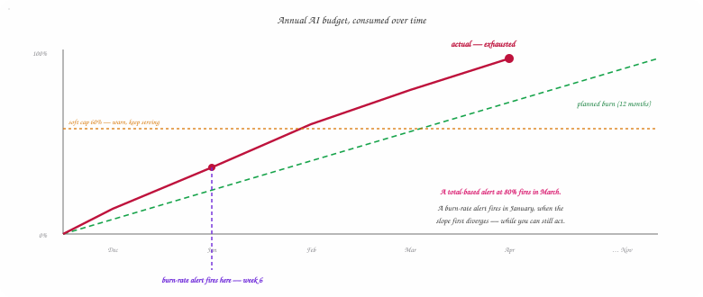

## The $6,000 Night — and Why It Wasn't a Rate Limit Problem

In December 2025, Uber rolled out Claude Code to roughly five thousand engineers. By April
2026 — four months in — the company had spent its entire annual AI budget.

The interesting part isn't the number. It's the mechanism. Engineers were ranked on internal
leaderboards by how much they used the tool. Typical monthly spend landed somewhere between
$150 and $250 per engineer; the heaviest users cleared $500, and some reached $2,000. Nobody
was abusing anything. Everyone was doing exactly what the incentive structure asked them to
do.

The second story is smaller and sharper. A developer wired up an automated script to check
for updates every thirty minutes. It ran unattended overnight. By morning it had generated a
**$6,000 bill**.

| | |
| --- | --- |
| **5,000** | Engineers Onboarded |
| **4 mo** | To Exhaust an Annual Budget |
| **$2,000** | Peak Monthly, Single User |
| **$6,000** | One Unattended Script, One Night |

The standard reading of these stories is "they needed rate limiting." That reading is half
right, and the half that's wrong is the more interesting half.

Consider the script. Every thirty minutes is *two requests per hour*. There is no rate
limiter on earth configured tightly enough to reject two requests per hour. A token bucket
at 100 requests per minute would have waved it through all night and never logged a single
rejection. The request rate was never the problem — the **cost per request** was, and
request counters are blind to cost.

Now consider Uber. Five thousand engineers spending $200 a month each is a perfectly healthy
request rate. No individual engineer was bursting. No endpoint was hot. The system was
operating exactly within spec at every instant, and still walked off a cliff — because the
thing being exceeded was a **budget measured in months**, and rate limiters measure in
seconds.

> **💡 The Reframe**
>
> "Rate limiting" is a family of controls operating over wildly different time horizons, on
> wildly different units. A concurrency limiter protects a resource over milliseconds. A rate
> limiter protects capacity over seconds. A quota protects money over a month. They are not
> interchangeable, and the algorithm you pick is downstream of choosing the right one. Both
> Uber stories are budget failures wearing a rate-limiting costume. We'll build the rate
> limiter properly first — and then, in section 11, build the thing that would actually have
> stopped them.



*Figure 1 — Diagram 1 — Three Control Loops, Three Time Horizons*

Two requests per hour is a perfectly legal rate and a catastrophic spend. The counter you install determines which failures you can even see.

## Five Controls That All Get Called "Rate Limiting"

Before choosing an algorithm, choose the control. These five get conflated constantly, and
picking the wrong one means solving a problem you don't have.

| Control | Question It Answers | Unit | Reach For It When |
| --- | --- | --- | --- |
| **Rate limiting** | How many, per unit time? | requests / window | You need fairness between tenants and protection from abuse |
| **Concurrency limiting** | How many at once? | in-flight requests | The bottleneck is a finite resource — connections, GPUs, memory |
| **Load shedding** | Are we drowning right now? | observed health signal | You need to survive overload regardless of who caused it |
| **Throttling** | Can we slow it down instead of dropping? | added delay | Latency is cheaper than failure for the caller (batch, async) |
| **Quota / budget** | How much total, this period? | tokens, dollars, rows | The scarce thing is cumulative, not instantaneous |

The distinction between the first two is worth an extra paragraph, because it's where most
designs go wrong. They're linked by **Little's Law**: the average number of items in a
system equals arrival rate multiplied by average time in system, `L = λW`. If you rate-limit
a service to 100 requests per second and each request takes 200 milliseconds, the
steady-state concurrency is 100 × 0.2 = 20 in flight. That's the number your connection pool
actually has to survive.

The trap is that *W is not a constant*. When the downstream slows to 2 seconds per request,
the same 100 req/s rate limit now implies 200 concurrent requests. Your rate limiter is
still happily saying yes while your connection pool is on fire. A rate limit bounds
arrivals; it does not bound occupancy. If what you're protecting is a fixed pool of
anything, limit concurrency directly — a semaphore, a bulkhead, a bounded queue — and let
the rate limit handle fairness separately.

> **⚠️ Watch Out**
>
> This is exactly the shape of an LLM inference backend. A GPU can serve a bounded number of
> concurrent sequences; a request can take 800ms or 80 seconds depending on output length.
> Rate limiting alone will not protect it. You need a concurrency limit at the inference layer
> and a rate limit at the API layer, and they answer different questions.

## The First Real Decision — What You're Counting Against

Every rate limiter is a counter behind a key. Almost every article jumps straight to how the
counter works and skips the key entirely, which is backwards: the key determines what the
limiter can protect and who it hurts when it fires. Get the key wrong and no algorithm saves
you.

| Key | Protects Against | Fails When |
| --- | --- | --- |
| `user_id` | A single authenticated account misbehaving | The attack is pre-auth (login, signup, password reset) |
| `api_key` / `tenant_id` | Noisy neighbours; enforcing plan tiers | One tenant has many legitimate end users behind it |
| `ip` | Unauthenticated abuse, scrapers, credential stuffing | NAT, CGNAT, corporate egress, mobile carriers — see below |
| `endpoint` | One expensive route saturating shared capacity | Used alone — it can't tell who is responsible |
| `global` | Total system capacity, regardless of source | Used alone — one caller can consume everyone's budget |

### The IP problem is worse than it looks

IP-based limiting is the default for unauthenticated traffic and it's a minefield. A single
corporate office, a university, or a mobile carrier's CGNAT pool can put tens of thousands
of legitimate users behind one address. Limit that address to 10 requests per minute and
you've taken down a customer's entire building while a distributed botnet — one request per
IP across 50,000 addresses — sails straight past.

Three practical corrections:

- **For IPv6, key on the prefix, not the address.** A single residential customer is typically handed a /64 or larger. Counting individual IPv6 addresses means an attacker rotates through billions of them for free. Aggregate to the /64, and consider /48 for coarser protection.
- **Never trust a client-supplied header.** `X-Forwarded-For` is a comma-separated list that anyone can prepend to. If your limiter reads the leftmost entry, every attacker gets an unlimited supply of fresh identities by sending a random one. Take the address your own trusted proxy appended — count in from the right, past exactly as many hops as you control.
- **Treat IP as a coarse outer ring, not the real limit.** Set it generously to catch volumetric abuse, and put the tight limits on authenticated identity where collateral damage is bounded.

### Composite and hierarchical keys

Real systems don't pick one key. They evaluate several, and a request must pass all of them.
The usual shape is a hierarchy from coarse to fine:

**Key Hierarchy**

```text
// evaluated in order; first rejection wins
global                          → 1,000,000 req/min   // total capacity
tenant:acme                     →    50,000 req/min   // plan tier
tenant:acme|user:u_8812         →       600 req/min   // per-seat fairness
tenant:acme|endpoint:/v1/export →        60 req/min   // expensive route
ip:203.0.113.0/24               →     5,000 req/min   // coarse abuse ring
```

Two design notes that matter more than they look. First, evaluate **cheapest and
most-likely-to-reject first** — a global counter in local memory costs nothing, and
rejecting there saves you four network round trips. Second, when a request fails, the
response must say *which* limit it hit. A client that can't tell "you personally are going
too fast" from "your whole organisation is over quota" cannot take the right corrective
action, and will retry into the same wall forever.



*Figure 2 — Diagram 2 — One Request, Five Counters*

A request must pass every gate. Cheap local checks run first so that obvious abuse never costs you a Redis round trip — and the rejection names the scope that actually fired.

## Six Ways to Say No

With the key chosen, the algorithm decides how the counter behaves. Five of these show up in
every interview. The sixth shows up in production systems and almost never in articles.

### 1. Fixed Window Counter

Divide time into fixed windows — say, one minute — and keep a counter per key per window.
Increment on each request; reject above the limit; the counter resets at the boundary. It's
the simplest thing that works, it's a single `INCR` in Redis, and it uses one integer per
key.

Its flaw is the boundary. The limit is enforced per window, not per any minute — so a client
can send its full allowance at the very end of one window and its full allowance at the
start of the next. **The effective burst is twice the limit**, delivered in an arbitrarily
short span across the boundary.



*Figure 3 — Diagram 3 — The Fixed-Window Boundary Problem*

Fixed windows enforce the limit per window, not per any window-length interval — so the worst-case burst is exactly double, and it is trivially reproducible.

### 2. Sliding Window Log

Store the timestamp of every request in a sorted set per key. On each request, evict
everything older than the window and count what remains. This is **exact** — there is no
boundary artefact, because the window genuinely slides with the clock.

You pay for that exactness in memory: O(limit) entries per key, forever, for every key. A
limit of 1,000 requests per minute across 10 million keys is 10 billion timestamps. It also
costs more CPU — every request does a range-delete plus a cardinality check. Use it when the
limit is small and correctness is non-negotiable (payment endpoints, SMS sends), not as a
general-purpose default.

### 3. Sliding Window Counter

The pragmatic compromise, and the one most large systems land on. Keep only two counters —
the previous window and the current one — and estimate the sliding count by weighting the
previous window by however much of it still overlaps:

**Sliding Window Counter — Estimate**

```text
elapsed  = (now - current_window_start) / window_size   // 0.0 → 1.0
estimate = current_count + previous_count * (1 - elapsed)

// Worked example — limit 100/min, 25% into the current window:
//   previous window saw 80, current window has seen 30 so far
estimate = 30 + 80 * (1 - 0.25) = 30 + 60 = 90   // → allow
// at 10% in, the same traffic estimates 30 + 72 = 102       → reject
```

Two counters per key regardless of limit size, no boundary doubling, and O(1) work per
request. The catch is in the word *estimate*: the formula assumes the previous window's
traffic was spread uniformly. If it was actually one spike at the very start, the estimate
over-counts and you reject traffic you shouldn't; if the spike was at the very end, you
under-count and let a burst through. In practice the error is tiny — Cloudflare, which runs
this approach at very large scale, has published production error rates in the low
thousandths of a percent — and the memory saving is enormous.

### 4. Leaky Bucket — and the distinction almost everyone misses

"Leaky bucket" names *two different algorithms*, and conflating them is the single most
common error in rate-limiting writing.

- **Leaky bucket as a queue.** Requests enter a FIFO queue and are drained at a fixed rate. Overflow is dropped. This *smooths output* — the downstream sees a perfectly constant rate no matter how spiky the input. It also means requests wait, which is a latency cost paid by the caller, and the queue itself becomes a failure surface (see section 9).
- **Leaky bucket as a meter.** No queue at all. A conceptual bucket fills by one unit per request and drains at a fixed rate; if adding a unit would overflow, reject immediately. This version is **mathematically equivalent to a token bucket** — same admission decisions, just counting from the other end. Anyone who says "leaky bucket doesn't allow bursts" is describing the queue variant and applying it to the meter.

### 5. Token Bucket

The workhorse. A bucket holds up to `capacity` tokens and refills at `refill_rate` tokens
per second. Each request removes a token; no token, no service. It permits bursts up to the
bucket's capacity while bounding the long-run average to the refill rate — which matches how
real traffic behaves and why AWS, Stripe, and the major LLM providers all use it.

The implementation trick is that you never run a background timer. You store the token count
and the timestamp of the last refill, and compute the refill lazily on the next request.

**Java — Token Bucket (single node)**

```java
public final class TokenBucket {

    private final double capacity;      // max burst size
    private final double refillPerSec;  // sustained rate

    private double tokens;
    private long   lastRefillNanos;

    public TokenBucket(double capacity, double refillPerSec) {
        this.capacity     = capacity;
        this.refillPerSec = refillPerSec;
        this.tokens       = capacity;          // start full
        this.lastRefillNanos = System.nanoTime();
    }

    public synchronized boolean tryConsume(double cost) {
        refill();
        if (tokens < cost) return false;
        tokens -= cost;
        return true;
    }

    private void refill() {
        long now = System.nanoTime();
        // Multiply first, divide last. Dividing to seconds before
        // multiplying truncates every sub-second gap to zero refill —
        // the bucket silently never refills under fast traffic.
        double earned = (now - lastRefillNanos) * refillPerSec / 1_000_000_000.0;
        tokens = Math.min(capacity, tokens + earned);
        lastRefillNanos = now;
    }
}
```

Note the `cost` parameter rather than a bare `tryConsume()`. That single change is what
turns a request counter into a cost meter, and section 5 is entirely about why you want it.

> **⚠️ Two Tuning Traps**
>
> **Capacity is not the limit.** A bucket of capacity 1,000 refilling at 10/sec permits a
> 1,000-request instantaneous burst. If your downstream can't absorb that, the limit you
> advertised is a fiction. Capacity should be sized to what the *downstream* survives, not to
> what feels generous. **Starting full is a choice.** Initialising every new key's bucket to
> capacity means the first thing any new client can do is burst. For keys that are cheap to
> create — per-IP buckets, for instance — that's a free burst per identity. Start those empty
> or partially filled.

> ### Deep Dive: GCRA — The Sixth Algorithm, and the One Redis Actually Ships +
>
> The **Generic Cell Rate Algorithm** comes from ATM networking and is what `redis-cell`
> implements. It gives you token-bucket semantics while storing *a single timestamp* per key —
> no token count, no last-refill time, one value.
>
> The idea is to track a virtual schedule instead of a balance. Define the emission interval
> `T = period / limit` (at 100/minute, T = 600ms) and a burst tolerance `τ = (burst - 1) × T`.
> Store the **theoretical arrival time** (TAT) — the earliest moment at which a perfectly
> conforming client would be allowed to send its next request.
>
> **GCRA — Complete Logic**
>
> ```text
> if (now < tat - τ) {
>     reject(retryAfter = (tat - τ) - now);   // too early
> } else {
>     tat = Math.max(now, tat) + T;              // advance the schedule
>     allow();
> }
> ```
>
> That's the entire algorithm. It is exact — no estimation error like the sliding window
> counter — uses O(1) memory with the smallest possible constant, and it hands you the exact
> `Retry-After` value for free rather than making you guess it. The trade is conceptual:
> engineers reading the code six months later will recognise a token bucket and will not
> recognise a TAT.
>
> Knowing GCRA is a genuine senior-plus signal in an interview, precisely because it shows
> you've read past the standard five.

### Picking one

| Algorithm | Memory / Key | Bursts? | Accuracy | Use When |
| --- | --- | --- | --- | --- |
| Fixed window | 1 counter | 2× at boundary | Poor | Coarse protection where a 2× burst is harmless |
| Sliding log | O(limit) | No | Exact | Small limits, high stakes — payments, SMS, OTP |
| Sliding counter | 2 counters | No | ~Exact | The default for smooth, memory-cheap enforcement |
| Leaky (queue) | queue depth | Absorbs, delays | Exact output | Downstream needs constant rate and can tolerate latency |
| Token bucket | 2 values | Yes, up to capacity | Exact | The default when bursts are legitimate; cost-weighting |
| GCRA | 1 value | Yes, up to τ | Exact | Token-bucket behaviour at minimum memory; free Retry-After |

> **💡 Interview Tip**
>
> The expected answer is "token bucket if bursts are legitimate, sliding window counter if you
> want smoothing." The answer that lands better is to ask what the limiter is *for* before
> naming one: protecting a fragile downstream argues for smoothing, enforcing a paid plan tier
> argues for bursts, and defending a login endpoint argues for an exact sliding log because
> the limit is 5 and the memory cost is irrelevant.

## Cost-Aware Limiting — When Requests Aren't Equal

Every algorithm above counts requests, and counting requests silently assumes that all
requests cost roughly the same. For a CRUD API that assumption is close enough. For the API
in our opening story it is catastrophically wrong.

One call to an LLM might send 200 tokens and receive 50. Another might send 200,000 tokens
of repository context and stream back 8,000 tokens of generated code. Same endpoint, same
request count, three orders of magnitude of difference in what it consumes. A limiter that
counts requests treats those identically — which is precisely how a script making two
requests per hour produces a $6,000 bill.

### Weight the cost, not the call

The fix is the `cost` parameter from the token bucket above. Instead of removing one token
per request, remove a number of tokens proportional to what the request actually consumes.
The bucket arithmetic is unchanged; only the debit changes.

This is exactly how the major LLM providers structure their limits. Anthropic's API, for
example, enforces several dimensions simultaneously — **requests per minute**, **input
tokens per minute**, and **output tokens per minute** — each as its own
continuously-replenishing bucket. You can be nowhere near your request limit and still get a
429 because you exhausted input tokens. Multi-dimensional limiting is not exotic; it's the
baseline for any API where work per call varies.

### The hard part: you don't know the cost yet

Here's the wrinkle that makes this genuinely difficult, and that almost no treatment of rate
limiting covers. To debit the bucket you need the cost. But at admission time — the moment
you must decide allow or reject — you only know the *input*. The output tokens don't exist
yet. You cannot know what a request costs until after you've served it.

The pattern that resolves this is **reserve-then-reconcile**. At admission, debit a
conservative *estimate*. After completion, settle the difference — refund what you
over-reserved, or debit the shortfall.

**Java — Reserve, Serve, Reconcile**

```java
// 1. RESERVE — before doing any work
long inputTokens = tokenizer.count(request.prompt());
long reserved    = inputTokens + request.maxOutputTokens();  // worst case

if (!bucket.tryConsume(reserved)) {
    throw new RateLimitedException(bucket.retryAfterFor(reserved));
}

Response response;
try {
    // 2. SERVE
    response = model.invoke(request);
} catch (Exception e) {
    bucket.refund(reserved);   // never charge for work that didn't happen
    throw e;
}

// 3. RECONCILE — settle against what it actually cost
long actual = response.usage().inputTokens() + response.usage().outputTokens();
if (actual < reserved) {
    bucket.refund(reserved - actual);        // give back the slack
} else if (actual > reserved) {
    bucket.forceConsume(actual - reserved);  // allowed to go negative
}
```

Three details make or break this. **Reserve the worst case, not the average** — you can
always refund, but you cannot un-serve a request that blew through the budget. **Refund on
failure**, or a downstream outage will burn through a tenant's entire quota on requests that
returned nothing. And **let the bucket go negative** on reconciliation: an overspend must be
repaid out of future allowance, not silently forgiven, or a client that consistently
underestimates gets a permanently free lunch.



*Figure 4 — Diagram 4 — Reserve, Serve, Reconcile*

Reserve-then-reconcile is what makes rate limiting work for variable-cost APIs. It's also the mechanism a spend ledger needs, which is where section 11 picks the thread back up.

> **💡 Senior Signal**
>
> In any interview involving an AI, media, or analytics API, volunteering "requests are the
> wrong unit here — I'd weight the bucket by tokens or bytes and reserve-then-reconcile
> because output size isn't known at admission" moves the conversation two levels up
> instantly. It's the difference between reciting algorithms and understanding what they're
> counting.

## Where the Limiter Lives

A rate limiter isn't one component in one place. Real systems put counters at several
layers, and each layer catches a class of problem the others structurally cannot.

- **Edge / CDN** — Stops volumetric floods before they cost you bandwidth. Coarse keys only — it has no idea who the user is.
- **API Gateway** — Knows the API key and plan tier. The natural home for per-tenant quotas and contract enforcement.
- **Service Middleware** — The only layer that knows what a request actually costs. Where cost-aware limiting has to live.
- **Sidecar / Mesh** — Uniform policy across polyglot services without every team reimplementing it.

**The edge** sees traffic before it costs you anything downstream, which makes it the right
place to absorb volumetric attacks. It's also blind: it has no user identity, no plan tier,
and no idea whether `/v1/export` is a thousand times more expensive than `/v1/ping`. Keep
its rules coarse and generous.

**The gateway** is where authentication has happened, so it knows the tenant and the plan.
This is where "Pro tier gets 10,000 requests per minute" belongs — it's a commercial
contract, and it should be enforced in one place rather than reimplemented by every service.

**Service middleware** is the only layer with the domain knowledge to weight cost. The
gateway cannot know that this particular export will scan 40 million rows; the service can.
Anything involving reserve-then-reconcile necessarily lives here, because only the service
sees the completion.

The important consequence: these are not alternatives, and each one's limit means something
different. Layering is the point. An attacker who slips past the edge still meets the tenant
quota; a legitimate tenant within quota still meets the per-endpoint cost limit.



*Figure 5 — Diagram 5 — Layers of Defence, and What Each One Can See*

Cheap-but-blind on the left, expensive-but-informed on the right. Defence in depth here is not belt-and-braces — each layer is limiting on a dimension the others genuinely cannot see.

## Going Distributed — The Part Everyone Waves At

Everything so far assumed one counter. In production you have fifty API servers behind a
load balancer, and "the counter" has to mean something coherent across all of them. This is
where most rate-limiting articles say "put it in Redis" and stop. There are four real
options, and the tradeoff is the same one every distributed system makes: accuracy versus
latency versus availability.

### Option 1 — Local counters, limit divided by N

Give each of your N servers a limit of `limit / N` and never coordinate. Zero latency, zero
shared infrastructure, trivially available.

It is also wrong nearly all the time. It assumes traffic distributes perfectly evenly across
servers, and it doesn't — sticky sessions, connection reuse, keep-alive, and unlucky hashing
all mean a given client's requests concentrate on a subset of nodes. A client sending
exactly the allowed rate gets rejected because its requests happened to land on three nodes
instead of fifty. And the fleet size N changes every time you autoscale, so the effective
global limit silently drifts with your capacity.

### Option 2 — Centralised store (the Redis answer)

One shared Redis, every server reads and writes the same counter. Accurate, simple, and what
most teams should start with.

The costs are real, though. You've added a network round trip to the hot path of every
single request — typically sub-millisecond in-datacentre, but it is now in your p99 and it
is a hard floor on your latency. You've created a component whose failure affects every
request (section 9 is about what you do then). And at very high request rates the limiter
itself becomes a throughput problem, since every request in the fleet touches the same small
set of keys.

### Option 3 — Two-tier leases (what large systems actually do)

The pattern that resolves the tension: each node keeps a local bucket, and periodically
*leases* a block of capacity from the global pool rather than checking in per request.

A node with 200 locally-held tokens serves 200 requests with zero network calls, then goes
back for more. The global store sees one round trip per few hundred requests instead of one
per request. Common requests take the fast path; the shared store handles bookkeeping, not
traffic.

The subtleties are worth stating plainly. Leases must **expire** — a node that crashes
holding 200 tokens must not remove them from the pool forever. Lease size is a direct
accuracy dial: bigger leases mean fewer round trips and looser global enforcement, because
up to `lease_size × node_count` tokens can be held outside the pool at any instant. And
nodes should **return unused capacity** when traffic drops, or an idle node hoards allowance
that a busy one needs.

### Option 4 — Asynchronous gossip

Each node counts locally and broadcasts its counts periodically; every node sums what it has
heard. Nothing blocks on the network. Enforcement is eventually consistent and always
slightly behind reality, with the lag bounded by the broadcast interval. Appropriate at edge
scale where a centralised store is geographically impossible and approximate enforcement is
genuinely fine.

| Approach | Added Latency | Accuracy | Survives Store Outage? | Fits |
| --- | --- | --- | --- | --- |
| Local, limit/N | None | Poor under uneven load | Yes | Coarse global caps where precision doesn't matter |
| Central store | 1 RTT per request | Exact | No | The right starting point for most systems |
| Two-tier lease | 1 RTT per lease | Bounded overshoot | Degrades gracefully | High throughput with tight latency budgets |
| Async gossip | None | Eventually consistent | Yes | Global edge networks; approximate is acceptable |



*Figure 6 — Diagram 6 — Three Coordination Models*

Lease size is the whole tradeoff in one number: larger leases buy latency at the cost of a bounded, predictable overshoot of the global limit.

> **⚠️ Whose Clock?**
>
> Every algorithm here depends on time, and in a distributed system there is no single clock.
> Application servers drift; two nodes can disagree by seconds. A window computed from a fast
> node's clock rolls over early and hands out a free window. Take the timestamp from the
> shared store instead — `redis.call('TIME')` inside the script — so every node reads the same
> clock and skew disappears from the problem. The alternative, passing the caller's timestamp
> in as an argument, keeps scripts deterministic and easily testable but reintroduces skew.
> Either is defensible; picking without noticing the tradeoff is not.

## Atomicity — Where Limiters Actually Break

Here's the bug that ships in most first implementations. It passes every test, works
perfectly in staging, and fails silently under exactly the load it was built to stop.

**Java — The Race Everyone Writes First**

```java
long count = Long.parseLong(redis.get(key));   // ① READ
if (count >= limit) {
    return REJECT;
}
redis.incr(key);                                  // ② WRITE
return ALLOW;
```

Between ① and ② there is a window. Under concurrency, fifty threads across ten servers all
read `count = 99` against a limit of 100, all conclude they're under the limit, and all
proceed. The counter ends at 149 and 50 requests got through that shouldn't have. The
limiter didn't fail loudly — it just quietly stopped being a limiter at precisely the moment
it mattered.

### Why MULTI/EXEC doesn't fix it

The instinctive reach is a Redis transaction. It doesn't help, and understanding why is the
actual lesson. `MULTI` / `EXEC` queues commands and runs them without other clients
interleaving — so the *write* is atomic. What it cannot do is **branch on an intermediate
result**. Inside a transaction the replies aren't available until `EXEC` returns, so there
is no way to express "read the count, and only increment if it's below the limit." The
read-decide-write cycle, which is the whole algorithm, spans the transaction boundary.

`WATCH` gives you optimistic locking — abort the transaction if the key changed — but that
converts the race into a retry loop, and under exactly the contention you care about, those
retries are heaviest when you can least afford them.

### The fix: move the logic to the data

A Lua script runs on the Redis server as a single atomic unit. Read, decide, and write all
happen with nothing interleaving, and it's one round trip instead of two.

**Lua — Atomic Token Bucket (Redis)**

```bash
-- KEYS[1] = bucket key
-- ARGV[1] = capacity   ARGV[2] = refill per second   ARGV[3] = cost

local capacity = tonumber(ARGV[1])
local rate     = tonumber(ARGV[2])
local cost     = tonumber(ARGV[3])

-- Server clock: every node agrees, so clock skew cannot open a free window
local t   = redis.call('TIME')
local now = tonumber(t[1]) + tonumber(t[2]) / 1000000

local state  = redis.call('HMGET', KEYS[1], 'tokens', 'ts')
local tokens = tonumber(state[1])
local ts     = tonumber(state[2])

if tokens == nil then            -- first request for this key
  tokens = capacity
  ts     = now
end

tokens = math.min(capacity, tokens + (now - ts) * rate)   -- lazy refill

if tokens < cost then
  local waitSec = (cost - tokens) / rate
  redis.call('HSET', KEYS[1], 'tokens', tokens, 'ts', now)
  redis.call('EXPIRE', KEYS[1], math.ceil(capacity / rate) * 2)
  return {0, math.floor(tokens), math.ceil(waitSec)}      -- denied
end

tokens = tokens - cost
redis.call('HSET', KEYS[1], 'tokens', tokens, 'ts', now)
redis.call('EXPIRE', KEYS[1], math.ceil(capacity / rate) * 2)
return {1, math.floor(tokens), 0}                        -- allowed
```

Three things in that script are easy to miss and expensive to omit. The `EXPIRE` on every
path is what stops your limiter from becoming an unbounded memory leak across millions of
one-off keys. The script returns the **remaining tokens and the wait time**, not just a
boolean, because those are exactly what the response headers in section 10 need — and
computing them anywhere else means computing them wrong. And state is written even on the
denied path, so the refill clock keeps advancing.

> **💡 The One-Line Version**
>
> For a plain fixed window you don't need any of this. `INCR` is atomic and returns the
> post-increment value, so `INCR key` followed by `EXPIRE key 60` when the result is 1 gives
> you a correct fixed-window limiter in two commands. It's a genuinely good answer when the
> boundary burst is acceptable — the complexity above is the price of the other algorithms,
> not of rate limiting itself.

One operational note: keep Lua scripts short and non-blocking. Redis is single-threaded, so
a slow script stalls every other client on that node. A limiter script should touch a
handful of keys and return — never iterate a large collection, never call `KEYS`.

## Failure Modes — When the Limiter Is the Outage

You have now added a component that sits in front of every request in your system. It is
worth being deliberate about what happens when it breaks, because "the rate limiter caused
the outage" is a real and embarrassing postmortem.

### Fail open or fail closed?

Redis is unreachable. Every request now needs an answer to a question you cannot compute.
There are exactly two options and no clever third one.

- **Fail open** — allow everything. Your API stays up; your protection is gone. If the store went down *because* of a traffic surge, you have just removed the only thing standing between that surge and your database.
- **Fail closed** — reject everything. Your protection holds; your API is down. A Redis blip becomes a total outage.

The right choice follows from what the limiter is protecting. If it enforces **fairness**
between well-behaved tenants, fail open — a few minutes of unfair-but-functional beats an
outage. If it is the control on something with real consequences — **spend, security, or a
fragile downstream** — fail closed, because the failure you're preventing is worse than the
downtime.

The refinement most systems land on is **fail open with a local fallback**: when the shared
store is unavailable, fall back to per-node in-memory limits set conservatively. You lose
global accuracy and keep a meaningful ceiling. Whichever you choose, make it *explicit
configuration* rather than whatever your exception handler happens to do — and alarm loudly
on entering the degraded path, because a limiter silently failing open is indistinguishable
from a limiter that works right up until it matters.

### Retry storms: how a limiter amplifies the problem it solved

You reject 10,000 requests with a 429. Every client's retry logic fires. If they all wait
exactly one second, all 10,000 come back *at the same instant* — a tighter, more
synchronised spike than the original. Reject again, and the wave repeats, more synchronised
each time. Well-behaved clients with naive backoff produce this; it doesn't take an
attacker.

The fix is jitter, and it belongs in the delay itself rather than being sprinkled on
afterwards. The standard formulation is **full jitter**: sleep a random duration between
zero and the exponentially growing ceiling.

**Java — Full Jitter Backoff**

```java
// Naive — every client retries in lockstep, re-creating the spike
long delay = baseMs * (1L << attempt);

// Full jitter — spreads retries across the whole window
long ceiling = Math.min(maxMs, baseMs * (1L << attempt));
long delay   = ThreadLocalRandom.current().nextLong(ceiling + 1);

// If the server told you when to come back, that wins — but still jitter it,
// or every client that got the same Retry-After returns at the same moment.
if (retryAfterMs > 0) {
    delay = retryAfterMs + ThreadLocalRandom.current().nextLong(1000);
}
```



*Figure 7 — Diagram 7 — Retry Storm, With and Without Jitter*

Identical retry volume, radically different peak. This is why Retry-After should be jittered by the client rather than obeyed to the millisecond by everyone at once.

### The queue of doom

If you chose the queueing variant of leaky bucket, there's a specific trap. When arrivals
exceed the drain rate, the queue grows. Latency grows with it. Requests at the back may wait
past the point where the client already gave up and retried — so you're now doing work whose
result nobody will read, while the retry sits behind it in the same queue.

Google's SRE guidance is blunt about this: under sustained overload, queueing increases
latency without increasing throughput. The mitigations are to **bound the queue** (shed on
overflow rather than growing), attach a **deadline** to each entry and drop anything already
past it, and consider **LIFO** ordering — under overload, the newest request is the one most
likely to still have a caller waiting for it.

### The limiter's own hot key

One tenant generating 80% of your traffic means one Redis key taking 80% of your limiter's
writes. Redis is single-threaded per shard, so that key's shard becomes the bottleneck for
the whole fleet, and since hashing sends a key to exactly one shard, adding shards doesn't
help.

The fix mirrors any hot-key problem: split the key into `N` sub-keys, give each `limit / N`,
and hash the request onto one. You trade a little accuracy — the same uneven-distribution
problem as local counters, but at a much smaller scale — for horizontal headroom.
Alternatively, put the biggest tenants on the two-tier lease path so their traffic stops
touching the shared key at all.

> ### Deep Dive: Client-Side Adaptive Throttling — Rate Limiting From the Other End +
>
> Everything above assumes the server does the limiting. Google's SRE book describes the
> complement: clients that limit *themselves* based on observed rejection rates, so an
> overloaded server stops receiving requests it will only reject.
>
> Each client tracks two rolling counters over a window — `requests` (everything attempted)
> and `accepts` (everything the server actually served) — and drops requests locally with
> probability:
>
> **Adaptive Throttling**
>
> ```text
> p(drop) = max(0, (requests - K * accepts) / (requests + 1))
> // K = 2 is the usual starting point
> ```
>
> While the server accepts everything, `requests ≈ accepts`, the numerator goes negative, and
> the client drops nothing. As rejections climb, `accepts` falls behind, and the drop
> probability rises smoothly — the client throttles itself in proportion to how unwelcome its
> traffic has become, with no coordination and no configuration.
>
> This matters most for internal service-to-service traffic, where you control both ends. It
> turns the rejection signal into something that reduces load rather than merely
> redistributing it, and it's the missing half of most rate-limiting designs.

## The Client's Half of the Contract

A rate limiter that only says "no" is a bad API. The client cannot behave well without
knowing how close it is to the limit, when it may retry, and which limit it hit. Every one
of those is a header.

### Tell them where they stand

The `X-RateLimit-*` family is the long-standing de-facto convention, and the IETF's HTTP API
working group has been standardising an unprefixed `RateLimit-*` form. Either way the
semantics are what matter:

| Header | Meaning | Send It |
| --- | --- | --- |
| `RateLimit-Limit` | The ceiling for the current window | On every response |
| `RateLimit-Remaining` | How much is left before rejection | On every response |
| `RateLimit-Reset` | When the allowance refills | On every response |
| `Retry-After` | Seconds (or a date) to wait before retrying | On 429 and 503 |

Send them on *successful* responses, not just rejections. A client that only learns about
the limit by hitting it can never slow down before it does — which is precisely the
behaviour you wanted. And when you enforce multiple dimensions, report them separately: a
client near its token limit but nowhere near its request limit needs to know which one to
back off on. The major LLM APIs do exactly this, exposing distinct remaining-and-reset
triples per dimension.

### 429 or 503?

They mean different things and clients treat them differently. **429 Too Many Requests**
says "you exceeded your allowance" — the caller is responsible, and backing off will help.
**503 Service Unavailable** says "the service is overloaded" — nothing about this caller was
wrong, and every caller is getting the same answer. Sending 503 for a per-tenant quota
breach makes a well-behaved tenant think you're broken; sending 429 for global overload
makes every caller think they personally did something wrong.

Include a machine-readable body alongside the status. Which limit fired, and what scope it
was on, is not something a client should have to infer:

**HTTP — A 429 a Client Can Act On**

```text
HTTP/1.1 429 Too Many Requests
RateLimit-Limit:      600
RateLimit-Remaining:  0
RateLimit-Reset:      12
Retry-After:          12
Content-Type:         application/json

{
  "error": {
    "type":    "rate_limit_error",
    "scope":   "user",          // not "tenant" — tells them who to fix
    "limit":   "requests_per_minute",
    "message": "600 requests/minute exceeded for user u_8812. Retry in 12s."
  }
}
```

### What a good client does

Three behaviours, in order of importance. **Honour `Retry-After`, plus jitter** — the server
knows exactly when capacity returns, and adding a random fraction of a second stops every
client from returning simultaneously. **Back off exponentially with full jitter** when
there's no `Retry-After`, and cap both the delay and the attempt count. And **open a circuit
breaker** after sustained rejection: past some threshold, stop sending entirely for a
cooling-off period rather than continuing to probe. Half-open it with a single trial request
rather than resuming full traffic, or you've just rebuilt the retry storm.

> **💡 Worth Knowing**
>
> Most official SDKs already do this. The Anthropic SDKs, for instance, retry 429 and 5xx
> responses with exponential backoff automatically and expose the retry count as
> configuration. Before writing your own retry loop around a vendor SDK, check whether you're
> about to build a second one on top of theirs — nested retry layers multiply, and a "3
> retries" policy wrapping a "2 retries" client is actually nine requests.

## Budget Enforcement — The Problem Uber Actually Had

We now have a properly engineered rate limiter: the right key, a cost-weighted token bucket,
atomic evaluation, layered placement, a defined failure mode, and a client contract. Deploy
all of it at Uber in December 2025 and the budget still burns in four months.

Nothing was going too fast. Five thousand engineers each making a few hundred well-shaped
requests a day is a healthy rate by any measure. The failure was **cumulative**, not
**instantaneous**, and no per-second control can see it. Rate limiting bounds the
derivative; budgets bound the integral.

### A spend ledger, not a counter

The mechanism is different in kind. A rate limiter forgets — that's the point of a window. A
budget must *accumulate* over the period and never forget until the period rolls. In
practice that means an append-only ledger of charges plus a running total, keyed by whoever
owns the money.

**Budget Enforcement — The Shape**

```text
// Same reserve-then-reconcile as section 5, different time horizon
record Charge(String subject, Instant at, long micros, String reason) {}

class BudgetGate {

    boolean admit(String subject, long estimatedMicros) {
        Budget b = budgets.forPeriod(subject, currentPeriod());
        long projected = b.spentMicros() + estimatedMicros;

        if (projected > b.hardCapMicros()) {
            alerts.hardCapReached(subject, b);
            return false;                // stop — this is the only true block
        }
        if (projected > b.softCapMicros() && !b.softCapNotified()) {
            alerts.softCapReached(subject, b);   // warn, do not block
            b.markSoftCapNotified();
        }
        return true;
    }

    void settle(String subject, long actualMicros, String reason) {
        ledger.append(new Charge(subject, Instant.now(), actualMicros, reason));
    }
}
```

Four properties separate a budget that works from one that just produces a monthly surprise:

- **Two caps, not one.** A soft cap warns and keeps serving; a hard cap blocks. A single cap is either so low it interrupts legitimate work or so high it never fires before the money is gone.
- **Burn rate, not just the total.** This is the borrowed idea from SRE error budgets, and it's the one that would actually have caught Uber. Don't alert at 80% consumed — alert when the current burn rate projects exhaustion before the period ends. Four months into a twelve-month budget at 100% spent is a fire; at week three, a burn rate implying month four is a *question*, and there's still time to answer it.
- **Attribution down to the actor.** A budget you can only see in aggregate tells you that you overspent, not who or what did. Every charge needs a subject and a reason, so "one script, every 30 minutes, overnight" is a query rather than a forensic exercise.
- **Per-actor sub-budgets with a shared pool.** Give each engineer a monthly ceiling well below the total, so no single runaway can consume the organisation's allowance — and let unused allowance flow back to a shared pool so the ceiling doesn't punish heavy legitimate users.



*Figure 8 — Diagram 8 — Burn Rate Is the Signal, Not the Total*

The consumed total only becomes alarming once it's nearly too late. The slope diverges from plan within weeks — which is why burn rate, not percentage consumed, is the number worth paging on.

### And the part no control fixes

One detail from the Uber story deserves to be said plainly, because it's the root cause and
it isn't technical: engineers were ranked on leaderboards by how much they used the tool.

That is Goodhart's Law in its natural habitat — when a measure becomes a target, it ceases
to be a good measure. Usage was chosen as a proxy for adoption, adoption became the thing
people optimised, and usage stopped carrying information about value. No budget, no quota,
and no rate limiter fixes that. A hard cap would have bounded the blast radius and turned a
four-month burn into a series of conversations; it would not have made the incentive sane.

> **⚠️ The Honest Version**
>
> Rate limiting protects your system from your users. Budget enforcement protects your users
> from themselves. Neither protects an organisation from a metric that rewards the behaviour
> it's trying to control. When you design the limits, look at what the surrounding system is
> incentivising — because that's what will show up at your limiter, at scale, every time.

## Back-of-Envelope: Sizing a Rate Limiter

"How much does this cost to run?" is the follow-up that separates people who've deployed a
rate limiter from people who've read about one. The answer comes from three inputs: key
cardinality, per-key memory, and operations per second.

**Estimate — API Rate Limiter at Scale**

```text
// Inputs
Peak traffic:              50,000 req/s
Distinct active users:     10,000,000
Limits enforced per req:   3  (global, tenant, user)
Limit:                     600 req/min per user

// Redis operations — one Lua call per limit, per request
50,000 req/s × 3 limits  = 150,000 ops/s
// A single Redis node handles ~100K ops/s comfortably → shard, or
// move the global counter in-process (it needs no cross-node accuracy)
50,000 req/s × 2 limits  = 100,000 ops/s   // after that one change

// Memory — this is where algorithm choice shows up in the bill
Token bucket:     ~100 bytes/key  (2 fields + Redis hash overhead)
  10,000,000 × 100 B   ≈ 1.0 GB
Sliding counter:  ~150 bytes/key  (2 counters + key overhead)
  10,000,000 × 150 B   ≈ 1.5 GB
Sliding log:      ~600 entries/key × ~50 B
  10,000,000 × 30 KB   ≈ 300 GB      // ← the reason nobody defaults to this

// Working set is smaller than the key space: TTL evicts idle users.
// If only 15% are active within any TTL window:
1.0 GB × 15%  ≈ 150 MB resident   // token bucket, realistically

// Latency budget
Redis round trip (same AZ):  0.2 – 0.5 ms
2 sequential limit checks:   0.4 – 1.0 ms added to p50
// Pipeline the independent checks → back to ~1 RTT
// Still too much? Two-tier leases: 1 RTT per ~200 requests
```

Two things fall out of that arithmetic that are worth internalising. First, the **300 GB
line** is the entire practical argument against the sliding window log — it's not that the
algorithm is bad, it's that its memory scales with the limit *and* the key count, and either
one alone is fine. Second, **the number of limits you evaluate is a latency multiplier**.
Three networked checks per request is three round trips unless you pipeline them or push the
cheap ones in-process. That's a design decision, not an implementation detail.

> **💡 Interview Tip**
>
> When asked to size a limiter, state the four inputs before computing anything: peak RPS,
> distinct keys, limits per request, and TTL. The number matters less than showing you know
> that key cardinality — not traffic — is what drives memory, and that TTL is what makes the
> difference between the key space and the working set.

## Rollout, Tuning & Observability

The most common way to cause an outage with a rate limiter is to turn it on. You picked a
number from intuition, it was 10× too low, and you rejected a third of production traffic in
the first minute.

### Never ship straight to enforce

Run the limiter in three stages, and let real traffic pick the number for you.

- `STAGE 1 shadow / dry-run` — Evaluate every limit and emit a metric on what would have been rejected — but allow everything. Run for at least a full weekly cycle so you see Monday morning and the batch job that runs at 3am Sunday. If your proposed limit would have rejected real customers, you learn it here, for free.

- `STAGE 2 warn` — Still allow, but send the RateLimit-* headers and notify the owners of any key that's crossing. Clients get a chance to fix themselves before anything breaks, and you find out which integrations ignore headers entirely.

- `STAGE 3 enforce` — Turn on rejection, ramped by percentage of traffic or by tenant cohort, with the kill switch already tested. Keep the shadow metric running so you can see the gap between what you're rejecting and what you would reject at a tighter limit.

### Picking the actual number

Don't guess, and don't ask what feels reasonable. Measure the current per-key request rate
over a representative period, take a high percentile — p99 or p99.9 of *legitimate* traffic
— and set the limit at a multiple of it. Starting at 3–5× p99 and tightening once you've
seen a few weeks of real distribution is far safer than starting tight and discovering your
assumptions in production.

Two adjustments worth making before you commit. Trim the obvious abuse out of your sample
first, or you'll size the limit around the thing you're trying to stop. And check the
distribution's shape — if a handful of legitimate integrations sit an order of magnitude
above everyone else, you want a tier or an override for them, not a global limit generous
enough to cover them.

### What to emit

A limiter you can't observe is a limiter you can't tune. The minimum useful set:

- **Decisions, by scope and outcome** — allowed and throttled counts labelled with which limit fired. Without the scope label, "throttle rate is up" is a fact you can do nothing with.
- **Top-N keys approaching their limit** — the leading indicator. A tenant at 85% for three days is a conversation now instead of a support ticket on Friday.
- **Limiter latency, separately from request latency** — the check is on the hot path, and when Redis degrades you want to see it in the limiter's own p99 rather than inferring it from everything getting slower.
- **Degraded-mode duration** — how long you've been failing open. This is the metric people forget, and it's the one that turns "the limiter was down for six hours and nobody noticed" into an alert.

> **⚠️ Cardinality Warning**
>
> Do not label metrics with the rate-limit key itself. A per-user label on a ten-million-user
> system is ten million time series, and you will take down your metrics backend faster than
> any traffic spike would have taken down your API. Label with the *scope* (user, tenant, ip)
> and the outcome; put the specific keys in a separate top-N structure with bounded size, or
> in logs.

## Interview Essentials & Level Expectations

"Design a rate limiter" is one of the most common system design prompts, and one of the
easiest to answer shallowly — reciting five algorithms takes ninety seconds and demonstrates
almost nothing. Here's what's typically expected at each level.

- **Mid-Level (E4)** *(80% Concepts · 20% Ops)* — Know the Mechanisms Explain why rate limiting exists. Describe fixed window, sliding window, and token bucket, and name the boundary problem. Know that the counter has to be shared across servers and that Redis is the usual answer.
- **Senior (E5)** *(50% Design · 50% Depth)* — Own the Trade-offs Choose the key before the algorithm, and justify it. Spot the read-then-write race and reach for Lua. Decide fail-open vs fail-closed from what's being protected. Size memory from key cardinality. Explain retry storms and specify jitter.
- **Staff+ (E6)** *(30% Design · 70% Depth)* — Design the Control System Separate rate limiting from concurrency limiting from quota, and pick per problem. Design cost-aware limiting with reserve-then-reconcile. Choose a coordination model against a latency budget. Own the rollout path, the tuning method, and the org-wide policy.

> **💡 Senior Signal**
>
> The strongest opening move is a question, not an algorithm: "What are we protecting, and
> what does exceeding it actually cost?" A limiter defending a fragile database wants
> smoothing and fails closed. A limiter enforcing a paid plan wants bursts and fails open. A
> limiter guarding spend isn't a rate limiter at all. Choosing the control before the
> algorithm is the whole difference between answering the question asked and answering the one
> that was meant.

## Summary

Rate limiting looks like a single well-defined problem with five textbook solutions, and it
isn't. It's a family of controls operating on different units over different horizons, and
almost every interesting failure comes from applying the wrong member of the family —
counting requests when cost was the scarce thing, bounding rate when the constraint was
concurrency, watching seconds when the budget was blowing up over months.

The algorithm is the easy part, and it's the part everyone writes about. What you count,
where the counter lives, how it behaves when it can't be reached, and what the client is
told: those are where the design actually lives.

| Concept | One-Line Recall |
| --- | --- |
| Choose the control first | Rate ≠ concurrency ≠ quota — different units, different horizons, different mechanisms |
| Key before algorithm | The key decides what you protect and who you hurt; IP keys need /64 aggregation and trusted-proxy parsing |
| Fixed window | One counter, 2× burst at the boundary — fine when that's harmless |
| Sliding window counter | Two counters, weighted estimate; the memory-cheap default for smooth enforcement |
| Token bucket | Bursts up to capacity, average bounded by refill; the natural home for cost weighting |
| GCRA | Token-bucket behaviour from a single stored timestamp, with Retry-After for free |
| Cost-aware limiting | Debit by tokens/bytes, not calls; reserve worst case, reconcile after completion |
| Atomicity | Read-then-write races under load; MULTI/EXEC can't branch — use Lua, or plain INCR |
| Fail open vs closed | Fairness fails open, spend and security fail closed — decide explicitly and alarm on it |
| Retry storms | Fixed backoff re-synchronises the spike; full jitter is the fix, including on Retry-After |
| Budget enforcement | Ledger + soft/hard caps + burn-rate alerting — the control rate limiting cannot provide |
| Rollout | Shadow → warn → enforce; set the limit from measured p99, never from intuition |

> **💡 Final Thought**
>
> Uber's five thousand engineers weren't abusing anything. The developer whose script cost
> $6,000 overnight wasn't attacking anyone. Both were doing exactly what the system asked of
> them, and the system had no way to notice until the money was gone. That's the real lesson,
> and it generalises well past AI budgets: unconstrained consumption at scale is a system
> design problem, and the constraint you install has to match the dimension that actually runs
> out. Pick the wrong dimension and you'll have beautifully engineered limits, comprehensive
> dashboards, and no idea anything is wrong until someone in finance asks a question.

> **Source**
>
> This is an expanded, diagram-illustrated edition of a shorter piece originally published on
> [Medium](https://medium.com/@ajay.kotnalajpr/uber-burned-its-entire-ai-budget-in-4-months-f87b5eba0099)
> — this version adds the control taxonomy, key selection, cost-aware limiting with
> reserve-then-reconcile, distributed coordination models, fail-open/fail-closed, retry
> storms, GCRA, budget enforcement, sizing, rollout, and the level-expectation breakdown.
