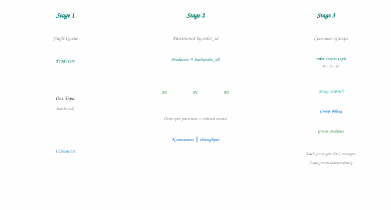
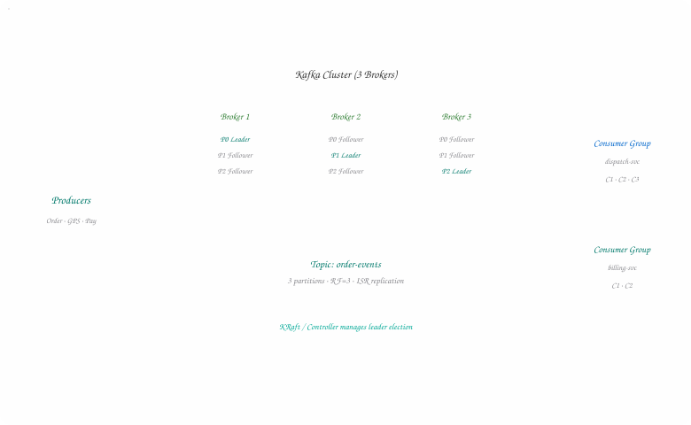
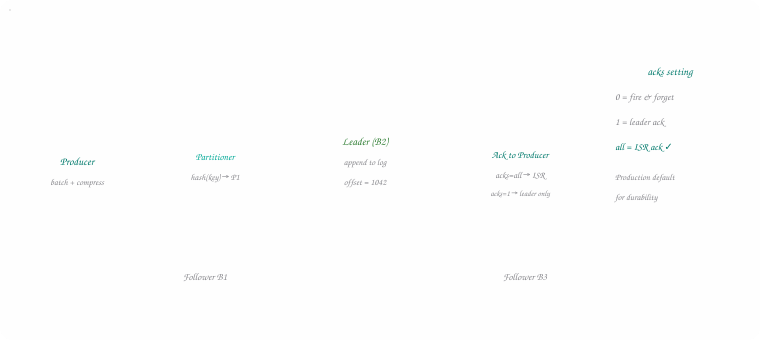
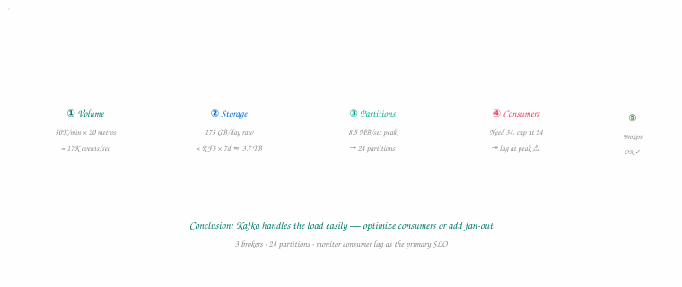
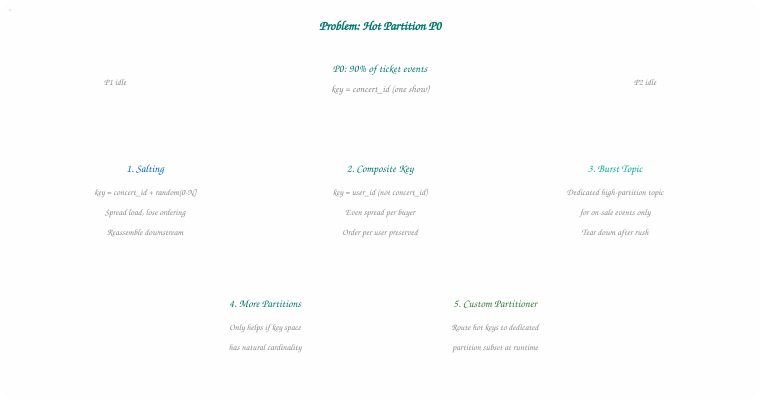
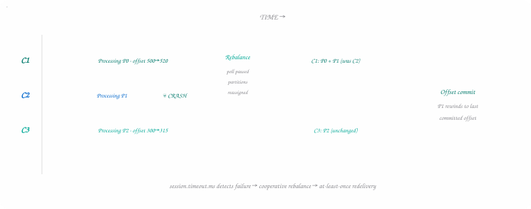

## Introduction — Why Kafka Matters

Apache Kafka is a distributed event streaming platform. That sentence shows up in every
textbook, but it doesn't tell you much until you've felt the pain Kafka solves: **millions
of events per second**, dozens of downstream systems that all need the same data, and zero
tolerance for losing an order status update because one service was briefly down.

Kafka sits in a sweet spot between a traditional message queue and a real-time data
pipeline. Producers append events to durable, ordered logs. Consumers read at their own
pace. Multiple teams can subscribe to the same stream without stepping on each other.
LinkedIn built it to handle their activity feed; today it powers everything from fraud
detection to CDC pipelines to the order-tracking screen you stare at while your biryani is
en route.

Interviewers ask about Kafka because it forces you to think about **throughput, ordering,
fault tolerance, and backpressure** in the same breath. It's not a "drop in RabbitMQ and
move on" topic — the vocabulary (partitions, offsets, ISR, consumer groups) is dense, and
the trade-offs are genuinely interesting.

> **💡 Interview Tip**
>
> When Kafka comes up, clarify whether the interviewer wants a **conceptual deep dive** (how
> it works) or an **applied design** (where you'd place it in a system). Both are common. A
> strong opening: "I'd use Kafka as the durable event backbone — let me walk through why, and
> what we'd publish."

| | |
| --- | --- |
| **2M+** | Partitions / Cluster (typical large deploy) |
| **~1M** | Msgs / Sec / Broker |
| **7 days** | Default Retention |
| **RF=3** | Production Replication |

## Motivating Example — Food Delivery at Scale

Picture a food delivery platform during Friday dinner rush. Every few seconds: an order is
placed, a restaurant accepts, a rider is assigned, GPS coordinates stream in, the customer
gets a push notification. That's easily **50,000+ events per minute** in a single metro —
and at least six different systems care about those events.

The analytics team wants every click for funnel dashboards. The dispatch service needs rider
location updates in near real time. Billing listens for "delivered" to charge the wallet.
Customer support replays order history when someone calls angry about cold fries. Marketing
triggers a coupon if delivery exceeds 45 minutes.

Your first instinct might be a single message queue: producers push, one consumer group
pulls, done. That works until **throughput spikes** and one slow consumer backs up the
entire queue. Or until you need **ordering per order ID** — rider assignment must not arrive
before restaurant acceptance — while still scaling horizontally across thousands of
concurrent orders.

### Stage 1: Single Queue — Simple, Then Painful

Start with one topic, one consumer. Every event flows through a single pipe. At 500
orders/minute you're fine. At 50,000/minute with bursty dinner peaks, the queue depth grows,
consumers lag, and the "order delivered" notification shows up ten minutes late. One poison
message can stall everything unless you build retry logic yourself.

### Stage 2: Partition by Order ID

Kafka's answer is **partitioning**. Hash the order ID to pick a partition. All events for
order `#ORD-8842` land in the same partition, preserving order within that order's
lifecycle. Different orders spread across partitions, so you scale writes horizontally. Ten
partitions means ten parallel write pipelines on the broker cluster.

### Stage 3: Consumer Groups — Same Data, Many Readers

Now dispatch, billing, and analytics all need the same `order-events` topic. Each runs as a
separate **consumer group**. Kafka delivers each message once *per group* — dispatch gets
every event, billing gets every event, analytics gets every event — but within a group, each
partition is consumed by exactly one consumer instance. Scale dispatch by adding consumers
(up to partition count); billing scales independently.



*Figure 1 — Diagram 1 — From Single Queue to Partitioned Consumer Groups*

Food delivery events evolve from a single bottleneck queue to keyed partitions, then fan out to independent consumer groups.

> **⚠️ Watch Out**
>
> Partition count is chosen at topic creation and is painful to change later. Under-partition
> and you cap throughput; over-partition and you bloat metadata and rebalance times. For
> interviews, state your key choice (`order_id`) and justify partition count with rough math:
> target throughput ÷ per-partition capacity.

## Terminology & Architecture

Before drawing boxes on the whiteboard, align on vocabulary. Kafka's model is simpler than
it sounds once you see everything as an **append-only log** sliced into partitions and
spread across brokers.

- **Producer** — Client that publishes records to a topic. Chooses partition via key hash or round-robin. Batches and compresses for throughput.
- **Consumer** — Client that reads records from assigned partitions. Pull-based — consumers fetch at their own rate, tracking position via offsets.
- **Broker** — A Kafka server storing partition data. A cluster is 3+ brokers for fault tolerance. Each broker hosts leaders and followers.
- **Topic** — Named category of events — like order-events or stock-ticks. Logical stream; physically split into partitions.
- **Partition** — Ordered, immutable sequence of records. Unit of parallelism. Ordering guaranteed within a partition, not across.
- **Offset** — Monotonic ID of a record within a partition. Consumers commit offsets to mark progress — Kafka's cursor, not a traditional queue ack.

### Message Queue vs Event Stream

Traditional queues (RabbitMQ, SQS) typically delete a message once consumed. Kafka
**retains** records for a configurable period — default seven days — regardless of who read
them. That retention is what makes it a stream: new consumer groups can rewind and replay
history; analytics can batch-read yesterday's data while real-time services process live
events.

| Aspect | Traditional Queue | Kafka (Event Stream) |
| --- | --- | --- |
| Message lifecycle | Deleted after ack | Retained by time/size policy |
| Multiple consumers | Competing consumers split work | Consumer groups — each group gets full copy |
| Ordering | Often global FIFO (single queue) | Per-partition ordering only |
| Replay | ✗ Not built-in | ✓ Reset offset, re-read |
| Throughput model | Push to consumers | Pull — consumer controls pace |



*Figure 2 — Diagram 2 — Kafka Cluster Architecture*

Producers write to partition leaders; followers replicate. Each consumer group independently reads the same topic.

## How Kafka Works Internally

Under the hood, Kafka is embarrassingly simple: a distributed commit log. Complexity lives
in how it **partitions, replicates, and serves** that log at scale.

### Records — The Unit of Data

Every message is a **record** with four parts: a optional `key` (used for partition
routing), a `value` (payload — JSON, Avro, Protobuf), a `timestamp`, and optional `headers`
(metadata like trace IDs or content-type). Keys aren't required, but without them records
round-robin across partitions and you lose per-entity ordering.

**Record Structure**

```text
                    {
                    "key"
                    :
                    "ORD-8842"
                    ,
                    "value"
                    : {
                    "event"
                    :
                    "RIDER_ASSIGNED"
                    ,
                    "riderId"
                    :
                    "R-991"
                    },
                    "timestamp"
                    :
                    1721654400000
                    ,
                    "headers"
                    : [{
                    "trace-id"
                    :
                    "abc-123"
                    }] }
                
```

### Append-Only Log & Offsets

Each partition is a sequential log on disk. Producers append; nothing is updated or deleted
in place (until retention kicks in). Every record gets an **offset** — 0, 1, 2, … — assigned
by the broker. Consumers track their position by committing offsets to an internal topic
(`__consumer_offsets`) or external store.

This design is why Kafka is fast: sequential disk writes, OS page cache, zero random I/O. A
broker can sustain hundreds of megabytes per second per partition on modest hardware.

### Replication — Leader, Follower, ISR

Each partition has one **leader** broker handling all reads and writes, and N-1
**followers** that replicate the log. The set of replicas caught up within a configurable
lag threshold form the **In-Sync Replica (ISR)** set. If the leader dies, a follower from
the ISR is elected — no data loss if producers waited for ISR acks.

### Pull-Based Consumption

Kafka consumers **poll** for records. The broker doesn't push. This inverts the backpressure
model: a slow consumer simply falls behind (increasing **consumer lag**), without slowing
producers or other consumer groups. You monitor lag per partition; alert when it crosses SLO
thresholds.



*Figure 3 — Diagram 3 — Message Write Path & Replication*

Producer selects partition, appends to leader, followers replicate from leader, producer receives ack based on durability setting.

### Hands-On — CLI & Node.js

The fastest way to build intuition is to spin up a local broker and produce/consume a few
messages. Here's the standard CLI flow, then the same idea in Node.js with kafkajs.

**Shell**

```text
# Create a topic with 3 partitions
                    kafka-topics.sh --create --topic order-events \ --bootstrap-server localhost:9092 --partitions 3
                    --replication-factor 1

                    # Produce with keys (order IDs)
                    kafka-console-producer.sh --topic order-events \ --bootstrap-server localhost:9092 \ --property
                    "parse.key=true"
                    \ --property
                    "key.separator=:"
# Type: ORD-8842:{"event":"PLACED","restaurant":"Taco Palace"}
# Consume from beginning, showing keys and offsets
                    kafka-console-consumer.sh --topic order-events \ --bootstrap-server localhost:9092 \
                    --from-beginning \ --property
                    print.key=true
                    \ --property
                    key.separator=:
                    \ --group dispatch-svc
                
```

**Node.js · kafkajs**

```text
const
                    { Kafka } =
                    require
                    (
                    'kafkajs'
                    );

                    const
                    kafka =
                    new
                    Kafka({ clientId:
                    'order-service'
                    , brokers: [
                    'localhost:9092'
                    ] });

                    const
                    producer = kafka.producer();
                    await
                    producer.connect();
                    await
                    producer.send({ topic:
                    'order-events'
                    , acks:
                    -1
                    ,
                    // wait for all ISR replicas
                    messages: [{ key:
                    'ORD-8842'
                    , value: JSON.stringify({ event:
                    'RIDER_ASSIGNED'
                    , riderId:
                    'R-991'
                    }), headers: {
                    'trace-id'
                    :
                    'abc-123'
                    } }] });

                    const
                    consumer = kafka.consumer({ groupId:
                    'dispatch-svc'
                    });
                    await
                    consumer.connect();
                    await
                    consumer.subscribe({ topic:
                    'order-events'
                    });
                    await
                    consumer.run({ eachMessage:
                    async
                    ({ topic, partition, message }) => { console.log({ offset: message.offset, key:
                    message.key?.toString() });
                    // process event — offset committed after handler succeeds
                    } });
                
```

## When to Use Kafka in Interviews

Not every system needs Kafka. Interviewers want to hear you **choose it deliberately**, not
reflexively. Here's a decision framework.

| Use Case | Kafka Fit | Alternative |
| --- | --- | --- |
| Event sourcing / audit log | ● Excellent — replay built-in | EventStoreDB, custom WAL |
| Fire-and-forget task queue | ○ Overkill — retention overhead | SQS, RabbitMQ, Redis Streams |
| Real-time analytics pipeline | ● Excellent — multiple consumers | Kinesis, Pulsar |
| CDC (database → downstream) | ● Excellent — Debezium + Kafka | Custom polling, AWS DMS |
| Request/response RPC | ○ Wrong tool — use gRPC/REST | Direct HTTP, service mesh |
| Log aggregation at massive scale | ● Strong — LinkedIn's origin story | Fluentd → Elasticsearch |

> **Queue vs Stream — Interview Sound Bite**
>
> Use a **queue** when one worker should process each task exactly once and discard it. Use a
> **stream** when events are facts that multiple systems may consume now or later — and you
> might need to replay them. Kafka is the stream; add a compacted topic or external dedup if
> you need queue semantics.

## Back-of-Envelope Estimations

Interviewers love when you do napkin math before drawing boxes. It shows you can tell
whether Kafka is even the right scale — or whether you're over-engineering a problem that
fits in a single RabbitMQ node. Let's walk through the food delivery example from Section 02
and size it like you'd do on a whiteboard.

> **💡 Interview Tip**
>
> State your assumptions out loud. Round aggressively. Interviewers care about
> **order-of-magnitude reasoning**, not decimal precision. Write: "Assume 500 bytes per event,
> 7-day retention, RF=3 — that puts us around X TB."

### Step 1 — Event Volume

Start from business metrics and work backward:

- **Active metros:** 20 cities at dinner peak
- **Peak events per metro:** ~50,000 events/min (orders, GPS pings, status changes)
- **Aggregate peak write rate:** 50K × 20 = **1M events/min** ≈ **17K events/sec**
- **Average off-peak:** assume 25% of peak → ~4K events/sec sustained average
- **Daily volume (avg):** 4K/sec × 86,400 sec ≈ **350M events/day**

| | |
| --- | --- |
| **17K** | Peak Writes / Sec |
| **350M** | Events / Day (avg) |
| **~500B** | Bytes / Event (JSON) |
| **~175GB** | Raw Ingest / Day |

### Step 2 — Storage (Retention × Replication)

Each event is a small JSON payload — order ID, event type, timestamp, maybe lat/long. Call
it **500 bytes** on the wire (headers + key included).

**Napkin Math**

```text
// Daily raw ingest
                    350M events × 500 bytes ≈
                    175 GB
                    /day

                    // With replication factor 3 (RF=3)
                    175 GB × 3 ≈
                    525 GB
                    /day on disk

                    // 7-day default retention
                    525 GB × 7 ≈
                    3.7 TB
                    total cluster storage (order-of-magnitude)

                    // With lz4 compression (~60% reduction, typical for JSON)
                    3.7 TB × 0.4 ≈
                    ~1.5 TB
                    effective storage
                
```

A three-broker cluster with 2 TB NVMe each gives you ~6 TB raw — plenty of headroom for
growth, compaction overhead, and segment files that haven't been cleaned yet. If retention
stretches to 30 days for audit, multiply storage by ~4× and you're looking at **6–8 TB
effective** — still manageable, but now tiered storage or S3 offload becomes worth
mentioning.

### Step 3 — Partition & Consumer Sizing

Rule of thumb: target **5–10 MB/sec per partition** for writes (varies by hardware). At 17K
events/sec × 500 bytes ≈ **8.5 MB/sec** peak ingest, you need roughly **12–24 partitions**
for the hot `order-events` topic — call it **24 partitions** for headroom and even key
distribution.

For consumers: if each dispatch worker processes ~500 events/sec (DB lookup + push
notification), one consumer handles ~500/sec. At 17K/sec peak you need **~34 consumer
instances** in the dispatch group — but you're capped at **24** (one per partition). That
means either optimize handler throughput, add a fan-out topic, or accept consumer lag during
spikes. *This is exactly the kind of tension interviewers want you to surface.*

**Consumer Math**

```text
                    Peak ingest:
                    17,000
                    events/sec Handler speed:
                    500
                    events/sec/consumer Consumers needed: 17,000 / 500 =
                    34
                    Partition cap: min(34, partition_count) = min(34, 24) =
                    24
                    → Max throughput at 500/sec each =
                    12,000
                    events/sec →
                    Gap:
                    5,000 events/sec lag accumulates during peak ⚠️
                
```

> **⚠️ Watch Out**
>
> When your math shows consumers can't keep up with partition count, don't silently add
> partitions — that makes it worse (more parallelism but same total handler capacity). Fix the
> handler, batch writes, or decouple with a faster intermediate step. Partitions scale
> **writes**; they don't magically scale **processing**.

### Step 4 — Broker Throughput Check

A well-tuned broker handles ~200–500 MB/sec disk write and ~1M small messages/sec in
benchmark conditions. Our peak of 8.5 MB/sec and 17K msg/sec is **nowhere near broker
limits** — the bottleneck is consumer processing, not Kafka itself. That's a great interview
punchline: "Kafka isn't the constraint here; our downstream dispatch service is."



*Figure 4 — Diagram 6 — Back-of-Envelope Sizing Flow*

Walk the interviewer through five steps: volume → storage → partitions → consumers → broker headroom. Name the bottleneck when you find it.

## Kafka vs RabbitMQ — Quick Comparison

"Why not RabbitMQ?" shows up in almost every Kafka interview. Both move messages between
services, but they're built for different problems. RabbitMQ is a **smart broker** — it
routes, buffers, and pushes messages to consumers with rich delivery semantics. Kafka is a
**dumb broker, smart client** — an append-only log that retains data and lets consumers pull
at their own pace.

| Dimension | Apache Kafka | RabbitMQ |
| --- | --- | --- |
| Core model | Distributed commit log (persistent stream) | Message broker with queues & exchanges |
| Throughput | Millions of msg/sec per cluster | Tens of thousands/sec per node (typical) |
| Delivery | Pull-based — consumer polls | Push-based — broker delivers to consumers |
| Message retention | Retained by policy (hours to forever) | Deleted after ack (default) |
| Replay | ● Native — reset offset, re-read log | ○ Not built-in — once ack'd, it's gone |
| Multiple consumers (same data) | ● Consumer groups — each group gets all events | ○ Fan-out via exchanges, but no shared replay log |
| Ordering guarantee | Per-partition ordering only | Per-queue ordering (single consumer) |
| Routing flexibility | Topic + partition key (simple) | Exchanges: direct, topic, fanout, headers (rich) |
| Retry / DLQ | Manual — retry topics + DLT pattern | ● Built-in dead-letter exchanges, TTL, priority queues |
| Ops complexity | Higher — ZooKeeper/KRaft, partitions, ISR tuning | Lower — single-node friendly, familiar queue semantics |
| Best for | Event streaming, analytics fan-out, CDC, audit logs | Task queues, RPC-style work distribution, job processing |

### When to Pick Which — Interview Decision Tree

Use this quick mental checklist on the whiteboard:

- **Choose Kafka** when multiple teams need the same events, you need replay, throughput is high, or events are facts worth retaining (order lifecycle, clickstream, CDC).
- **Choose RabbitMQ** when you need task distribution with built-in retries, complex routing (route by header/priority), low-latency RPC-style request/worker patterns, or your volume fits comfortably on one cluster node.
- **Use both** in polyglot architectures — Kafka as the durable event backbone, RabbitMQ (or SQS) for per-service task queues that need instant retry/DLQ without custom plumbing.

> **💡 Interview Sound Bite**
>
> "RabbitMQ excels at **getting work done once and moving on**. Kafka excels at **recording
> what happened and letting anyone catch up later**. For our food delivery pipeline, Kafka
> fits because dispatch, billing, analytics, and support all need the same order events — and
> support might replay yesterday's stream. For sending a one-off email, I'd reach for RabbitMQ
> or SQS instead."

## Interview Essentials

These are the topics that separate "I've heard of Kafka" from "I've operated it in
production." Work through each with a concrete example from your motivating scenario.

### Scalability & Hot Partitions

Throughput scales with partition count — but only if load is evenly distributed. A skewed
key — imagine every stock tick for `AAPL` hashing to the same partition, or a celebrity's
concert ticket release — creates a **hot partition**. One broker handles disproportionate
traffic while others idle.



*Figure 5 — Diagram 4 — Hot Partition Mitigation Strategies*

When one partition absorbs most traffic, salt keys, redesign key choice, or isolate burst traffic — each trades ordering for throughput differently.

### Fault Tolerance — acks & ISR

Production clusters run replication factor 3 with `min.insync.replicas=2` and producer
`acks=all`. A broker failure triggers leader election from the ISR — typically seconds of
unavailability per affected partition, not data loss. Mention
`unclean.leader.election.enable=false` to prevent electing out-of-sync replicas (trading
availability for consistency during disasters).

### Consumer Failure & Rebalancing

When a consumer joins or leaves a group — crash, deploy, scale-out — Kafka triggers a
**rebalance**. Partitions are reassigned across live consumers. During rebalance, processing
pauses (classic "stop-the-world" with older protocols; cooperative sticky assignors reduce
the blast radius in modern clients).



*Figure 6 — Diagram 5 — Consumer Failure & Rebalance Timeline*

Consumer C2 crashes; the group rebalances; C1 inherits P1 and resumes from the last committed offset — uncommitted messages may be reprocessed.

> ### Deep Dive: Retries, Idempotency & Dead Letter Queues +
>
> Kafka guarantees **at-least-once** delivery by default — if your consumer crashes after
> processing but before committing offset, the message is redelivered. Design handlers to be
> **idempotent**: use the event ID or offset as a dedup key in your database.
>
> For poison messages that always fail parsing, route to a **Dead Letter Topic (DLT)** after N
> retries. In Spring Kafka or kafkajs, configure a retry topic with backoff, then forward
> failures to `order-events.DLT` for manual inspection. Never block the partition indefinitely
> on a bad message.
>
> Enable producer **idempotence** (`enable.idempotence=true`) to prevent duplicate writes
> during network retries — the broker deduplicates using a producer ID + sequence number per
> partition.

> ### Deep Dive: Performance — Batching, Compression & Retention +
>
> Producers batch records (`linger.ms`, `batch.size`) before sending — trading a few
> milliseconds of latency for 10× throughput. Enable **compression** (`lz4` or `zstd`) on the
> wire; Kafka stores compressed bytes on disk.
>
> Consumers fetch in chunks (`fetch.min.bytes`, `max.poll.records`). Tune
> `max.poll.interval.ms` so long-running handlers don't get kicked from the group
> mid-processing.
>
> **Retention** is time-based (`retention.ms`) or size-based (`retention.bytes`). Compacted
> topics keep only the latest value per key — useful for changelog streams like
> `user-preferences`. For compliance, extend retention or tier to S3 via Kafka Connect.

> **💡 Senior Signal**
>
> Volunteer the **exactly-once** story: idempotent producer + transactional writes +
> read-process-write in a single transaction. It's expensive and not always worth it — but
> knowing when to reach for it (financial ledger events) vs. at-least-once + idempotent
> consumers (order notifications) shows production maturity.

## Level Expectations

Kafka questions scale from "draw the architecture" to "design a multi-region disaster
recovery strategy." Here's what interviewers typically expect at each level.

- **Mid-Level (E4)** *(80% Concepts · 20% Ops)* — Know the Vocabulary Explain topics, partitions, consumer groups, and offsets. Draw producer → broker → consumer. Describe why partitioning enables scale. Know queue vs stream difference.
- **Senior (E5)** *(50% Design · 50% Depth)* — Own the Trade-offs Discuss acks, ISR, hot partitions, consumer lag, and rebalancing. Choose partition keys with justification. Run back-of-envelope math for storage and consumer sizing. Design retry/DLT strategy. Mention monitoring (lag, under-replicated partitions).
- **Staff+ (E6)** *(30% Design · 70% Depth)* — Operate at Scale Multi-region replication (MirrorMaker 2), tiered storage, KRaft migration, capacity planning math. When not to use Kafka. Cross-team governance for schema registry and topic ownership.

## Summary

Kafka is a distributed commit log dressed up as an event streaming platform. It wins when
you need **high throughput, durable retention, and multiple independent consumers** over the
same event stream — food delivery pipelines, stock tickers, ticket drops, CDC, and analytics
fan-out all fit that mold.

For interviews, anchor on a concrete scenario, walk through partition key choice, explain
replication with acks and ISR, and proactively mention hot partitions, consumer lag, and
at-least-once semantics. The candidates who impress aren't the ones who recite definitions —
they're the ones who explain *what breaks at 2 AM* and how they'd fix it.

| Concept | One-Line Recall |
| --- | --- |
| Topic | Named stream of events, split into partitions |
| Partition | Ordered log; unit of parallelism and ordering scope |
| Consumer Group | Cooperative consumers; each partition → one member |
| Offset | Consumer's bookmark in the partition log |
| ISR | Replicas caught up enough to be elected leader safely |
| acks=all | Producer waits for ISR — production durability default |
| Kafka vs RabbitMQ | Kafka = durable stream + replay; RabbitMQ = task queue + routing |

> **💡 Final Thought**
>
> The best Kafka answers sound like a story, not a glossary. Start with the business event
> ("when the rider marks delivered…"), follow one record from producer to consumer, and name
> the failure modes along the way. That's how you turn a infrastructure component into a
> system design answer.
