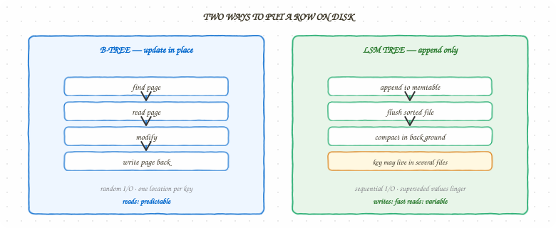
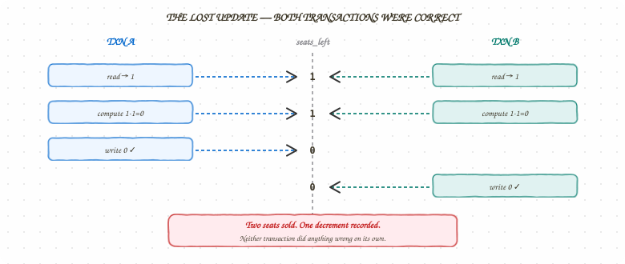
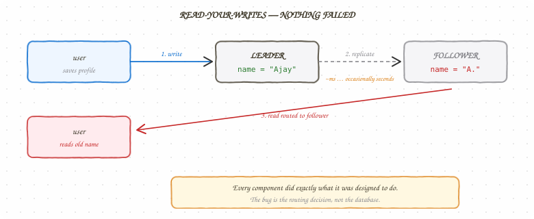
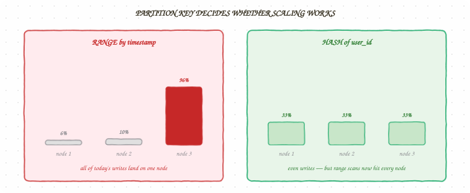

## Introduction — The 1,000× You Never Deployed

Here is a query. It has not changed in three years.

```sql
SELECT * FROM bookings WHERE user_id = ?
```

At launch, `bookings` held 40,000 rows. The query took under a millisecond, and nobody
thought about it again. Today the table holds 90 million rows and the same query takes
around 400 milliseconds. Nothing was deployed. No code was edited. The query plan simply
crossed a threshold where reading every row stopped being cheap.

That is the shape of almost every storage incident: **a decision made at schema-design time,
billed at 3am eighteen months later.** The query was never the problem. The absence of an
index on `user_id` was, and the moment to fix it passed long before the pager went off.

| | |
| --- | --- |
| **~0.2 ms** | Indexed lookup, 90M rows |
| **~400 ms** | Full table scan, 90M rows |
| **~2,000×** | The gap, from one missing index |
| **0** | Deploys required to cross it |

The number is not the interesting part. The mechanism is. A B-tree index turns a linear scan
into a logarithmic descent — roughly 27 comparisons instead of 90 million row reads. That
gap does not grow gently as the table grows; it grows *with the table*, which means it is
invisible in staging, invisible in the first year, and then suddenly the only thing anyone
is talking about.

> **💡 Interview Tip**
>
> The specific latencies above depend on row width, page cache warmth, and storage hardware —
> quote them as orders of magnitude, not measurements. What you should be precise about is the
> *complexity claim*: a scan is O(n) in table size, a B-tree lookup is O(log n). That is the
> part that does not depend on anyone's hardware, and it is the part interviewers are actually
> listening for.

This chapter covers the layer every other chapter in this book quietly assumes. The
[caching chapter](#) talks about stale reads without defining what staleness is measured
against. The ticketing design locks seats without naming the isolation level that makes the
lock necessary. The proximity-matching design picks Cassandra without saying what that buys
or costs. All of those are storage decisions, and they are made — like the missing index —
long before the incident that reveals them.

## The Question Before "SQL or NoSQL"

Most storage discussions open with the wrong question. "Should we use SQL or NoSQL" is a
question about products. The decision underneath it is about **access patterns**, and it is
answerable before you have named a single database.

Three questions determine almost everything that follows:

- **How do you read it?** By primary key only, or by arbitrary combinations of fields? One
  row at a time, or ranges? Do you need to join across entities, or is each read
  self-contained?
- **How do you write it?** Append-mostly, or update-in-place? Are writes spread evenly across
  keys, or concentrated on a few? Do multiple writers touch the same row?
- **What must be true after a write?** Must the next reader see it, always? Must two writes
  either both land or neither? Or is "eventually, within a second or two" genuinely fine?

Answer those and the product choice mostly falls out. Answer them *after* choosing the
product and you spend the next two years working around a mismatch.

| If your access pattern is… | You want… | Because |
| --- | --- | --- |
| Arbitrary queries across many fields, joins, ad-hoc reporting | Relational (Postgres, MySQL) | The query planner and secondary indexes exist precisely for queries you did not anticipate |
| Known key, huge write volume, predictable reads | Wide-column (Cassandra, DynamoDB) | Partitioned by key from the start; no join means no coordination |
| Whole-object reads, flexible shape, few cross-entity queries | Document (MongoDB, DocumentDB) | The object is the unit of storage *and* the unit of access |
| Ephemeral, latency-critical, small values | In-memory (Redis) | No durability tax on the hot path |
| Full-text relevance ranking | Search index (Elasticsearch, OpenSearch) | An inverted index answers a question a B-tree cannot |

The honest version of the tradeoff: **relational databases optimize for the queries you have
not thought of yet; non-relational databases optimize for the ones you have.** If you know
your access pattern precisely and it will not change, a wide-column store will serve it
faster and scale it further. If you do not — and most products do not, early on — the query
planner is worth more than the throughput.

> **💡 Senior Signal**
>
> "It depends" is a non-answer. "It depends on whether reads are key-only or ad-hoc, and I would
> start relational because we do not yet know our query patterns" is a design position with a
> stated assumption and an implied migration trigger. Interviewers are not testing whether you
> know Cassandra exists. They are testing whether you can name the condition under which your
> answer changes.

## How the Data Actually Sits on Disk

Two storage engine families sit underneath nearly every database you will use, and the
difference between them explains most of the performance behaviour you will observe.

### B-trees — optimized for reads and updates in place

A B-tree keeps keys sorted in fixed-size pages, typically 4–16 KB, arranged in a shallow,
wide tree. Finding a key means descending a handful of levels. Updating a value means
finding its page and **overwriting it in place**.

That in-place update is the defining property. It makes reads predictable — one key lives in
exactly one place — and it makes writes expensive, because a write must locate, read, modify,
and rewrite a whole page, plus write to a journal first so a crash mid-update does not corrupt
the tree.

Postgres, MySQL/InnoDB, and most relational engines are B-tree engines.

### LSM trees — optimized for writes

A log-structured merge tree never updates in place. Writes go to an in-memory sorted
structure, which is flushed to disk as an immutable sorted file when it fills. Background
compaction merges those files and discards superseded values.

Writes are sequential appends, which is dramatically faster than random page rewrites. The
cost lands on reads: a key might live in the memtable, or in any of several on-disk files,
so a read may have to check several places. Bloom filters — the same structure the caching
chapter uses for negative lookups — exist here to make "definitely not in this file" cheap.

Cassandra, RocksDB, LevelDB, and HBase are LSM engines.



*Figure 1 — Two ways to put a row on disk.* The B-tree pays on every write to keep one
canonical location per key. The LSM tree pays on every read for never having rewritten a page.

| | B-tree | LSM tree |
| --- | --- | --- |
| Write path | Read-modify-write a page | Append to memtable, flush sequentially |
| Write throughput | Lower | Higher |
| Read path | One location | Possibly several files |
| Read latency | Predictable | More variable (compaction-dependent) |
| Space behaviour | Fragmentation | Write amplification during compaction |
| Best when | Reads and updates dominate | Writes dominate |

> **💡 Interview Tip**
>
> When someone says "Cassandra is faster," ask *at what*. Cassandra is faster at ingesting a
> high volume of writes against known keys. It is not faster at "find me every booking in
> March where status is pending" — it cannot answer that at all without a secondary index or a
> second table you maintain yourself. The engine choice is a statement about which operation
> you want to be cheap.

## Indexes — Making Reads Fast, and Writes Pay For It

An index is a second data structure that stores the same data in a different order, so a
lookup can avoid scanning. That is the whole idea. Everything interesting is in the cost.

**Every index you add makes writes slower.** A table with five indexes turns one row insert
into six write operations — the row plus five index updates, each potentially splitting a
page. This is the tradeoff people forget: indexes are not free reads, they are reads
purchased with writes.

### Composite indexes and the leftmost rule

An index on `(user_id, created_at)` can serve a query filtering on `user_id`, or on
`user_id` *and* `created_at`. It cannot efficiently serve a query filtering on `created_at`
alone, because the index is sorted by `user_id` first. This is the leftmost-prefix rule, and
it is the single most common reason a query "has an index" and still scans.

```sql
-- index: (user_id, created_at)

WHERE user_id = 42                          -- uses the index
WHERE user_id = 42 AND created_at > '...'   -- uses the index, both columns
WHERE created_at > '...'                    -- does NOT use the index
```

### Covering indexes

If an index contains every column a query needs, the database can answer entirely from the
index and never touch the table. That turns two lookups into one:

```sql
-- Query needs only user_id and status
SELECT status FROM bookings WHERE user_id = ?

-- A covering index on (user_id, status) answers it without reading the row
```

The cost is size — you are storing `status` twice — and, again, write throughput.

> **💡 Senior Signal**
>
> "Add an index" is a mid-level answer. "Add a composite index on `(user_id, created_at)`,
> which also lets us drop the standalone `user_id` index because the composite covers it as a
> leftmost prefix — and accept roughly 15% slower writes on a write-light table" is a senior
> one. Name the index, name what it replaces, name what it costs.

## Transactions — What "Consistent" Actually Promises

The word *consistent* does more ambiguous work in system design than any other. In ACID it
means "the database's own invariants hold." In CAP it means something else entirely. Being
precise about which one you mean is most of the battle.

A transaction guarantees **atomicity** (all of it lands or none of it does), **isolation**
(concurrent transactions do not corrupt each other), and **durability** (once committed, it
survives a crash). Isolation is where the real decisions live, because databases offer it in
levels, and the default is rarely the strictest.

### The anomalies, in the order you will meet them

- **Dirty read** — you read a value another transaction wrote but has not committed. It may
  roll back, and you acted on data that never existed.
- **Non-repeatable read** — you read a row twice in one transaction and get different values,
  because someone committed in between.
- **Phantom read** — you run the same range query twice and get different *rows*, because
  someone inserted into that range.
- **Lost update** — two transactions read the same value, both compute a new one from it, and
  the second overwrites the first. Neither did anything wrong individually.

| Isolation level | Prevents | Still allows |
| --- | --- | --- |
| Read Uncommitted | — | dirty, non-repeatable, phantom, lost update |
| Read Committed | dirty reads | non-repeatable, phantom, lost update |
| Repeatable Read | dirty, non-repeatable | phantoms (in some engines), lost update |
| Serializable | all of them | nothing — but throughput drops and aborts rise |

**Read Committed is the default in Postgres and Oracle. Repeatable Read is the default in
MySQL/InnoDB.** Neither prevents a lost update. That is not a bug; it is a throughput
decision, and it is yours to override where correctness demands it.

### The lost update, and the two ways to stop it

This is the concurrency failure that shows up in every booking, inventory, and balance system
— and it is the same problem the [concurrency chapter](#) describes as a race on a shared
resource, one layer down. There, two threads contend on a variable. Here, two transactions
contend on a row. The shape is identical; only the scope changed.

**Pessimistic — take the lock first:**

```java
// SELECT ... FOR UPDATE takes a row-level write lock for the
// duration of the transaction. The second transaction blocks
// here until the first commits or rolls back.
String sql = "SELECT seats_left FROM shows WHERE id = ? FOR UPDATE";

try (Connection cx = ds.getConnection()) {
    cx.setAutoCommit(false);
    int left = queryInt(cx, sql, showId);
    if (left <= 0) {
        cx.rollback();
        throw new SoldOutException(showId);
    }
    update(cx, "UPDATE shows SET seats_left = seats_left - 1 WHERE id = ?", showId);
    cx.commit();
}
```



*Figure 3 — The lost update.* Two seats sold, one decrement recorded. Neither transaction
violated any rule on its own; the anomaly only exists in their interleaving.

**Optimistic — detect the conflict at write time:**

```java
// No lock is held while the user thinks. The version column
// turns "did anyone else change this?" into a WHERE clause.
// If the update touches 0 rows, someone did — retry.
int rows = update(cx,
    "UPDATE shows SET seats_left = seats_left - 1, version = version + 1 " +
    "WHERE id = ? AND version = ? AND seats_left > 0",
    showId, expectedVersion);

if (rows == 0) {
    throw new ConcurrentModificationException("retry with fresh read");
}
```

Pessimistic locking is simpler to reason about and holds locks for the length of the
transaction — fine when contention is rare and transactions are short, actively dangerous
when a human sits inside the transaction. Optimistic locking holds nothing and pays with
retries — better under low contention, worse under high, because everyone retries into the
same conflict.

> **💡 Interview Tip**
>
> The seat-booking question is a lost-update question wearing a domain costume. Say the words
> "lost update," name the isolation level you are running at, and then choose. Candidates who
> jump straight to Redis locks without naming what the database already offers are solving a
> problem they have not diagnosed.

## Replication — One Copy Is Not a System

A single database instance is a single point of failure and a hard ceiling on read
throughput. Replication addresses both by keeping additional copies. It also introduces
every hard problem in the rest of this chapter.

The dominant topology is **leader–follower**: one node accepts writes, replicates them to
followers, and followers serve reads. The critical decision is *when the leader considers a
write done*.

- **Synchronous** — the leader waits for a follower to confirm before acknowledging. No data
  loss on leader failure; every write now pays the slowest follower's latency, and a stalled
  follower stalls all writes.
- **Asynchronous** — the leader acknowledges immediately and ships changes in the background.
  Fast, and if the leader dies before shipping, those writes are gone.
- **Semi-synchronous** — wait for *one* follower, not all. The common production compromise.

The lag between leader and follower is the source of the most confusing bugs in distributed
systems, because it is usually a few milliseconds and occasionally several seconds — long
enough to be visible to a user, short enough never to reproduce locally.



*Figure 2 — Nothing failed.* The write landed, replication is working, the follower answered
instantly. The defect is in the routing decision, not in any component.

## Quorums — Replication Without a Leader

Leader–follower replication has one structural weakness: the leader is a single point of
write availability. If it dies, nobody writes until a new one is elected, and election takes
seconds you may not have.

Leaderless replication removes the leader entirely. Every replica accepts writes. The
coordination that a leader used to provide is replaced by arithmetic.

With **N** replicas, a write is acknowledged once **W** of them confirm it, and a read
consults **R** of them and takes the newest value. The guarantee comes from one inequality:

```text
R + W > N
```

If the read set and the write set must overlap, then any read is guaranteed to touch at least
one replica that saw the most recent write. That is the whole mechanism. There is no
consensus protocol and no leader — just a pigeonhole argument.


*Figure 5 — The overlap is the guarantee.* With `W=2, R=2` over three replicas the read set
cannot miss the write set. With `W=1, R=1` it can, and a stale read becomes legal behaviour
rather than a bug.

| N | W | R | Behaviour |
| --- | --- | --- | --- |
| 3 | 2 | 2 | Balanced. Tolerates one node down for both reads and writes. The common default. |
| 3 | 3 | 1 | Fast reads, fragile writes. One node down stops all writes. |
| 3 | 1 | 3 | Fast writes, fragile reads. Good for ingest-heavy, read-rare workloads. |
| 3 | 1 | 1 | `R + W = 2`, not `> 3`. **No overlap guarantee** — eventual consistency, and you chose it. |

That last row is the one worth internalising. `W=1, R=1` is a perfectly legitimate
configuration — it is fast, and it survives almost anything — but it has abandoned the
overlap guarantee. A read can legally return a value older than a completed write. If you
have ever seen a system described as "eventually consistent," this arithmetic is usually why.

### What quorums do not give you

A quorum guarantees overlap. It does not guarantee ordering, and it does not give you a
transaction.

Two clients writing to the same key concurrently, each satisfying `W=2`, will both succeed.
The replicas now disagree, and something must decide which value wins. The usual answer is
**last-write-wins** by timestamp, which is simple, and which silently discards one of the two
writes. That is fine for a "last seen at" field and catastrophic for a bank balance.

- **Read repair** — when a read notices replicas disagree, it writes the newest value back to
  the stale ones. Repairs what is actually being read, and leaves cold data drifting.
- **Anti-entropy** — a background process compares replicas and reconciles differences,
  usually via Merkle trees. Catches cold data, at the cost of continuous background traffic.
- **Sloppy quorum** — if the "home" replicas are unreachable, accept the write on whichever
  nodes *are* reachable and hand it off later. Availability goes up; the overlap guarantee
  goes away for the duration.

This is exactly the model Cassandra and DynamoDB implement, and it is why the
proximity-matching design in Part III gets high write throughput and no multi-row
transactions in the same breath. Those are the same decision.

> **💡 Interview Tip**
>
> If you propose Cassandra, expect "what consistency level?" as the follow-up. Saying
> `QUORUM` is fine. Saying "`QUORUM` for the write and `QUORUM` for the read, because `2 + 2 > 3`
> gives me read-your-writes without a leader, and I will accept last-write-wins on concurrent
> updates to the same key" is the answer that ends the line of questioning.

## Multi-Leader — When One Leader Is Not Enough

Multi-leader replication puts a writable leader in each region. Users write locally at low
latency, and the leaders replicate to each other asynchronously.

It solves a real problem — a user in Sydney should not pay a 300ms round trip to a leader in
Virginia to save a form — and it introduces the hardest problem in this chapter: **two
regions can accept conflicting writes to the same record, and neither is wrong.**

Conflict resolution is then unavoidable, and there are only a few honest options:

- **Last-write-wins.** Simple, and lossy. Requires synchronized clocks you do not have, which
  is why systems that do this seriously use logical clocks or version vectors rather than
  wall time.
- **Application-defined merge.** Keep both versions and let domain logic decide. Correct, and
  it pushes real complexity into every write path that touches the record.
- **CRDTs.** Data types whose merge function is mathematically guaranteed to converge —
  counters, sets, ordered lists. Excellent when your data fits one, and it usually does not.
- **Avoid the conflict.** Partition by region so a given record only ever has one writable
  home. Not always possible, and by far the cheapest answer when it is.

That last option is the one experienced designers reach for first. Multi-leader is not
primarily a replication decision; it is a *data ownership* decision. If every record has
exactly one region that owns writes for it, most of the difficulty evaporates.

## Failure Mode 1 — Reading Your Own Writes

A user updates their profile. The write goes to the leader. They are immediately redirected
to the profile page, which reads from a follower that has not received the change yet. They
see their old name and conclude the save button is broken.

Nothing failed. Every component did exactly what it was designed to do.

Three fixes, in increasing order of cost:

- **Read from the leader for that user, briefly.** After a write, pin that user's reads to the
  leader for a few seconds. Cheap, effective, and it concentrates load on the leader.
- **Track the write position.** The client keeps the log position of its last write and asks
  for a replica at least that current. Precise, and it requires the client and the data layer
  to cooperate.
- **Read from the leader always for that entity.** Correct, and it discards the read-scaling
  benefit you built replicas for.

This is the same class of problem as cache staleness — a faster copy that is allowed to be
behind. The caching chapter answers it with TTLs; here the answer is routing. Both are
choosing *how stale is acceptable*, which is the only question that ever gets asked about
replicated data.

## Failure Mode 2 — Replication Lag Under Load

Lag is not constant. It grows precisely when you can least afford it: during traffic spikes,
bulk imports, and schema migrations, because the follower applies changes single-threaded in
many engines while the leader accepts them concurrently.

The dangerous property is that **lag is invisible to the application unless you measure it**.
A follower that is 30 seconds behind returns results instantly and confidently. It does not
return an error. It returns the past.

Defend by measuring lag as a first-class metric, routing reads away from replicas whose lag
exceeds a threshold, and — critically — deciding in advance whether a lagging replica should
be removed from the read pool or the system should degrade to leader reads. Systems that have
not made that decision make it during an incident, badly.

## Failure Mode 3 — The Hot Shard

Partitioning splits data across nodes so no single machine holds it all. The split key
determines whether that works.

**Range partitioning** keeps keys ordered and makes range scans efficient — and puts all of
today's writes on one node if the key is a timestamp. **Hash partitioning** spreads writes
evenly and destroys range scans. There is no partitioning scheme that gives you both, which
is why the choice belongs to the access pattern, not to preference.

The hot shard is the partitioning analogue of the hot key from the caching chapter. Same
mechanism — a skewed access distribution meeting a scheme that assumed uniformity — at a
different layer. The mitigations rhyme too: split the key with a salt, isolate the hot tenant
onto dedicated capacity, or add a caching layer in front of the specific hot range.



*Figure 4 — The partition key is the decision.* Range keeps scans cheap and concentrates
today's writes on one node. Hash spreads writes evenly and makes range scans touch every node.

**Resharding is the part that hurts.** Naive modulo hashing (`hash(key) % N`) remaps almost
every key when N changes, which means a rebalance moves nearly the entire dataset.
Consistent hashing exists to bound that: adding a node moves roughly `1/N` of the keys
instead of all of them. If you take one thing from this section into an interview, take that
sentence.

## Secondary Indexes in a Partitioned World

Once data is partitioned, a secondary index has to choose which of two bad options it wants,
and this is where "just add an index" stops transferring from the single-node world.

**Local index (index-per-partition).** Each node indexes only the rows it holds. Writes stay
cheap — one node updates one index — but a query on the indexed field must ask *every*
partition, because any of them might hold a match. This is scatter-gather: latency becomes
the slowest node's latency, and cost grows with cluster size.

**Global index (index partitioned by the indexed term).** The index itself is partitioned by
the term being indexed, so a lookup goes to exactly one node. Reads are fast. Writes now
touch two partitions — the row's, and the index term's — which means a write is no longer a
single-node operation and is no longer atomic without extra machinery.

| | Local index | Global index |
| --- | --- | --- |
| Write cost | One partition | Two partitions, cross-node |
| Read cost | Every partition (scatter-gather) | One partition |
| Write atomicity | Natural | Requires distributed coordination |
| Used by | Cassandra secondary indexes, Elasticsearch shards | DynamoDB GSI |

The practical takeaway is blunt: **in a partitioned store, if you find yourself wanting many
secondary indexes, the partition key is probably wrong.** Wide-column stores expect you to
model a second table keyed by the second access pattern and write to both, which trades
storage and write amplification for predictable reads. That is not a workaround; it is the
intended design, and it is the single biggest adjustment for people arriving from relational
systems.

## Changing the Schema Without Taking the System Down

Every chapter so far has assumed the schema is fixed. It is not, and migrations are where
storage decisions become operational incidents.

A naive `ALTER TABLE` on a large table can lock it for the duration. On a 90-million-row
table that is not a maintenance window, it is an outage. The safe pattern is **expand and
contract**, run across several deploys:

- **Expand.** Add the new column as nullable. Add nothing that requires rewriting existing
  rows. Deploy.
- **Backfill.** Populate the new column in batches, throttled, with the application still
  reading the old one. This is where replication lag spikes if you are not careful — a
  single-threaded follower applying a bulk backfill is Failure Mode 2 arriving on schedule.
- **Dual-write.** Write both old and new columns. Read the old. Deploy.
- **Switch reads.** Read the new column, still writing both. Deploy. This is the reversible
  step — if the new column is wrong, revert the read without data loss.
- **Contract.** Stop writing the old column, then drop it. Deploy.

Five deploys to add one column looks absurd until the first time a one-step migration locks a
production table. The property that matters is that **every intermediate state is a working
system**, and every step before the final drop is reversible.

> **💡 Senior Signal**
>
> Volunteering the migration path is one of the strongest signals available in a design
> interview, because almost nobody does it unprompted. "I would store it denormalized in a
> second table" is a design. "I would store it denormalized in a second table, and I would get
> there with expand-contract so we are never in a state that requires a rollback of data" is
> an engineering plan.

## Back-of-Envelope: Sizing a Database

**Estimate — Booking History Store**

```text
// Inputs
Bookings per day:            2,000,000
Average row size:                400 B
Retention:                     5 years
Read traffic (peak):          12,000 req/s
Write traffic (peak):          1,200 req/s
Replication factor:                  3

// Raw data volume
2,000,000 × 400 B          = 800 MB/day
800 MB × 365 × 5           ≈ 1.46 TB   // 5-year primary data

// Indexes typically add 20-40% on a table with 2-3 secondary indexes
1.46 TB × 1.3              ≈ 1.9 TB    // data + indexes

// Replication multiplies everything
1.9 TB × 3                 ≈ 5.7 TB    // total provisioned storage

// Write amplification: 1 row insert + 3 index updates, × 3 replicas
1,200 writes/s × 4 × 3     = 14,400 physical writes/s across the cluster

// Read distribution with 1 leader + 2 followers
12,000 req/s ÷ 2 followers = 6,000 req/s per follower  // leader reserved for writes
```

The number that drives the conversation is not the 1.46 TB. It is the **5.7 TB** — because
replication factor and index overhead are what turn a comfortable single-node dataset into a
sharding decision. Candidates who compute raw data volume and stop have answered a storage
question. Candidates who multiply by replication and index overhead have answered a *capacity
planning* question, which is what was actually asked.

> **💡 Interview Tip**
>
> State retention explicitly and early. "Five years" versus "90 days" changes the answer by a
> factor of twenty and is almost never specified in the prompt. Asking for it is not stalling;
> it is the single highest-leverage clarifying question in any storage sizing problem.

## The Real Decision — Consistency vs. Availability vs. Cost

Every storage decision in this chapter reduces to the same three-way tension.

| You optimize for | You give up | Typical choice |
| --- | --- | --- |
| Strong consistency | Write latency, availability during partitions | Synchronous replication, serializable isolation, leader reads |
| Availability and throughput | Freshness guarantees | Async replication, read-committed isolation, follower reads |
| Cost and simplicity | Headroom, blast-radius isolation | Single primary, fewer replicas, vertical scaling until it hurts |

The failure modes above — stale reads, lag under load, hot shards, lost updates — are not
arguments against replication or partitioning. They are the price of admission for surviving
a node failure and scaling past one machine. The engineering work is deciding which of them
you can tolerate and building the narrow, specific defence for the ones you cannot.

Notice the shape of that sentence. It is the same conclusion the caching chapter reaches, and
the same one the rate limiting chapter reaches. That is not repetition — it is the actual
thesis of this book showing up at a third layer. **The mechanism you pick is downstream of
the guarantee you decided to make.**

## Interview Essentials & Level Expectations

Storage questions scale from "what is an index" to "design the data layer for a multi-region
ledger with regulatory residency constraints." Here is roughly what is expected at each
level.

- **Mid-Level (E4)** *(80% Concepts · 20% Ops)* — Know the Vocabulary. Explain what an index
  does and why it speeds up reads. Describe ACID. Know that replicas can lag. Name the
  difference between SQL and NoSQL without treating it as a religious question.
- **Senior (E5)** *(50% Design · 50% Depth)* — Own the Trade-offs. Choose an isolation level
  and justify it. Diagnose a lost update and fix it with optimistic or pessimistic locking,
  stating which and why. Size a dataset including index and replication overhead. Explain why
  a composite index does not serve a query on its second column.
- **Staff+ (E6)** *(30% Design · 70% Depth)* — Operate at Scale. Choose a partition key with a
  stated skew hypothesis and a resharding plan. Reason about consistent hashing versus modulo
  under node addition. Design read routing that degrades safely when replication lag spikes.
  Set org-wide standards for retention, isolation defaults, and migration safety.

> **💡 Senior Signal**
>
> Volunteer the write cost when you propose an index, and volunteer the staleness window when
> you propose a follower read. The mid-level answer names a mechanism. The senior answer names
> the mechanism *and* the bill. Interviewers rarely ask "what does that cost?" — they wait to
> see whether you say it unprompted.

## Summary

Storage is where system design stops being a diagram and starts being a set of promises. An
index promises fast reads and bills you in write throughput. A transaction promises atomicity
and bills you in lock contention. A replica promises availability and bills you in staleness.
A partition promises scale and bills you in lost range queries and a resharding problem you
will meet later.

None of these are reasons to avoid the mechanism. They are the reason storage is a design
topic rather than a configuration detail. Name the access pattern, name the engine family it
implies, name the isolation level you are running at, and name which staleness you have
agreed to live with.

| Concept | One-line recall |
| --- | --- |
| B-tree vs LSM | In-place updates favour reads; append-only flushes favour writes |
| Leftmost prefix | A composite index serves its first column, not its second alone |
| Covering index | Index holds every column the query needs; no table read at all |
| Lost update | Two reads, two writes, one survivor — fix with row locks or a version column |
| Read Committed | Default in Postgres; prevents dirty reads, not lost updates |
| Replication lag | A follower returns the past instantly and without error — measure it |
| Read-your-writes | Pin reads to the leader briefly after a write |
| Hot shard | Skewed keys meeting a scheme that assumed uniformity — salt, isolate, or cache |
| Consistent hashing | Adding a node moves ~1/N of keys instead of nearly all of them |
| Quorum | `R + W > N` forces the read set to overlap the write set — that is the whole mechanism |
| Last-write-wins | Resolves conflicts by discarding one — fine for `last_seen`, never for money |
| Local vs global index | Cheap writes and scatter-gather reads, or fast reads and cross-partition writes |
| Expand–contract | Add, backfill, dual-write, switch reads, drop — every intermediate state works |
