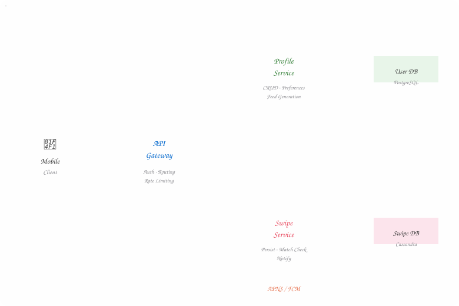
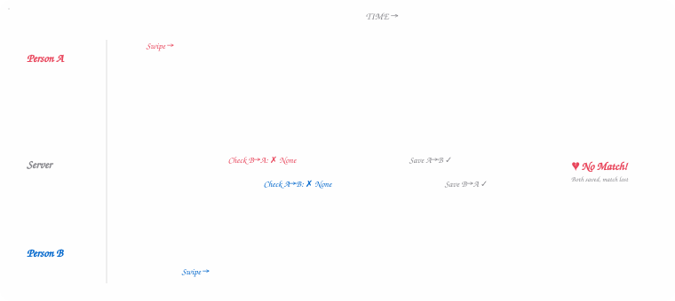
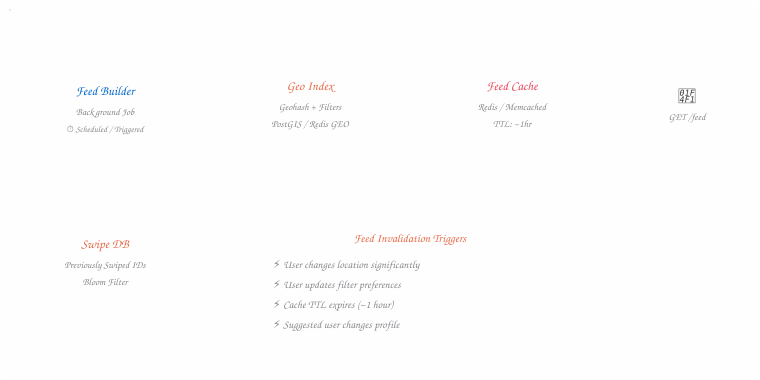

## Understanding the Problem

At its core, Tinder is deceptively simple. You open the app, see a profile, and make a snap
judgment — swipe right if you're interested, swipe left if you're not. If two people swipe
right on each other, **boom**, it's a match, and the conversation can begin.

But beneath that buttery-smooth swiping experience lies a monster of a system. We're talking
about **20 million daily active users**, each firing off roughly 100 swipes per day. That's
2 billion swipes. *Per day.* And every single one of those swipes needs to be processed
quickly, consistently, and without showing the same profile twice.

The beauty of this system design question — and what makes it a favorite in interviews — is
that it forces you to think about the full stack: real-time geolocation, massive write
throughput, consistency guarantees, and a recommendation feed that loads faster than the
user can lose patience.

> **💡 Interview Tip**
>
> This question focuses on the **recommendation feed and swiping experience**, not on chat,
> image uploads, or premium features. If you're unsure what to prioritize, have a quick
> conversation with your interviewer — they'll steer you toward the most complex or unique
> functionality.

## Defining Requirements

### Functional Requirements

Let's keep our scope tight. These are the features we *need* to build:

- **Profile creation** with preferences — age range, interests, maximum distance
- **Feed generation** — a stack of potential matches filtered by the user's preferences and current location
- **Swiping** — right for "yes," left for "no," processed one at a time
- **Match notification** — both users are notified when there's a mutual "yes"

### Non-Functional Requirements

These are the engineering constraints that separate a whiteboard sketch from a production
system:

| | |
| --- | --- |
| **20M** | Daily Active Users |
| **~100** | Swipes / User / Day |
| **<300ms** | Feed Load Latency |
| **~2B** | Daily Swipes |

| Requirement | Priority | Why It Matters |
| --- | --- | --- |
| Strong swipe consistency | ● Must have | Mutual swipes must trigger a match — no "lost love" bugs |
| Low-latency feed loading | ● Must have | Users expect instant gratification — the stack should appear immediately |
| No duplicate profiles | ● Must have | Re-showing swiped profiles creates a frustrating UX |
| Fake profile protection | ○ Out of scope | Important, but a separate domain |
| Monitoring & alerting | ○ Out of scope | Assumed to exist, not the focus |

## Core Entities & Data Model

Before we jump into designing APIs or drawing architecture diagrams, let's ground ourselves
with the fundamental data objects our system revolves around. Think of these as the *nouns*
in our system's vocabulary.

- **User** — A person using the app — both as the active swiper and as a profile shown to others. Includes preferences like age range, interests, and max distance.
- **Swipe** — An expression of "yes" or "no" on another profile. Belongs to a swiping_user and references a target_user.
- **Match** — The magic moment — a connection formed when two users mutually swipe "yes" on each other.

Nothing earth-shattering here, and that's fine. The goal at this stage is alignment. In an
interview, list these entities, explain the relationships, and make sure you and your
interviewer are speaking the same language before diving deeper.

## The API Surface

The API is your contract with the outside world — get it right, and everything downstream
flows naturally. We need exactly one endpoint for each functional requirement.

- `POST /profile` — Create or update a user's profile preferences. Includes age range, distance, interests. The user's identity comes from the auth token in headers — never from the request body.

**Request Body**

```text
{
  "age_min": 20,
  "age_max": 30,
  "distance": 10,
  "interestedIn": "female" | "male" | "both"
}
```

- `GET /feed?lat={}&long={}&distance={}` — Fetch a stack of potential match profiles. We pass location client-side since it changes constantly. Other filters (age, interests) are loaded server-side from the user's saved preferences.

> **Design Decision**
>
> You might be tempted to add pagination here, but this isn't a typical paginated list — it's
> a **recommendation engine**. When the stack is exhausted, the client simply hits the
> endpoint again for a fresh batch. No page cursors needed.

- `POST /swipe/{userId}` — Record a swipe decision on a target user. The response immediately indicates whether this swipe resulted in a match.

**Request Body**

```text
{
  "decision": "yes" | "no"
}
```

## High-Level Architecture

Now we get to the fun part — putting the pieces together. We'll walk through each functional
requirement and build up our system step by step, starting simple and layering on complexity
only when the problem demands it.

### Profile Creation Flow

This is the straightforward starting point. A user opens the app, fills in their
preferences, and we persist them. Classic **client → gateway → service → database** pattern.



*Figure 1 — Diagram 1 — High-Level System Architecture*

The system splits into two independent services — Profile and Swipe — each with its own optimized data store.

### Why Two Separate Services?

This is a question that comes up a lot, and the reasoning matters. Profile views and
creation are *low-frequency, read-heavy* operations. Swipes, on the other hand, are a
**firehose of writes**. With 20M DAU × 100 swipes/day, we're looking at roughly **200GB of
new swipe data per day**.

By separating these concerns, we get independent scaling, optimized database choices
(PostgreSQL for structured profile data vs. Cassandra for massive write throughput), and the
freedom to implement swipe-specific caching without touching the profile service.

### The Swipe + Match Flow

Here's where things get interesting. When Person B swipes right on Person A, the system
needs to instantly check whether Person A had previously swiped right on Person B. If they
did — it's a match.

Person B sees the match graphic immediately (they're already in the app). Person A, who
might have swiped days ago, gets notified via a push notification through APNS or FCM.

> **⚠️ Watch Out**
>
> We chose Cassandra for the swipe database because of its write-optimized storage engine. But
> Cassandra trades consistency for availability, which introduces a critical race condition
> we'll tackle in the deep dives.

## Deep Dive: Swipe Consistency

Here's a nightmare scenario. Person A and Person B both swipe right on each other at
*roughly the same time*. The system processes both swipes in parallel, and each one checks
for the inverse — but neither swipe has landed in the database yet. Result? **Both checks
come back empty. No match is created. True love: lost to a race condition.**



*Figure 2 — Diagram 2 — The "Lost Match" Race Condition*

When both swipes arrive simultaneously, the inverse check finds nothing — and the match is silently lost.

### How Do We Fix This?

There are two broad approaches, and the choice says a lot about your engineering philosophy:

> ### Approach 1: Eventual Consistency + Reconciliation +
>
> Instead of demanding real-time accuracy, run a **background reconciliation job** that
> periodically scans for unmatched mutual swipes. When it finds a pair of "yes" swipes that
> were never surfaced as a match, it retroactively creates the match and sends push
> notifications to both users.
>
> From the user's perspective, they simply get a notification that the other person swiped on
> them — they'll never know it was a reconciliation process catching up. This approach
> prioritizes availability and is simpler to implement, but your interviewer might push you
> toward a stricter solution.

> ### Approach 2: Strong Consistency with Distributed Locking +
>
> For real-time accuracy, we can use a **distributed lock** keyed on the pair of user IDs
> (always ordered, so `min(A,B):max(A,B)`). Before processing a swipe, the service acquires a
> lock for the user pair. This guarantees that concurrent swipes between the same two users
> are serialized.
>
> A Redis-based lock with a short TTL (a few seconds) works well here. The chance of two users
> swiping on each other within the same second is astronomically low, so lock contention will
> be negligible. The trade-off is added latency (~1-2ms for the lock operation) and the
> operational overhead of a Redis cluster.
>
> **Alternative:** Use a strongly consistent database (like CockroachDB) for the swipe data,
> or route all swipes for a given user pair to the same partition/server. Both approaches
> enforce serialization without explicit locking.

## Deep Dive: Low-Latency Feed Generation

Let's talk about the elephant in the room. Our naive query looks like this:

**SQL**

```sql
SELECT * FROM users
WHERE age BETWEEN 18 AND 35
AND interestedIn = 'female'
AND lat BETWEEN userLat - maxDist AND userLat + maxDist
AND long BETWEEN userLong - maxDist AND userLong + maxDist
```

This query is a performance disaster at scale. Filtering by a bounding box of lat/long
coordinates requires scanning an enormous number of rows, even with B-tree indexes.
Geo-spatial queries need a fundamentally different approach.

### Geo-Spatial Indexing with Geohashing

The solution is **geohashing** — a technique that converts 2D coordinates (latitude,
longitude) into a single string that represents a grid cell. Nearby locations share a common
prefix, which means finding users in your area becomes a **prefix-based lookup** instead of
a range scan.

Services like Redis (with its built-in geospatial commands) or databases like PostGIS make
this trivial. When a user updates their location, we compute their geohash and store it. To
generate a feed, we look up the user's geohash cell and its neighboring cells, then filter
by other criteria.

### Pre-Computing Feeds

Even with geospatial indexing, generating a feed on-demand adds latency. The better approach
is to **pre-compute feeds in the background** and cache them. Here's the architecture:



*Figure 3 — Diagram 3 — Pre-Computed Feed Generation Pipeline*

A background job pre-builds feeds using geospatial queries and caches them. Staleness is managed via TTL and event-driven invalidation.

### Handling Stale Feeds

Pre-computing introduces a new problem: **stale profiles**. A user in your cached feed might
have changed locations, updated their preferences, or deleted their account since the feed
was built.

The solution is a multi-layered freshness strategy:

- **Short TTL** (~ 1 hour) on cached feeds, with background recomputation
- **Event-driven invalidation** — if a user changes their location significantly or updates preferences, trigger a feed refresh
- **Warm caches only for active users** — don't waste compute pre-building feeds for dormant accounts

> **Tunable Parameters**
>
> One of the most powerful aspects of this design is its **tunability**. Cache TTL, number of
> cached profiles, criteria for "active" users, geohash precision — all of these can be
> adjusted without changing system logic. This gives operators fine-grained control over cost
> vs. freshness trade-offs.

## Deep Dive: Avoiding Duplicate Profiles

Nothing kills the swiping vibe faster than seeing someone you already passed on show up
again. Or worse — swiping right on someone and then seeing them reappear, making you wonder
if your original swipe was even recorded.

### The Straightforward Approach

During feed generation, query the swipe database for all user IDs this person has previously
swiped on, and filter them out. Since we're partitioning Cassandra by `swiping_user_id`,
this lookup is efficient — it hits a single partition.

### The Scaling Challenge

For power users with tens of thousands of historical swipes, that "contains check" gets
expensive. Two solutions stand out:

> ### Solution: Bloom Filters for O(1) Deduplication +
>
> A **Bloom filter** is a probabilistic data structure that can tell you definitively if an
> element is *not* in a set, or *probably* in a set — with a configurable false positive rate.
>
> For each user, maintain a Bloom filter of all user IDs they've swiped on. When building a
> feed, check each candidate against the Bloom filter. A false positive means we occasionally
> skip a valid candidate — a tiny, invisible cost. A false negative (showing a
> previously-swiped profile) never happens.
>
> The beauty is that the Bloom filter is constant-size regardless of swipe history, and
> lookups are O(1). At ~1KB per user with a 0.1% false positive rate, we can fit the entire
> Bloom filter set for our active users in memory.

## Final Architecture & Interview Bar

Let's zoom out and look at the complete picture. Our final design incorporates all the
layers we've discussed — from the API surface down to the storage and caching strategies.

| Component | Technology | Rationale |
| --- | --- | --- |
| API Gateway | Kong / AWS API GW | Auth, rate limiting, routing |
| Profile Service | Stateless microservice | CRUD, preference management |
| Swipe Service | Stateless microservice | Write-heavy, match detection |
| User Database | PostgreSQL + PostGIS | Structured data, geo-spatial indexing |
| Swipe Database | Cassandra | Massive write throughput, partitioned by user |
| Feed Cache | Redis | Pre-computed feeds, Bloom filters, geo commands |
| Feed Builder | Background worker | Scheduled + event-driven feed generation |
| Push Notifications | APNS / FCM | Match alerts to offline users |
| Distributed Lock | Redis (Redlock) | Swipe consistency for concurrent mutual swipes |

### What's Expected at Each Level?

Interviewers calibrate their expectations based on your seniority. Here's a rough guide to
what "good" looks like at each level for this particular problem.

- **Mid-Level (E4)** *(80% Breadth · 20% Depth)* — Build the Foundation Clearly define APIs and data model. Land on a functional HLD covering feed, swiping, and matching. Show awareness of geo-spatial filtering and profile deduplication.
- **Senior (E5)** *(60% Breadth · 40% Depth)* — Drive the Depth Quickly nail the HLD, then spend time on feed generation trade-offs, geo-spatial indexing options, and swipe consistency strategies. Proactively surface stale cache issues.
- **Staff+ (E6)** *(40% Breadth · 60% Depth)* — Own the Conversation Breeze through the basics, then deep-dive into trade-offs with confidence drawn from real-world experience. The interviewer follows your lead, not the other way around.

> **💡 Final Thought**
>
> The best candidates don't just design a system that works — they design a system with
> **tunable knobs**. Cache TTLs, Bloom filter sizes, geohash precision, reconciliation
> intervals — these parameters give operations teams control without requiring code changes.
> That's what separates textbook architecture from production-ready engineering.
