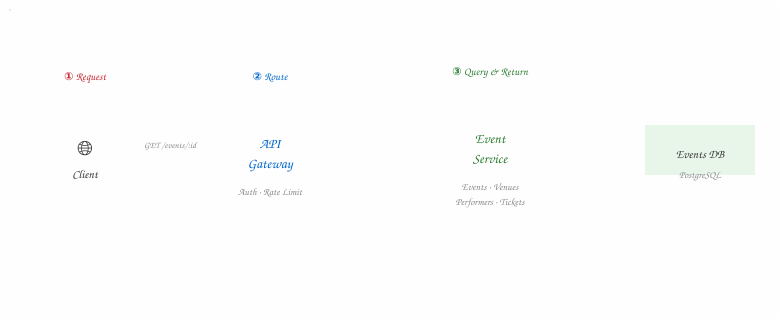
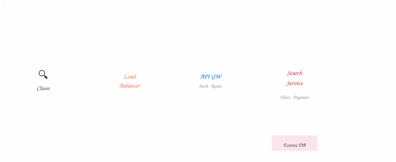
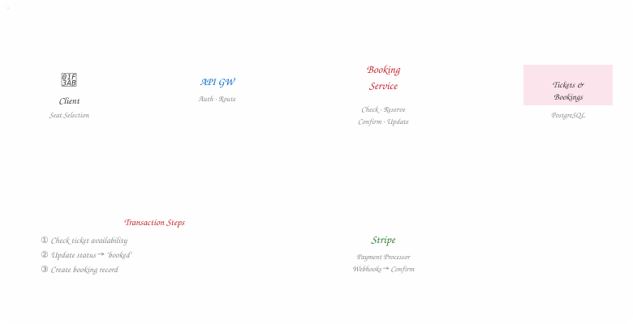
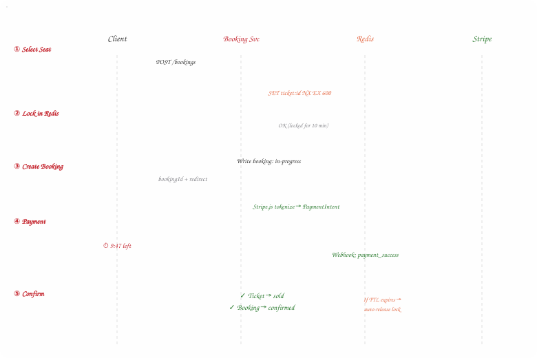
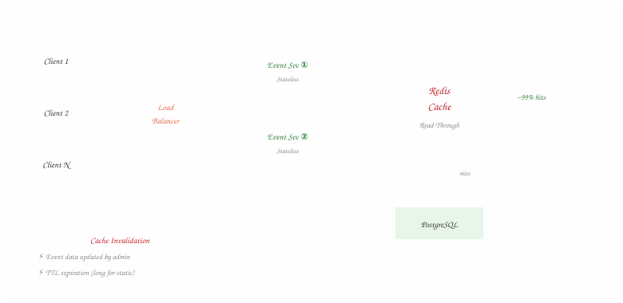
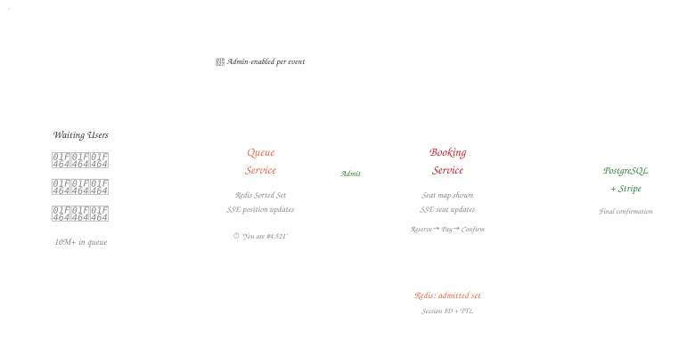
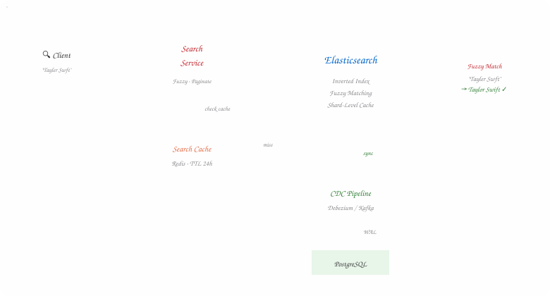

## Understanding the Problem

BookMyShow is one of those platforms that looks simple on the surface. You open the app,
browse upcoming concerts, pick your seats, pay, and you're done. Easy, right?

Not quite. Beneath that clean event listing and slick seat picker lies a system that has to
handle some truly gnarly engineering challenges. Think about a Taylor Swift concert dropping
tickets at noon. **Millions of fans** flood the platform simultaneously. Every single one of
them is clicking on the same event, staring at the same seat map, and racing to grab the
same front-row seats. And the system *cannot* sell the same seat twice.

That combination — extreme read throughput for browsing, strict write consistency for
booking, and a healthy dose of real-time UX to keep users sane — is what makes this system
design question a perennial favorite in interviews. It forces you to navigate the tension
between availability and consistency, and there's no single right answer. Just trade-offs.

> **💡 Interview Tip**
>
> This question is about the **booking pipeline** — not about payment processing, user
> authentication, or admin dashboards. Keep your scope tight: viewing events, searching for
> them, and booking tickets without double-selling. Everything else is "below the line."

## Defining Requirements

### Functional Requirements

Let's keep our scope tight and prioritize the top three features. Everything else shows
product thinking, but we won't be designing for it:

- **View events** — browse event details, venue info, performer bios, and an interactive seat map showing availability
- **Search for events** — find events by keyword, date range, location, or event type with sub-500ms latency
- **Book tickets** — select seats, reserve them temporarily, complete payment, and confirm the booking with zero double-sells

### Non-Functional Requirements

These are the engineering qualities that separate a working prototype from a production
system that can survive a Coldplay concert going on sale:

| | |
| --- | --- |
| **10M** | Concurrent Users |
| **100:1** | Read: Write Ratio |
| **<500ms** | Search Latency |
| **0** | Double Bookings |

| Requirement | Priority | Why It Matters |
| --- | --- | --- |
| Availability for search & viewing | ● Must have | Browsing must never go down — it's the front door to revenue |
| Consistency for booking | ● Must have | Double-selling a seat is a legal and PR nightmare |
| Scalable to viral events | ● Must have | 10M users hitting one event page at once is our design target |
| Low-latency search | ● Must have | Users expect autocomplete-fast results; anything slower feels broken |
| GDPR & data protection | ○ Out of scope | Important, but a separate domain |
| CI/CD & fault tolerance | ○ Out of scope | Assumed to exist, not the focus |

## Core Entities & Data Model

Before we start drawing architecture diagrams, let's establish the fundamental data objects
our system revolves around. Think of these as the *nouns* in our system's vocabulary. We
don't need to nail every column right now — just get aligned on what exists and how things
relate.

- **Event** — The central entity — stores name, description, date, type, and links to its venue and performers.
- **User** — A person interacting with the platform — browsing events, searching, and purchasing tickets.
- **Performer** — The artist, band, team, or company performing. Could be a comedian, an orchestra, or an IPL team.
- **Venue** — The physical location — address, capacity, and a seat map (JSON structure defining sections, rows, and seat coordinates).
- **Ticket** — One ticket per seat per event. Tracks section, row, seat number, price, and status (available → reserved → sold).
- **Booking** — Groups multiple tickets into a single transaction — tracks user, total price, payment status, and timestamps.

You could fold booking data into the Ticket entity, but keeping a separate Booking makes
life easier when a user buys multiple seats in one transaction — you need a single order
with a shared payment status and total price.

> **Design Decision**
>
> When a new event is created, we generate a Ticket record for **every seat** in the venue
> based on the venue's seat map. The client fetches this data to render the interactive seat
> picker, combining the seat map coordinates with each ticket's status.

## The API Surface

The API is your contract with the outside world. We need exactly one endpoint per functional
requirement — simple, clean, and easy to reason about. We'll evolve these as the design
matures.

- `GET /events/:eventId` — Fetch full details for an event — including venue info, performer bios, and the complete ticket list (to render the seat map with real-time availability). This is the most heavily trafficked endpoint.

**Response**

```text
→
                    Event & Venue & Performer & Ticket[]

                    // Tickets are needed to render the seat map
// Each ticket includes: section, row, seat, price, status
```

- `GET /events/search?keyword={}&start={}&end={}&page={}` — Search for events by keyword, date range, event type, or location. Returns a paginated list of matching events. Later, we'll supercharge this with Elasticsearch.

- `POST /bookings/:eventId` — Initiate a booking for selected tickets. Initially a single endpoint; we'll split this into reserve + confirm as we add distributed locking in the deep dives.

**Request Body**

```text
                    {
                    "ticketIds"
                    : [
                    "ticket_A12"
                    ,
                    "ticket_A13"
                    ],
                    "paymentDetails"
                    : { ... } }
                
```

> **Design Decision**
>
> We're starting with a simple "book in one step" API. As we dig into the reservation flow
> later, we'll split this into a **two-phase process**: first reserve (lock the seats), then
> confirm (process payment). Communicate this intent to your interviewer early.

## High-Level Architecture

Now we get to the fun part — assembling the pieces. We'll walk through each functional
requirement and build up the system layer by layer. The goal here is **functional
correctness first**, then we'll optimize in the deep dives.

### 1. View Event Flow

When a user navigates to an event page, they expect to see all the details — event name,
date, venue, performers, and crucially, the interactive seat map showing which seats are
still available. Here's the straightforward flow:



*Figure 1 — Diagram 1 — View Event Architecture*

The view flow is intentionally simple — Client → Gateway → Event Service → PostgreSQL. We'll layer caching on top in the deep dives.

### 2. Search Events Flow

Users need to find events before they can view them. Our search takes a combination of
keywords, dates, location, and event type. For now, we'll connect a Search Service directly
to our database — it's not optimal, but it works as a starting point.



*Figure 2 — Diagram 2 — Search Events Architecture*

A naive search that queries PostgreSQL directly. This works for low traffic but won't survive a LIKE '%Taylor%' at scale.

### 3. Book Tickets Flow

Here's where things get interesting. The critical constraint: **two users must never pay for
the same seat**. To handle this, we need a database that supports ACID transactions. We'll
use PostgreSQL with proper isolation levels.



*Figure 3 — Diagram 3 — Simple Booking Architecture*

The booking service handles the critical path: check availability, lock the seat, process payment via Stripe, and confirm.

> **⚠️ Watch Out**
>
> This design has a fundamental flaw: users fill out payment details, hit "Confirm," and
> *then* discover their seat was taken while they were typing their credit card number. We'll
> fix this with a reservation timer in our first deep dive.

You may notice that our Event Service and Booking Service share the same database. The
"database per service" rule is often repeated, but it's not a hard-and-fast rule. Here,
sharing makes sense because tickets, events, and bookings are tightly coupled, we need ACID
transactions, and splitting would add complexity for zero benefit. Weigh the trade-offs,
don't parrot architectural dogma.

## Deep Dive: Ticket Reservation & No Double Booking

If you've ever booked a flight or concert ticket, you've probably seen that anxiety-inducing
countdown timer: **"Complete your purchase in 9:47 or your seats will be released."** That
timer isn't just a UX trick — it's the heartbeat of a critical distributed systems problem.

We need three guarantees: (1) a seat is locked for a user while they're checking out, (2) if
they abandon checkout, the seat becomes available again, and (3) two users never
successfully pay for the same seat. Let's explore the approaches, from bad to great.

> ### ❌ Bad: Long-Running Database Locks +
>
> A tempting but terrible idea: use `SELECT FOR UPDATE` to lock the ticket row for the entire
> checkout duration. The lock is held until the transaction commits or rolls back.
>
> The problem? Database locks are designed for **millisecond-scale operations**, not 10-minute
> checkout flows. Holding a transaction open for that long strains connection pools, risks
> deadlocks, and can grind the entire database to a halt under load. If the app crashes
> mid-lock, you're stuck with orphaned locks. This is a non-starter for production.

> ### 🟡 Good: Status Field + Cron Job +
>
> A better approach: add a `status` field to the Ticket table (`available`, `reserved`,
> `booked`) plus a `reserved_at` timestamp. When a user selects a seat, we update the status
> to `reserved` and record the time. A cron job periodically scans for tickets where status is
> `reserved` and the reservation has expired, flipping them back to `available`.
>
> This works, but the cron job introduces **delay** between when a reservation expires and
> when the seat actually becomes available again. For a sold-out Taylor Swift show, those
> extra seconds of latency mean frustrated fans staring at a "no seats available" screen while
> expired reservations sit unreleased.

> ### 🟢 Better: Expiration-Based Status Check +
>
> The key insight: a ticket's *real* status is the **combination** of two fields — its status
> AND whether its reservation has expired. Rather than relying on a cron job to flip expired
> reservations, we bake the expiry check directly into our transaction:
>
> 1. Begin transaction
> 2. Check if ticket is `AVAILABLE` OR (`RESERVED` but expired)
> 3. Update to `RESERVED` with expiration = now + 10 minutes
> 4. Commit
>
> This eliminates the cron dependency for correctness. We can still run a sweep job for
> tidiness (keeping the table readable), but the system's *behavior* doesn't depend on it. The
> trade-off is slightly more complex read queries since every check needs to evaluate two
> conditions.

> ### 🚀 Great: Redis Distributed Lock with TTL +
>
> The production-grade solution. PostgreSQL gives us strong consistency for the final booking,
> but it doesn't natively support row-level TTLs. Redis does — and since it's in-memory, lock
> acquisition is **blazing fast** under high concurrency.
>
> Here's how it works: when a user selects a seat, we acquire a Redis lock using `SET
> ticket:{id} user:{id} NX EX 600` (NX = set only if not exists, EX = expire in 600 seconds).
> This is an **atomic** operation — only one client wins. If the lock succeeds, the seat is
> reserved. If the TTL expires (user abandoned checkout), Redis automatically releases the
> lock. No cron jobs, no race conditions.
>
> The ticket table in PostgreSQL now only has two states: `available` and `booked`. All
> temporary reservation logic lives in Redis. When payment succeeds, we write the final state
> to PostgreSQL inside a transaction with OCC (Optimistic Concurrency Control) to guarantee no
> double-booking even if the Redis lock expired a split second before payment completed.
>
> For multi-seat bookings, acquire locks sequentially per ticket. If any lock fails, release
> the ones you already acquired. A Redis Lua script can make multi-lock acquisition atomic if
> tickets hash to the same node.

Let's go with the Redis distributed lock. Here's the complete booking flow:



*Figure 4 — Diagram 4 — Booking Flow with Redis Distributed Lock*

The full booking flow: Redis lock → 10-minute timer → Stripe payment → webhook confirmation. If the timer expires, Redis auto-releases.

> **💡 Edge Case: TTL Expires During Payment**
>
> What if User A's lock expires at minute 10 but Stripe confirms at minute 11? User B could
> have grabbed the lock in between. The safety net is our PostgreSQL transaction with OCC —
> only one write succeeds for a given ticket. The losing user gets an automatic Stripe refund.
> Set the TTL generously, and consider extending the lock when payment is initiated.

## Deep Dive: Scaling Reads for Viral Events

When a massive event goes on sale, the event detail page gets absolutely **hammered**.
Thousands of users refresh the same page waiting for tickets to drop. Our PostgreSQL
database, no matter how well-tuned, can't handle 10 million concurrent reads of the same
event data.

The good news? Event details, venue information, and performer bios rarely change. This is a
perfect candidate for aggressive caching.

### The Caching Strategy

- **Read-through cache** with Redis or Memcached in front of PostgreSQL
- Cache key-value pairs like `event:{eventId}` → serialized event object
- **Long TTLs** for static data (venue info, performer bios) — hours or days
- **Short TTLs** for dynamic data (ticket availability) — seconds to minutes
- **Event-driven invalidation** — database triggers notify the cache when event data changes

### Horizontal Scaling

The Event Service is stateless, so we can spin up as many instances as needed behind a load
balancer. Use **Least Connections** routing to distribute traffic evenly. During a major
on-sale event, auto-scale the service fleet based on request rate.



*Figure 5 — Diagram 5 — Caching Architecture for High-Read Traffic*

Multiple stateless Event Service instances sit behind a load balancer, all backed by a shared Redis cache. Cache hits serve ~99% of requests.

## Deep Dive: Real-Time Seat Maps & Waiting Rooms

With popular events, the seat map goes stale *fast*. Users click on a seat, get an error
because someone else grabbed it a second ago, and frustration builds. We need real-time
updates and, for truly viral events, a way to control the stampede altogether.

### Server-Sent Events for Live Seat Updates

For moderately popular events, we can use **Server-Sent Events (SSE)** to push seat status
changes to the client in real-time. SSE is a unidirectional channel from server to client —
perfect for broadcasting "seat A12 just got reserved" without the overhead of a full
WebSocket connection.

When any seat's status changes (reserved or booked), the Booking Service publishes an event.
All connected clients viewing that event's seat map receive the update instantly, and the UI
greys out the taken seat without a page refresh.

### Virtual Waiting Room for Viral Events

But SSE alone won't save us during the "Taylor Swift problem." When 10 million users hit the
booking page simultaneously, the seat map becomes a chaotic seizure of disappearing seats. A
better experience: **don't show the seat map until it's your turn.**



*Figure 6 — Diagram 6 — Virtual Waiting Room Architecture*

For viral events, users enter a virtual queue. The Queue Service uses SSE to push position updates and gradually admits users to the booking page.

The queue is backed by a **Redis sorted set** (timestamp as score for FIFO ordering). Users
get SSE updates with their position and estimated wait time. When admitted, their session ID
is added to an `admitted:{eventId}` set in Redis with a TTL. The Booking Service checks this
set before allowing any reservation — unadmitted users are rejected.

## Deep Dive: Search at Scale & Final Architecture

Our current search implementation queries PostgreSQL directly. Let's be honest about what
that means at scale:

**SQL**

```sql
-- This is a performance disaster
SELECT
                    *
                    FROM
                    Events
                    WHERE
                    name
                    LIKE
'%Taylor%'
OR
                    description
                    LIKE
'%Taylor%'
```

That `LIKE '%Taylor%'` wildcard forces a **full table scan**. No index can help with a
leading wildcard. As the events table grows, this query gets slower and slower. We need
something purpose-built for text search.

### The Evolution of Search

> ### Step 1: Database Indexes & Full-Text Search +
>
> Start with B-tree indexes on frequently queried columns (event date, performer name, venue
> location). Then layer on PostgreSQL's built-in **full-text search** using `tsvector` and GIN
> indexes. This turns "Taylor" into a fast token lookup instead of a wildcard scan.
>
> This handles exact and stemmed word matching well, but falls short on fuzzy matching. When
> someone types "Tayler Swft," PostgreSQL's full-text search won't help.

> ### Step 2: Elasticsearch + CDC for Real-Time Sync +
>
> For production-grade search, add **Elasticsearch**. It uses inverted indexes for
> sub-millisecond full-text search, supports fuzzy matching (handling typos like "Tayler Swft"
> → "Taylor Swift"), and excels at complex multi-field queries.
>
> To keep Elasticsearch in sync with PostgreSQL, use **Change Data Capture (CDC)** — tools
> like Debezium stream every insert, update, and delete from PostgreSQL into the Elasticsearch
> index in near real-time.
>
> Layer a **search result cache** (Redis, keyed by query parameters with a 24-hour TTL) on top
> to serve repeated queries without hitting Elasticsearch at all. Elasticsearch also has
> built-in shard-level query caching for frequently accessed data.



*Figure 7 — Diagram 7 — Elasticsearch Search Architecture with CDC*

Elasticsearch handles fuzzy search, CDC keeps it in sync with PostgreSQL, and Redis caches repeated queries. A typo like "Tayler Swft" still finds the right event.

### Final Architecture Summary

Let's zoom out and see the complete picture — every component, every technology choice, and
why it's there.

| Component | Technology | Rationale |
| --- | --- | --- |
| API Gateway | Kong / AWS API GW | Auth, rate limiting, request routing |
| Event Service | Stateless microservice | Horizontally scaled, serves event/venue/performer data |
| Search Service | Stateless microservice | Delegates to Elasticsearch, caches hot queries |
| Booking Service | Stateless microservice | Reservation, payment integration, confirmation |
| Primary Database | PostgreSQL | ACID transactions, source of truth for all entities |
| Distributed Lock | Redis (SET NX EX) | 10-minute seat reservation with auto-expiry |
| Event / Read Cache | Redis / Memcached | Absorbs 99% of read traffic for event pages |
| Search Engine | Elasticsearch | Full-text, fuzzy search with inverted indexes |
| Data Sync | Debezium / Kafka CDC | Real-time PostgreSQL → Elasticsearch sync |
| Real-Time Updates | SSE (Server-Sent Events) | Push seat availability changes to clients |
| Virtual Queue | Redis Sorted Set + SSE | Manages stampede for viral events |
| Payment | Stripe (Webhooks) | PCI-compliant, idempotent webhook handling |

### What's Expected at Each Level?

Interviewers calibrate expectations based on seniority. Here's a rough guide for the
BookMyShow problem:

- **Mid-Level (E4)** *(80% Breadth · 20% Depth)* — Build the Foundation Clearly define API endpoints and data model. Land on a functional HLD covering viewing, searching, and booking. Solve "no double booking" with at least the status field + cron approach.
- **Senior (E5)** *(60% Breadth · 40% Depth)* — Drive the Depth Speed through the HLD, then spend time on distributed locking, Elasticsearch for search, and caching strategies. Proactively surface the "stale seat map" problem and propose SSE.
- **Staff+ (E6)** *(40% Breadth · 60% Depth)* — Own the Conversation Breeze through the basics, then deep-dive into Redis TTL edge cases, CDC consistency guarantees, virtual waiting rooms, and Stripe webhook idempotency. The interviewer follows your lead.

> **💡 Final Thought**
>
> The best candidates don't just build a system that works — they build a system with
> **tunable knobs**. Redis TTLs, cache expiration strategies, queue admission rates,
> Elasticsearch fuzzy thresholds — these parameters give operations teams control without
> requiring code changes. That's what separates textbook architecture from production-ready
> engineering.
