## Understanding the Problem

BookMyRide in interview shorthand — is the kind of product that looks trivial on a napkin:
pin a pickup, pin a drop-off, wait for a car. Then it quietly becomes one of the hardest
distributed systems problems you can draw in an interview. You are coordinating **two moving
clients**, a price that must stay honest, and a matching engine that cannot double-book a
driver when a stadium lets out and fifty thousand people tap "Request ride" at once.

I like this question because it forces the same muscle as real ride-hailing engineering:
geospatial data at insane write rates, human-in-the-loop workflows with timeouts, and
consistency guarantees that actually matter. If you assign one driver to two rides, someone
does not get picked up. If matching drags past a minute, the rider opens a competitor app.
The bar is unforgiving.

In this walkthrough we will stay above the product line on purpose — fare quote, request,
match, accept — and treat ratings, scheduled rides, and vehicle tiers as explicit "below the
line" scope. That discipline is what keeps a 45-minute whiteboard session shippable.

> **💡 Interview Tip**
>
> Confirm the **top three functional requirements** with your interviewer before you draw
> boxes. Offer a crisp "below the line" list (ratings, GDPR, ride categories) so they can
> promote or demote items without you guessing.

## Defining Requirements

### Functional — above the line

- **Fare estimate** from pickup and destination
- **Request a ride** from an accepted fare quote
- **Match** the rider with a nearby, available driver
- **Driver accept/decline** and navigate to pickup and drop-off

### Below the line

- Post-trip ratings, payment capture, and fare splitting
- Scheduled rides and multi-category fleets (XL, Comfort, etc.)
- GDPR-style privacy, full observability stack, multi-region DR

### Non-functional — core

| | |
| --- | --- |
| **<1m** | Match or fail |
| **1:1** | Driver ↔ active offer |
| **100k** | Surge from one venue |
| **~2M/s** | Location writes (fleet scale) |

| Requirement | Priority | Why it matters |
| --- | --- | --- |
| Sub-minute matching | ● Core | Riders bail when the spinner never ends |
| No double-assign driver | ● Core | Strong consistency on driver availability |
| Peak throughput | ● Core | Events create localized tsunamis |
| Payment & ratings | ○ Below line | Real, but not today's diagram budget |

## Core Entities & Data Model

Five nouns carry the whole design. You do not need every column on the whiteboard — you need
shared vocabulary.

- **Rider** — Requests rides, payment profile, identity from auth — never trust a client-supplied rider id.
- **Driver** — Vehicle metadata, availability state, linked to live location streams.
- **Fare** — Immutable quote: pickup, destination, estimated price and ETA. Created before commit.
- **Ride** — Lifecycle from requested through matched, accepted, in-progress, completed.
- **Location** — Latest driver coordinates plus server-side timestamp of last ping.

Storage split follows access pattern: **PostgreSQL** holds Fare and Ride rows (source of
truth for billing and lifecycle). **Redis GEO** holds ephemeral driver positions optimized
for radius search. Never mix them — querying Postgres for "drivers within 2km" at ping
frequency is how interviews go off the rails.

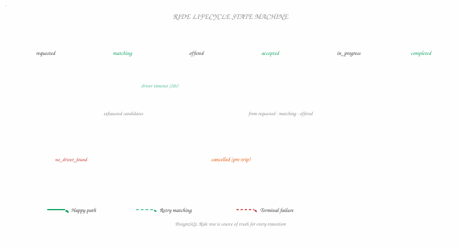

*Figure 1 — State Machine*

Every state a Ride row passes through — timeout loops back to matching; rider cancel is valid until the trip starts.

## The API Surface

One endpoint per user-visible capability. Matching stays internal — triggered by ride
creation.

- `POST /fare` — Create a fare estimate from pickup and destination. Persists a Fare row the rider can accept later.

**Request Body**

```text
                    {
                    "pickupLocation"
                    : {
                    "lat"
                    :
                    37.7749
                    ,
                    "lng"
                    :
                    -122.4194
                    },
                    "destination"
                    : {
                    "lat"
                    :
                    37.7849
                    ,
                    "lng"
                    :
                    -122.4094
                    } }
                
```

- `POST /rides` — Confirm ride request. Body carries only fareId; server loads price and coordinates from DB.

**Request Body**

```text
                    {
                    "fareId"
                    :
                    "fare_8x2k9m"
                    }
                
```

- `POST /drivers/location` — Driver heartbeat. driverId comes from JWT/session — never from the JSON body.

**Request Body**

```text
                    {
                    "lat"
                    :
                    37.7749
                    ,
                    "long"
                    :
                    -122.4194
                    }
                
```

- `PATCH /rides/:rideId` — Driver accepts or declines. Response includes pickup and destination for in-app navigation.

**Request Body**

```text
                    {
                    "decision"
                    :
                    "accept"
                    |
                    "deny"
                    }
                
```

> **🔒 Security**
>
> Never trust the client for **userId**, **fare amounts**, or **timestamps**. Identity belongs
> in the token; money belongs in the Fare row; clocks belong on the server.

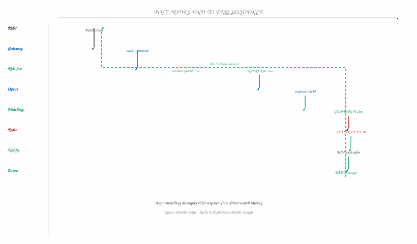

*Figure 2 — Sequence Diagram*

From rider tap to driver notification — fareId validation, durable enqueue, geo search, lock, push, and accept.

## High-Level Architecture (Build-Up)

We grow the design in the same order riders experience the app — quote, commit, match,
accept — so the interviewer always knows why the next box appeared.

### Step 1 — Fare estimation

Rider Client → API Gateway → Ride Service → third-party Maps API → PostgreSQL (Fare).
Gateway handles auth and rate limits; Ride Service calls routing for distance/time, applies
pricing rules (base + per-mile + surge multiplier), inserts Fare, returns the entity.

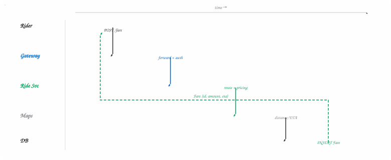

*Figure 3 — Sequence Diagram*

Server computes price from stored route data — the client never sends a fare amount.

### Step 2 — Ride request

Add a Ride table. `POST /rides` validates the fareId is fresh (typically 5–10 minute TTL),
creates a row in `requested` state linked to the Fare, then kicks off matching —
synchronously in a small interview, asynchronously via queue in production.

### Step 3 — Matching

Introduce Driver Client, Location Service, and Ride Matching Service. Drivers stream
location; matching queries nearby availability, ranks by ETA and rating, and locks one
candidate at a time.

### Step 4 — Accept flow & notifications

Notification Service pushes via APNS/FCM. Driver PATCH updates ride to `accepted` and
returns coordinates for client-side navigation. Rider gets a real-time update via WebSocket
or push — whichever your interviewer prefers.

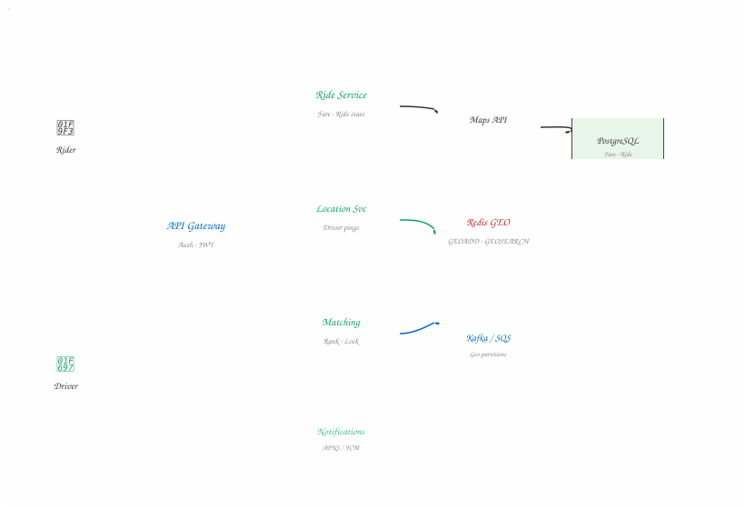

*Figure 4 — Architecture Diagram*

After deep dives: matching reads Redis geo, ride requests buffer in geo-partitioned queues, and fare/ride state lives in PostgreSQL.

## Deep Dive: Driver Location & Proximity

Ten million drivers pinging every five seconds is roughly two million writes per second.
Pair that with naive "compute distance to every row" and your HLD dies before the first
surge pricing joke.

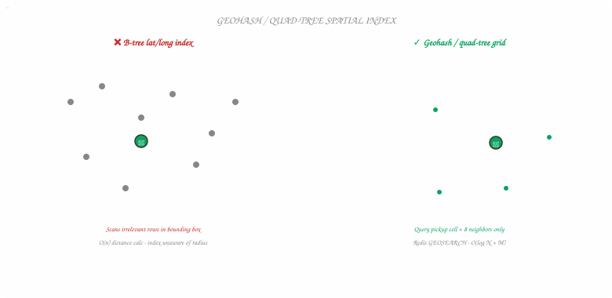

*Figure 5 — Spatial Partition*

B-tree indexes don't understand radius — geohash grids limit search to relevant cells around the pickup pin.

> ### Bad — per-update DB writes + table scan +
>
> Write every ping to PostgreSQL or DynamoDB and, on each match, scan drivers in a bounding
> box. B-tree indexes on lat/long do not understand radius search; cost explodes with fleet
> size.
>
> At on-demand Dynamo pricing, multi-million WRU/sec is a six-figure daily line item — fine
> for a horror story in an interview, not fine for a P&L.

> ### Good — batch writes + PostGIS / quad-tree +
>
> Aggregate pings over a short window, flush in batches, and query with PostGIS or a quad-tree
> index. Writes drop; searches become logarithmic in practice.
>
> Trade-off: batched positions lag reality by the flush interval — drivers look "behind"
> during fast matching unless you shrink the batch aggressively.

> ### Great — Redis GEOADD / GEOSEARCH + stale cleanup +
>
> Redis geohashes each driver into a sorted set; `GEOADD` overwrites the previous point so you
> always have the latest fix. `GEOSEARCH` pulls candidates in a radius in sub-millisecond time
> at high QPS.
>
> Run a companion sorted set keyed by last-seen timestamp; a periodic sweeper evicts drivers
> silent for ~30s. Durability? Accept ephemeral loss — pings rebuild in seconds. Sentinel +
> AOF if you want belt and suspenders.

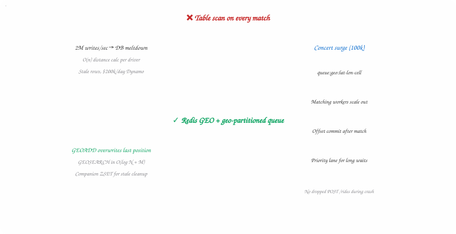

*Figure 6 — Comparison Diagram*

Location and demand scale on different axes — in-memory geo for reads, durable queues for ride intent.

## Deep Dive: Adaptive Location Pings

Not every design problem lives in the data center. The driver app can back off when
stationary, tighten when speed or heading changes, and ping aggressively near an assigned
pickup. That cuts bandwidth and write load without lying about position during active
matching.

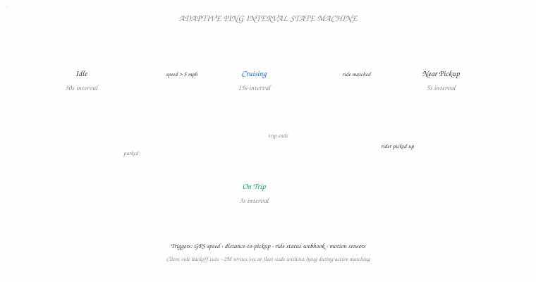

*Figure 7 — State Machine*

Driver client tightens heartbeat near pickup and on-trip — backs off when idle to save bandwidth and write load.

> **Client-side matters**
>
> Interviewers reward candidates who sketch the **driver client** as more than a box — motion
> sensors, GPS accuracy tiers, and backoff policies are legitimate scalability tools.

## Deep Dive: One Driver, One Offer

Strong consistency here means: at most one outstanding ride request per driver, and one
driver candidate actively pinged per ride attempt (before timeout cascade). Ticketmaster
seat holds use the same mental model.

> ### Bad — in-memory lock in the matching service +
>
> Each instance tracks locked drivers locally. Horizontal scaling guarantees two instances can
> pick the same driver; crashes strand locks forever.

> ### Okay — DB status flag + cron unlock +
>
> Mark driver `outstanding_request` in PostgreSQL transactionally. Coordination improves, but
> in-process timers die on restart; cron-based expiry adds lag and ops glue.

> ### Great — Redis distributed lock with 10s TTL +
>
> `SET lock:{driverId} {rideId} NX EX 10`. Only the holder may notify that driver. Accept
> deletes the key; silence lets TTL free the driver automatically — no orphaned in-memory
> timers.

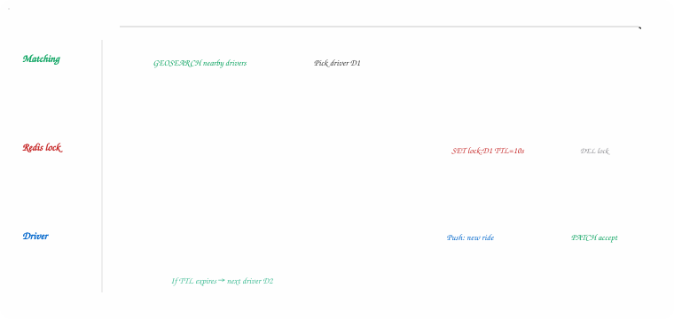

*Figure 8 — Timeline Diagram*

One driver, one outstanding offer — the Redis TTL is your countdown timer without in-process timers.

## Deep Dive: Peak Demand & Queues

When the arena empties, synchronous matching in the request thread will drop work long
before you finish autoscaling. Persist intent first.

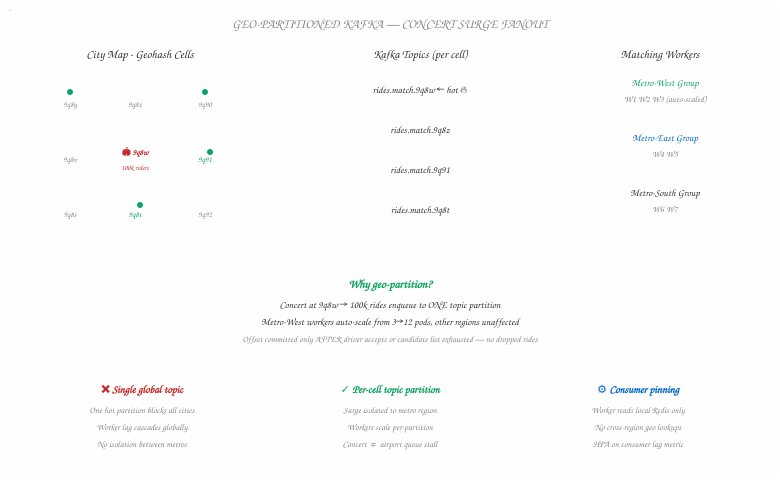

*Figure 9 — Geo-Partitioned Kafka Topics*

Each geohash cell maps to a Kafka topic partition — concert surges stay local, workers auto-scale per metro.

> ### Bad — process inline, no buffer +
>
> Crash mid-match loses the ride. Burst traffic overwhelms matching pods before HPA adds
> capacity.

> ### Good — Kafka / SQS with geo-partitioned topics +
>
> Enqueue ride id after DB insert; workers commit offset only after a driver accepts or the
> candidate list exhausts. Partition by geohash cell so a concert surge fans out across
> consumers in that metro.

> ### Great — priority lane vs strict FIFO +
>
> Pure FIFO lets one pathological match block thousands behind it. A secondary priority stream
> (wait time, rider tier, distance to nearest driver) improves UX while keeping FIFO within a
> cell for fairness debates you can have with the interviewer.

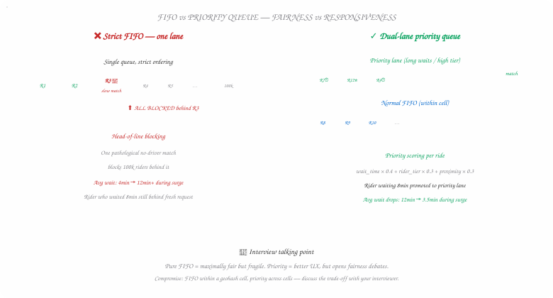

*Figure 10 — FIFO vs Priority Queue Trade-off*

Strict FIFO lets one slow match block everyone — a priority lane based on wait time and proximity keeps surge riders moving.

## Deep Dive: Driver Timeout & Human-in-the-Loop

Phones slide under seats. Drivers miss pushes. Something must advance the workflow when ten
seconds pass with no PATCH.

> ### Good — delay queue per offer +
>
> Schedule an SQS delayed message when notifying D1. On fire, if ride still unassigned, offer
> D2 — and cancel stale delays on accept to avoid double assignment.

> ### Great — Temporal / Step Functions durable workflow +
>
> Model matching as a workflow: offer → wait for signal or timer → branch. State survives
> process restarts; Uber's Cadence DNA is literally this problem class. Trade-off: new
> operational surface — worth it when revenue rides on zero dropped requests.

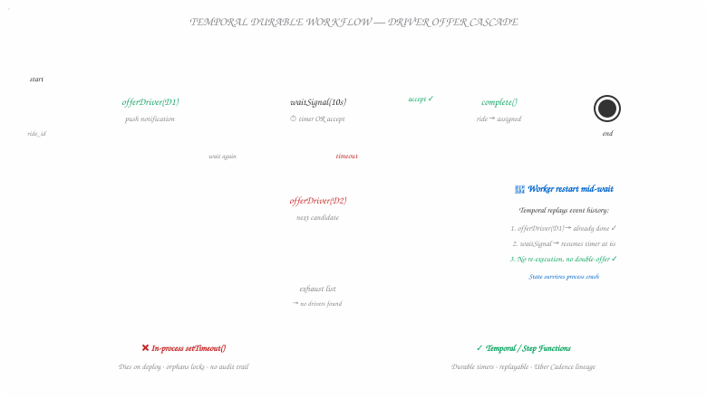

*Figure 11 — Temporal Workflow — Driver Timeout*

Temporal models matching as a durable workflow — offer, wait, branch. State survives restarts; no orphaned in-process timers.

## Deep Dive: Scaling Beyond One Region

Vertical scaling is the answer you mention only to dismiss — bigger boxes, downtime to
resize, hard ceiling. Horizontal scaling with **geo sharding** puts riders, queues, Redis,
and read replicas close to demand. Scatter-gather appears only when a search radius
straddles shard boundaries — rare if cells align with geohash prefixes.

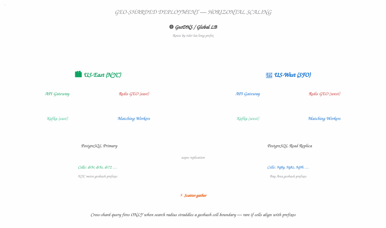

*Figure 12 — Geo-Sharded Deployment*

Each region runs its own stack — scatter-gather only fires when a search radius crosses shard boundaries.

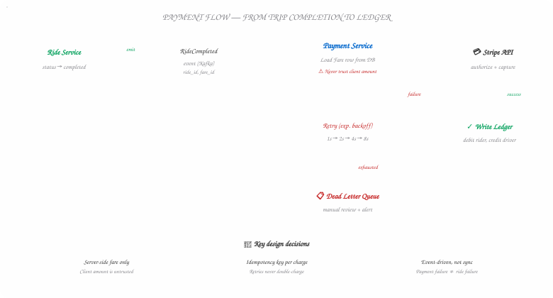

*Figure 13 — Payment Flow (Below the Line Extension)*

Money moves after trip completion — event-driven, idempotent, and never trusting the client amount.

## Failure Modes & Mitigations

Production ride-hailing is a catalog of things going wrong at 2am. Here is the short list
interviewers expect you to name unprompted:

| Failure | Impact | Mitigation |
| --- | --- | --- |
| Double-assign driver | Two riders, one car | Redis lock with TTL; idempotent accept handler |
| Stale driver in geo index | Match to offline driver | Last-seen sweeper; exclude locked/outstanding drivers |
| Matching worker crash | Lost ride request | Durable queue + at-least-once processing with ride idempotency |
| Maps API outage | No fare quotes | Cached routes for popular corridors; graceful degradation message |
| Redis cluster failover | Brief geo blindness | Sentinel/AOF; matching retries after sub-second blip |
| Expired fare accepted | Price mismatch | Server-side fare TTL check on POST /rides |

## Final Architecture & Interview Bar

| Component | Technology | Rationale |
| --- | --- | --- |
| API Gateway | Kong / AWS API GW | JWT validation, rate limits |
| Ride Service | Stateless service | Fare + ride state machine |
| Location Service | Stateless ingest | Normalize pings → Redis GEO |
| Matching Service | Workers + queue | Rank, lock, notify |
| Primary DB | PostgreSQL | Fare, Ride, billing truth |
| Live positions | Redis GEO | Write-heavy geospatial index |
| Match backlog | Kafka / SQS | Surge absorption + recovery |
| Workflow (optional) | Temporal | Timeouts across restarts |
| Push | APNS / FCM | Driver offer delivery |

### What's expected at each level?

- **Mid-Level** *(80% Breadth · 20% Depth)* — Solid HLD + one lock story APIs and entities clean; sequential HLD; knows spatial search cannot be a table scan; implements DB or app lock with known flaws.
- **Senior** *(60% Breadth · 40% Depth)* — Two deep dives with trade-offs Fast HLD; detail on Redis geo OR queueing OR Redis TTL locks; discusses FIFO vs priority and client adaptive pings.
- **Staff+** *(40% Breadth · 60% Depth)* — Three+ areas, production nuance Proactively connects surge queues, durable workflows, geo sharding, and security; interviewer learns something new.

> **💡 Final Thought**
>
> BookMyRide interviews reward engineers who separate **intent** (durable ride rows + queues)
> from **ephemeral truth** (live driver map in Redis) and who never let the client set the
> price. That split is how real fleets survive concert night.
